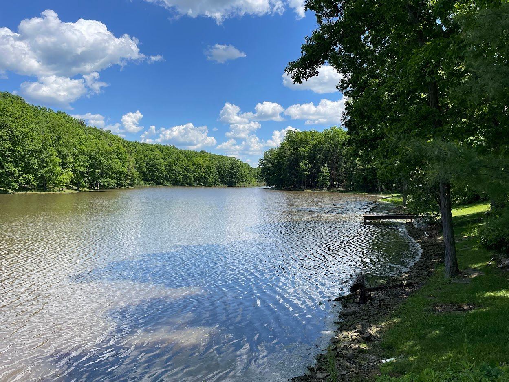
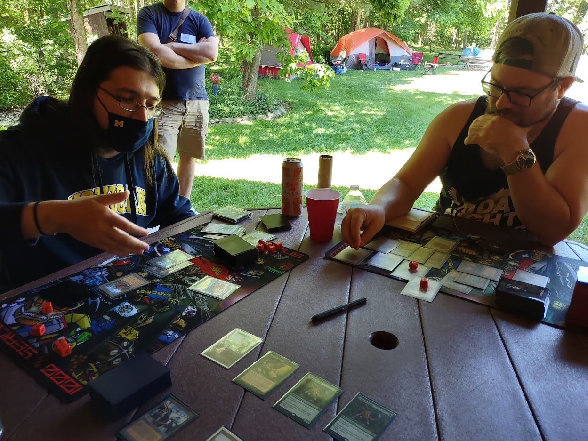

*This report was originally posted on themanadrain.com.*

We had 34 players signed up for the Vintage portion of TSI: The Land 3 - Mishra’s Twerkshop (vaccinations were required for attendance).

## Pictures

## Philanthropy

TSI: The Land Series continues the spirit of giving this year, raising over $1100 for the Second Harvest Food Bank of the Mahoning Valley through the generous donations of attendees, friends and Seriousos in absentia.

## Vintage

### Round 3 - Pinata

To celebrate the 3rd event in The Land Invitational series, we had a Liquor Pinata!

### Standings

After 6 rounds of Swiss, the standings were as follows:

### Top 8 after Swiss

1. Pat Vincent
2. Kevin Lewandoski
3. Jacob Hilty
4. Kai Schafroth
5. Stuart Ziarnik
6. Guhstin Dewey
7. Bryan Hockey
8. Bob Agra

Here is how the top 8 played out:

### Quarterfinal

- Pat V. vs. Mcgrew - Pat wins!
- Kai vs. Stu - Kai wins!
- Kevin L. vs Bryan H. - Kevin Wins!
- Jacob Hilty vs Guhstin - Jake wins!

### Semi

- Pat V. vs Kai - Kai wins!
- Kevin L vs Jacob Hilty - Kevin L wins!

### Finals

Kevin L vs Kai - Kai wins!

Kai poses with his prize and his Trophy necklace.

### Meta Game

Blue / Blue Combo (12):

- BUG Standstill
- BUG
- Bird Blade x 2
- Bant Archon
- Grixis Tinker
- Yorion
- Ledger Shredder
- UR Ragavan
- BUG Abdel
- BUG Chainsmokers
- Castatrolabe

Bazaar (3):

- Dredge
- Hogaak

Workshops: (6)

- Hardened Scales x 2
- Cyberdrive Aggro
- Patchwork Automaton
- Smokestack
- 8 Cast

Combo: (8)

- Doomsday
- PO x 3
- UR Belcher
- Abundant Belcher
- Underworld Dreams
- DPS x2

Misc: (3)

- Merfolk
- GSZ Depths
- Eldrazi

### TOP 16 Decks

[Top 16 Decks on MTGGoldfish](https://www.mtggoldfish.com/tournament/tsi-the-land-3-mishra-s-twerkshop)

We are working on getting the full 34 lists up.

## Middle School

Everything kicked off with 21 players for Middle School on Friday. After 6 rounds (Swiss +1), the standings were as follows:

### T8 Metagame

1. Landstill
1. Full English Breakfast
1. Squirrelcraft Enchantress
1. BG Nether Spirit Control
1. Fires
1. Pox
1. Naya Beasts
1. Elves

## Grandpa Belcher’s World Famous Pub Quiz

As the Top 8 of Vintage began, Nat hosted his World Famous Pub Quiz (WFPQ)!

Four Teams formed to battle it out for the true Glory of The Land.

1. Team "Awesome" - Rajah, Ben, Rob, Joe, Hazard (Quotation marks added by Nat)

1. "Kevin Poenisch by Himself" - Eric, Kevin, Angelo, Kevin

1. Team Mean Reflect Bus - JR, Andy, Jimmy, David

1. "Dr. Steven B. Morbius" - Steven, Mike O, Jake B., Bob

Rounds included classic Pub themes such as *Dogs* and *Blues Brothers*, along with Magic related categories and an amazing Lightning Round.

It was clear from the beginning that allowing the super team of Mean Reflect Bus to come together was a mistake; they ran away with the victory. While Hazard was able to hold down Team “Awesome” with a near-perfect score in the *Blues Brother’s* category, JR’s virtuoso performance in the “Lightning Round” category *Wrestling with Film* capped off their near flawless victory.

Congrats to Team Mean Reflect Bus for taking home the Trivia Gold! And huge thank you to Nat for hosting!

Nat, Super Host:

## Cake

We had not one but two birthdays on the weekend! First up was Ben Revell celebrating 40 years! We enjoyed German Chocolate cake on Friday to celebrate.

We also helped Nat celebrate the BIG 40 with a cake and singing!

To the relief of some and the regret of others, no spankings were distributed to either birthday boy. That I know of.

## Crackin’ Boosties: Mystery Booster Convention Edition

Nam had a box of the much sought after “Convention Edition” of the Mystery Boosters. He didn’t want to draft himself but would enjoy his box getting opened, so we did it!

Angelo
Chad
Mike O
Eric / McGrew
Kevin Poensich
David Lance
Rajah
Ben Revell

The finals featured Angelo on a nasty fast Green deck with Beastmaster’s Ascension and some super dope Convention cards vs. Rajah on a mostly mono-black deck featuring Meren, Mortapod, and Reassembling Skeleton. Angelo smashed face and prevailed as the Mystery Booster Convention Edition Champion!

## Thanks

James Family for use of the space and grilling and everything!
Andy for amazing trophy  and the name :)
Angelo for the Bottlehouse Warm UP
JR, Jerry, Twan - My dad and uncle say special thanks for the help prepping and chatting
Nat for the amazing trivia. You rule.
All Team Serious Friends
All attendees! Everyone else not mentioned by name who did anything, thank you and appreciate you
