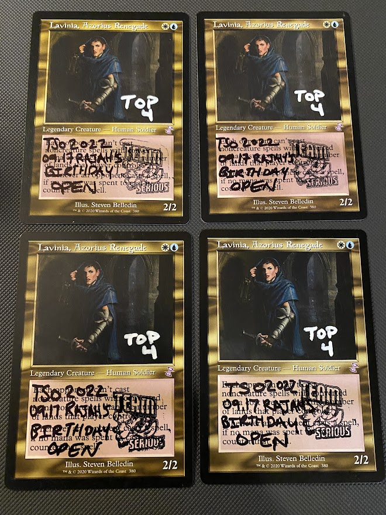
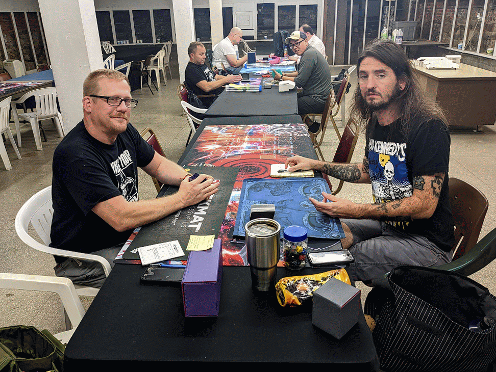
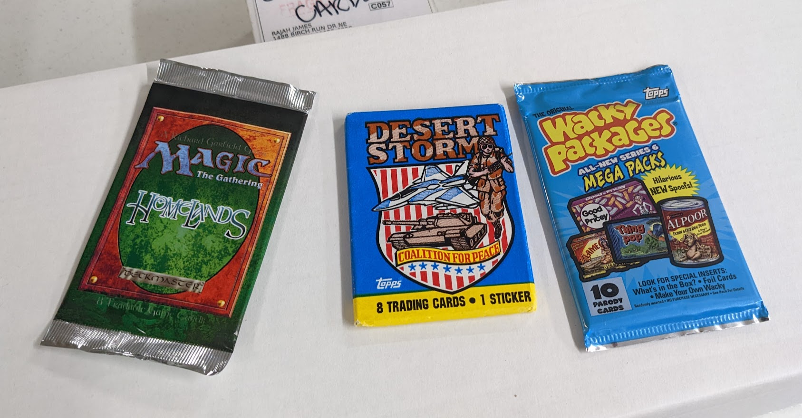
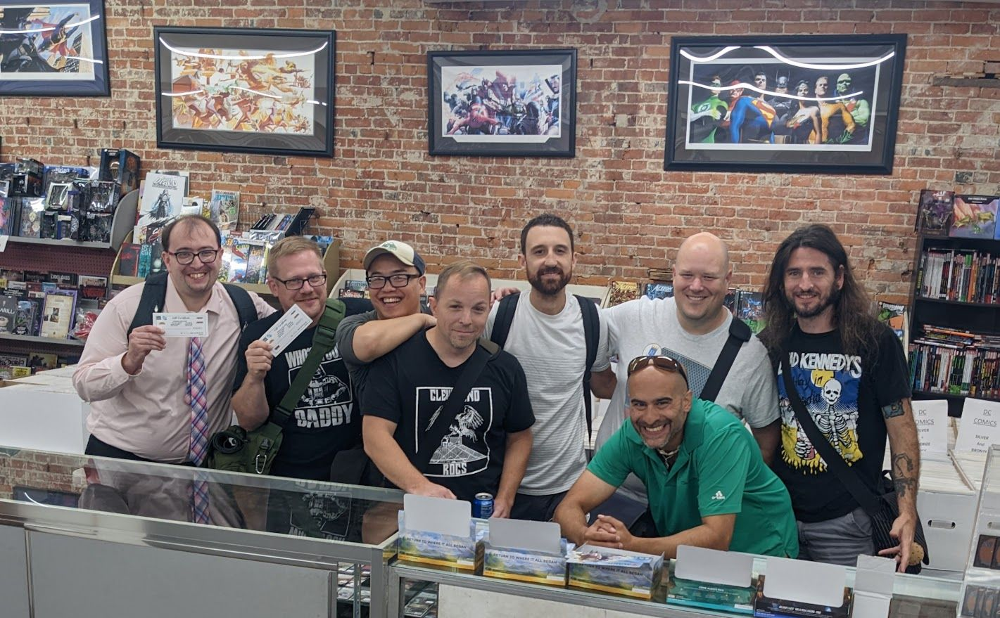

8 wizards gathered to battle for glory in  my 'birthday' Vintage! Paper Vintage is (hopefully) becoming more regular in NEO, with All-American Cards and Comics hosting us again, now for the second time. Big thanks to them as always!

Mocha House was our breakfast spot again! I had the Mocha House platter. Recommend.

Make sure to catch us for the next Team Serious Open event, TBA! Tentative date is 2022.11.12.

## Standings

We played Swiss +1 rounds with no cut, with payout to T3. Here are the standings and archetypes.

[MTGMELEE](https://mtgmelee.com/Tournament/View/11179#standings)

| Rank | Points | Name             | Deck                |
|------|--------|------------------|---------------------|
| 1    | 9      | Rajah James      | Oops, All Spells!   |
| 2    | 9      | Anthony Michaels | RUG Delver          |
| 3    | 9      | Charles Rolko    | Aggro Shops         |
| 4    | 6      | Jonathan Brne    | Oops, All Spells!   |
| 5    | 6      | Justin Dewey     | 2CM / BCV           |
| 6    | 6      | Steven Sasala    | Aggro Shops         |
| 7    | 3      | Kyle Wells       | Hullbreacher Tinker |
| 8    | 0      | Jerry Yang       | GW Hatebears        |

## Meta

Workshops - 3 (Aggro, Combo)

Blue Combo - 3 (2x Oops, 1x Tinker)

Blue Aggro Control - 1 (RUG Delver)

Non-Blue Aggro - 1 (GW Hatebears)

## Decklists

### 1	9	Rajah James	Oops, All Spells!

    4 Agadeem's Awakening
    1 Ancestral Recall
    4 Balustrade Spy
    1 Black Lotus
    1 Cabal Therapy
    4 Chrome Mox
    4 Dark Ritual
    1 Dread Return
    4 Force of Negation
    4 Force of Will
    1 Gitaxian Probe
    2 Goblin Charbelcher
    2 Grief
    1 Lotus Petal
    1 Mana Crypt
    1 Mana Vault
    1 Mox Emerald
    1 Mox Jet
    1 Mox Pearl
    1 Mox Ruby
    1 Mox Sapphire
    4 Narcomoeba
    4 Pact of Negation
    4 Sea Gate Restoration
    1 Sol Ring
    1 Thassa's Oracle
    1 Tinker
    4 Undercity Informer

    Sideboard
    4 Chain of Vapor
    2 Goblin Charbelcher
    2 Grief
    1 Lion's Eye Diamond
    1 Mental Misstep
    3 Mindbreak Trap
    2 Misdirection

### 2	9	Anthony Michaels	RUG Delver

    4 Force of Will
    3 Daze
    2 Misdirection
    2 Flusterstorm
    2 Red Elemental Blast
    1 Mental Misstep
    3 Lightning Bolt
    2 Ancient Grudge
    1 Ancestral Recall
    1 Gush
    1 Brainstorm
    1 Time Walk
    1 Merchant Scroll
    1 Ponder
    4 Preordain
    2 Dack Fayden
    4 Delver of Secrets
    4 Dragon's Rage Channeler
    1 Black Lotus
    1 Mox Sapphire
    1 Mox Ruby
    1 Mox Emerald
    1 Island
    4 Volcanic Island
    2 Tropical Island
    1 Taiga
    4 Wooded Foothills
    2 Steam Vents
    1 Misty Rainforest
    1 Strip Mine
    1 Library of Alexandria

    Sideboard
    1 Mountain
    1 Forest
    2 The Tabernacle at Pendrell Vale
    1 Crop Rotation
    2 Ancient Grudge
    1 Red Elemental Blast
    2 Trygon Predator
    2 Nature's Claim
    2 Pithing Needle
    1 Grafdigger's Cage

### 3	9	Charles Rolko	Aggro Shops

    4 Patchwork Automaton
    3 Walking Ballista
    4 Foundry Inspector
    3 Arcbound Ravager
    1 Black Lotus
    4 Nettlecyst
    1 Mox Emerald
    1 Mox Jet
    1 Mox Ruby
    1 Mox Pearl
    1 Mox Sapphire
    1 Chalice of the Void
    4 Mishra's Workshop
    4 Urza's Saga
    4 Wasteland
    4 Ancient Tomb
    1 Trinisphere
    1 Thorn of Amethyst
    4 Sphere of Resistance
    1 Mana Vault
    1 Mana Crypt
    1 Sol Ring
    1 Lodestone Golem
    1 Strip Mine
    4 Phyrexian Revoker
    1 Gingerbrute
    1 Tolarian Academy
    2 Unlicensed Hearse

    Sideboard
    2 Crucible of Worlds
    3 Grafdigger's Cage
    2 Mindbreak Trap
    2 Archive Trap
    1 Pithing Needle
    1 Relic of Progenitus
    1 Skysovereign, Consul Flagship
    2 Wurmcoil Engine
    1 Soul-Guide Lantern

### 4	6	Jonathan Brne	Oops, All Spells!

    1 Time Walk
    1 Ancestral Recall
    4 Narcomoeba
    4 Undercity Informer
    1 Thassa's Oracle
    1 Mox Jet
    1 Sol Ring
    1 Dread Return
    4 Agadeem's Awakening
    3 Goblin Charbelcher
    4 Sea Gate Restoration
    4 Force of Will
    1 Black Lotus
    1 Tinker
    4 Chrome Mox
    1 Mox Sapphire
    1 Mana Vault
    1 Mental Misstep
    4 Dark Ritual
    4 Pact of Negation
    1 Gitaxian Probe
    1 Demonic Tutor
    2 Unmask
    1 Mana Crypt
    1 Mox Pearl
    1 Mox Ruby
    1 Sphinx of the Steel Wind
    1 Lotus Petal
    1 Mox Emerald
    4 Balustrade Spy

    Sideboard
    1 Bolas's Citadel
    4 Mindbreak Trap
    1 Lion's Eye Diamond
    4 Force of Negation
    4 Chain of Vapor
    1 Goblin Charbelcher

### 5	6	Justin Dewey	2CM / BCV

    4 Ancient Tomb
    4 Mishra's Workshop
    3 Urza's Saga
    3 Wasteland
    2 Urborg, Tomb of Yawgmoth
    1 Strip Mine
    1 Tolarian Academy
    1 Mox Jet
    1 Mox Ruby
    1 Mox Pearl
    1 Mox Emerald
    1 Mox Sapphire
    1 Black Lotus
    1 Mana Crypt
    1 Sol Ring
    1 Lodestone Golem
    1 Mana Vault
    1 Voltaic Key
    1 Time Vault
    1 Walking Ballista
    2 Grindstone
    3 Painter's Servant
    3 Helm of Obedience
    4 Leyline of the Void
    4 Kuldotha Forgemaster
    3 Traxos, Scourge of Kroog
    3 Voltaic Servant
    4 Metalworker
    3 Staff of Domination

    Sideboard
    1 Psychosis Crawler
    1 Memory Jar
    3 Hope of Ghirapur
    3 Defense Grid
    3 Wurmcoil Engine
    2 Steel Hellkite
    2 Duplicant

### 6	6	Steven Sasala	Aggro Shops

    4 Mishra's Workshop
    4 Urza's Saga
    4 Wasteland
    4 Ancient Tomb
    1 Strip Mine
    1 Tolarian Academy
    1 Black Lotus
    1 Mana Vault
    1 Mana Crypt
    1 Sol Ring
    1 Mox Ruby
    1 Mox Jet
    1 Mox Pearl
    1 Mox Sapphire
    1 Mox Emerald
    4 Patchwork Automaton
    4 Phyrexian Revoker
    1 Gingerbrute
    4 Foundry Inspector
    3 Nettlecyst
    1 Lodestone Golem
    2 Arcbound Ravager
    4 Walking Ballista
    1 Chalice of the Void
    1 Thorn of Amethyst
    4 Sphere of Resistance
    1 Pithing Needle
    1 Trinisphere
    2 Unlicensed Hearse

    Sideboard
    1 The Tabernacle at Pendrell Vale
    1 Crucible of Worlds
    1 Mental Misstep
    1 Dismember
    1 Pithing Needle
    3 Wurmcoil Engine
    1 Ravenous Trap
    2 Mindbreak Trap
    2 Grafdigger's Cage
    1 Soul-Guide Lantern

### 7	3	Kyle Wells	Hullbreacher Tinker

    1 Polluted Delta
    1 Flooded Strand
    1 Mountain
    1 Volcanic Island
    1 Tolarian Academy
    1 Misty Rainforest
    4 Urza's Saga
    2 Scalding Tarn
    2 Underground Sea
    2 Island
    1 Mox Emerald
    1 Mox Jet
    1 Mox Pearl
    1 Mox Ruby
    1 Mox Sapphire
    1 Black Lotus
    1 Time Walk
    1 Timetwister
    1 Ancestral Recall
    1 Merchant Scroll
    1 Narset, Parter of Veils
    1 Dig Through Time
    1 Ponder
    1 Force of Negation
    1 Repeal
    1 Tinker
    1 Brainstorm
    1 Gitaxian Probe
    4 Force of Will
    1 Mental Misstep
    1 Flusterstorm
    1 Sol Ring
    1 Demonic Tutor
    1 Sensei's Divining Top
    1 Mana Crypt
    1 Yawgmoth's Will
    1 Bolas's Citadel
    2 Ragavan, Nimble Pilferer
    2 Dack Fayden
    4 Hullbreacher
    1 Voltaic Key
    1 Time Vault
    1 Pithing Needle
    2 Pyroblast
    1 Abrade

    Sideboard
    4 Leyline of the Void
    1 Sphinx of the Steel Wind
    1 Grafdigger's Cage
    1 Nihil Spellbomb
    2 Fatal Push
    1 Abrade
    1 Hurkyl's Recall
    1 Surgical Extraction
    1 Pithing Needle
    2 Pyroblast

### 8	0	Jerry Yang	GW Hatebears

    4 Wasteland
    4 Windswept Heath
    3 Dark Depths
    3 Thespian's Stage
    2 Flagstones of Trokair
    2 Savannah
    2 Yavimaya, Cradle of Growth
    1 Bojuka Bog
    2 Dryad Arbor
    1 Forest
    1 Gaea's Cradle
    1 Plains
    1 Sejiri Steppe
    1 Strip Mine
    1 The Tabernacle at Pendrell Vale
    1 Urza's Saga
    1 Vesuva
    2 Mox Diamond
    1 Black Lotus
    1 Mox Emerald
    1 Mox Pearl
    4 Elvish Reclaimer
    4 Thalia, Guardian of Thraben
    3 Crop Rotation
    3 Deafening Silence
    3 Green Sun's Zenith
    1 Chalice of the Void
    1 Collector Ouphe
    1 Outland Liberator
    1 Pithing Needle
    1 Ramunap Excavator
    1 Sylvan Safekeeper
    1 Thorn of Amethyst

    Sideboard
    4 Force of Vigor
    2 Bojuka Bog
    2 Outland Liberator
    1 Karakas
    1 Knight of the Reliquary
    1 Maze of Ith
    1 Pithing Needle
    1 Collector Ouphe
    2 Grafdigger's Cage

## Media
Top 4 Cards

Sup

Birthday Presents from "The" Kyle Wells! What a sweetheart. Thanks Kyle!

Top 8
