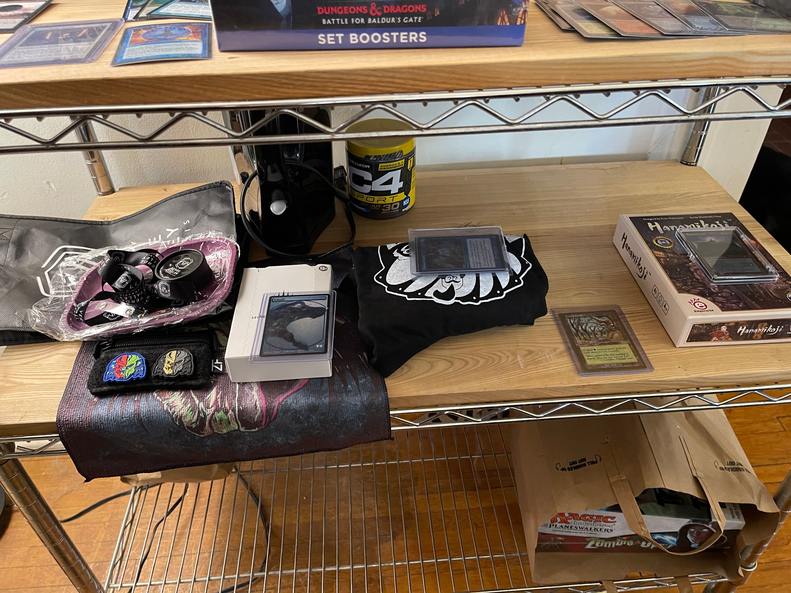
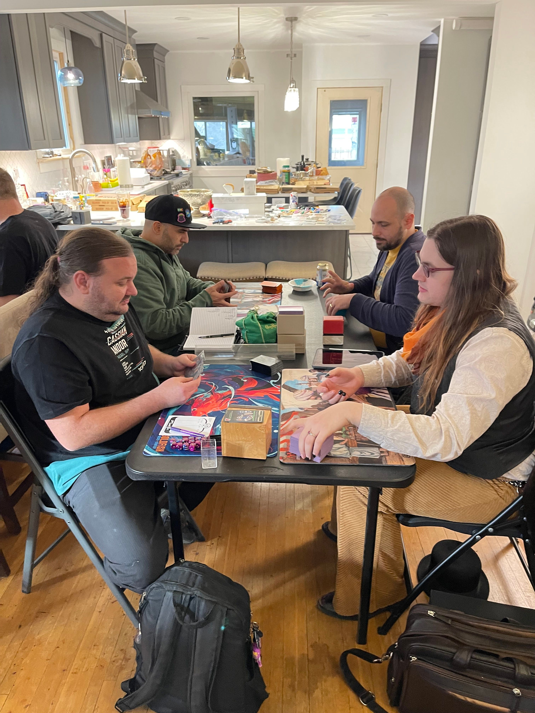
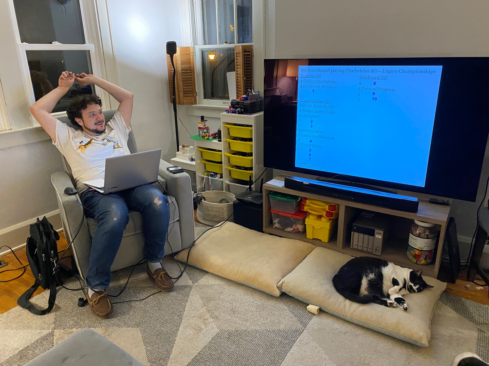

# Team Serious Invitational - Hazard Serious Invitational 6
*event report by Rajah James*

After a hiatus in 2021, Hazardvitational returned this year for the 6th installment. We join our hero in the midst of a house move and familial growth, a hectic time for even such a monumental mage such as Matt Hazard. With the blessing of his partner, he endeavoured to once again bring the team together in celebration of his birth, with friendship and cards. 

With such things filling his mind day to day, he enlisted me to help put things together and herd the cats as best as possible. As I am wont to do, I set about making some promotional materials. See above :)

Folks were generally stoked already to come together and especially more so since only me and Duane got to meet at Eternal Weekend; last TSI was The Land 3 in June 2022 and folks were pretty excited to play Vintage. Thanks as always to the Hazard family for opening their home to all of *Those Ohio Idiots* once again. Happy Birthday Matt!

## Philanthropy

This year, Matt asked particpants to donate to the Clintonville Community Resource Center ([Clintonville CRC](https://www.clintonvillecrc.org/)), an organization in his community that serves families in need. The CRC also benefits families from the surrounding communities as well, working towards a Vision for "A community of resilient, connected, and thriving neighbors".

|  |  |
|:--:| :--:| 
| | |

Thanks to the very generous contributions of Team Serious memebers, we were able to make a massive ***$815*** donation to the CRC in honor of Matt and Dr. T.P. Serious!

## Pre-Tournament Gathering
Folks from beyond Ohio were coming in to town for the gathering, so two AirBnBs were acquired. In a new twist on responsiblity sharing, those interested in staying signed up and Josh rolled to randomly assign the responsibility of booking the spot. Also noted was the fact that we got more than one AirBnB; weirdly, stacking 8 deep into a 2 man hotel room doesn't have the same appeal as it for some reason did years ago. #old

|  |  |
|:--:| :--:| 
| *Seventh Sons* | *TX BBQ in Columbus* |

Folks started to descend upon Columbus and surrounding areas on Thursday or so. The tournament venue is conveniently located near a lot of eateries and provions suppliers in Columbus. The AirBnBs were well stocked.

|  |  |
|:--:| :--:| 
| *Chad Brought Blackbird* | *Drank* |

||
|:--:|
| *Shovin'...Buddies* |

## Stream

I initially wanted to do some remote commentary for the stream. I even asked Kevin Cron and he agreed to try it. But the reality of the coordination was a bit much. 

||
|:--:| 
| *Rob Prepared with the Big Undercity* |

Seriouso [Rob Wilson](https://twitter.com/Robert_H_Wilson) agreed to bring his very sophisticated [Buffalo Chicken Dip Legacy](https://twitter.com/BcdLegacy) setup to get us on stream. Big ups to Rob for his efforts to get us live. You can view the VODs of the stream on his channel for now: https://www.twitch.tv/BuffaloChickenDipLegacy

Look for them on the Team Serious YouTube channel around the twelfth of Perhaps Someday.

## Hazard's Opening Remarks

||
|:--:|
| *"Everybody you are looking at here is at least 51% of the reason you are here...and who has a deck for me?!"* |

## Vintage Play

We had 27 people signed up to play Vintage magic. The full decklists are available [here](https://mtgmelee.com/Tournament/View/13042). 

The Top 8 broke down like this:

| Rank | Player | Deck |
|:--:|--:|:--|
| 1 | Kyle Lenox | Jeskai Arcanist |
| 2 | Jacob Hilty | PO Oath Breach |
| 3 | Jimmy McCarthy | BUG Birds |
| 4 | Nathan Mulch | Dredge |
| 5 | Andy Probasco | CatAstrolabe PO |
| 6 | Chad	Proctor-Frazier | Doomsday |
| 7 | Jerry Yang | Jewel Shops |
| 8 | Ben Revell | Dredge |

|Top 8 Playoff|||
|--:|:--|:--:|
|*Quarter Final*||**Winner**|
| Kyle Lenox | Ben Revell | Ben
| Jacob Hilty | Jerry Yang | Jerry
| Chad Proctor-Frazier | Jimmy McCarthy | Jimmy
| Nathan Mulch | Andy Probasco | Andy
|*Semi-Final*||**Winner**|
| Andy Probasco | Ben Revell | Andy
| Jimmy McCarthy | Jerry Yang | Jimmy
|*Finals*||**Winner**|
| Andy Probasco | Jimmy McCarthy | ***Jimmy!***

### Metagame

#### Overall Breakdown

| Archetype  | #s |
|------------|----|
| Bazaar     | 5  |
| Aggro      | 1  |
| Blue Combo | 8  |
| Blue Other | 6  |
| Workshop   | 7  |

#### Individual Breakdown

| PlayerName           | Archetype      | Deck                    |
|--:                   |:--:            |                      :--|
| Eric Butler          | Aggro          | Mono W                  |
| Ben Revell           | Bazaar         | Dredge                  |
| Gilberto Rivera      | Bazaar         | 8 Squee                 |
| Matt Hazard          | Bazaar         | 8 Squee                 |
| Nat Moes             | Bazaar         | Dredge                  |
| Rajah James          | Bazaar         | 8 Squee                 |
| Andy Probasco        | Blue Combo     | Cat Combo               |
| Chad Proctor-Frazier | Blue Combo     | Doomsday                |
| Jacob Hilty          | Blue Combo     | Oath Breach PO          |
| Josh Chapple         | Blue Combo     | Oracle Vial             |
| Matthew Treible      | Blue Combo     | Abdel                   |
| Nathan Mulch         | Blue Combo     | Abundant Belcher        |
| Steven McGrew        | Blue Combo     | PO                      |
| JR Goldberg          | Blue Combo     | Sunny Oath              |
| Charles Rolko        | Blue Midrange  | RUG Planeswalkers       |
| Jimmy McCarthy       | Blue Midrange  | BUG Birds               |
| Joe Dyer             | Blue Midrange  | 4C Planeswalkers        |
| Kyle Lenox           | Blue Midrange  | Jeskai Arcanist         |
| Phil Thorson         | Blue Midrange  | Deadbeat Attractions    |
| Robert Wilson        | Blue Midrange  | Grixis Arcanist         |
| Anthony Michaels     | Workshop       | Prison                  |
| Eric Caffrey         | Workshop       | Hardened Scales         |
| Mark Trogdon         | Workshop       | Metalworker Aggro Combo |
| Randall Witherell    | Workshop       | Welder                  |
| Duane Haddix         | Workshop Combo | Smelting Vat Combo      |
| Jerry Yang           | Workshop Combo | Jewel Shops             |
| Nam Tran             | Workshop Combo | Jewel Shops             |

### Prize Table

As part of the entry fee, each participant donated a prize to the prize pool of $25 or greater value. After the swiss rounds, the Top 8 drafted prizes first, followed by the rest of the participants in Swiss placement order.

|||
|:--:| :--:| 
|Prizes|Prizes|

The prizes were deep and varied; the goal is that everyone is able to go home with something. In addition to the prize pool, we executed the now traditional 'group signed' cards. I brought a pile of Vintage playables for folks to choose from; many folks put a particular card into the pool that they wanted for a deck.

|||
|:--:| :--:| 
| *Sweet New Event Stamp* | *Eric Peterson Doesn't Sign Cards. Group Sign!* |

### Round 1

| *Round 1, Fight!* |
|:--:| 
|  |

| *WAFWHF 1* |*Pillars of the Format* |
|:--:| :--:| 
|  |  |

| *Battling in the Basement* | *Jimmy Teaches G His Deck* |
|:--:| :--:| 
|  |  |

### Round 2

| *Going Live for Round 2* |
|:--:| 
|  |

### Round 3 and Donatos Lupper

| | | |
|:--:| :--:| :--:| 
||||
||||

### Round 4

## Trivia

As the Top 8 started up, the REAL tournmanent was about to begin; [Nat](https://twitter.com/GrandpaBelcher) patiently waited to deploy his latest Trivia creation on the team. I am enamored with the Nat's wonderful ability to mix media and subject matter, making seemingly the perfect combination of magic and muggle questions for our age bracket. Folks were weirdly very into playing magic cards; I expected more participation overall.

Team JS, Team "Eric B 'n Marky T", Team Glodberg, and Team Hazard duked it out for Trivia supremacy.

| | | |
|:--:| :--:| :--:| 
||||

One of my favorite rounds was the "Hazard's Deck Round." We were given the partially filled in decklist of the Matt Hazard Legacy Runner-Up Belcher deck, and we were to fill in the missing cards. I think Matt missed 3 or 4 out of his own deck; he said some of the SB cards never came in and were, as such, forgettable. #FTaiga

In the end, Team Glodberg was victorious, winning the competition by only a single point!

## Top 8

As is tradition, Top 8 Participants were obliged to imbibe a "YangTime":tm:. (Not endorsed by Jerry Yang in any way)

||
|:--:|
||
| *Top 8 and also Duane* |
||
| *Top 8 Prize Table* |

## Finals

After 5 rounds of Swiss and battling through the eliminiation rounds, it came down to The Brass Man vs. The Jimmy in the end. Andy fought hard but Jimmy's Bird deck eventually prevailed against Andy's Cat deck.

## Etc

| Kitty | Doggos |
|:--:| :--: |
|||

| Booster Crackin' |
|:--:|
||

| Sleep Like a Champ | Sleep Files 2 |
|:--:|:--:|
|||

## Decks

Selected Deck Photos. I'll add more as I get them. Full decklists [here](https://mtgmelee.com/Tournament/View/13042).

| *Nat's Abundant Belcher* | |
|:--:| :--: |
|  |  |

| *Josh's Oracle Vial* | |
|:--:| :--: |
|  |  |

| *Phil was the Main Attraction* | *Attractions in Action* |
|:--:| :--:|
|  | 

| *NamTime Jewel Shops* |
|:--:|
|  |

| *8 Squee Grinding: Master! Master!* |
|:--:|
|  |

| *Trogdon Shops aka the only list I will transcribe by hand* |
|:--:|
|  |
