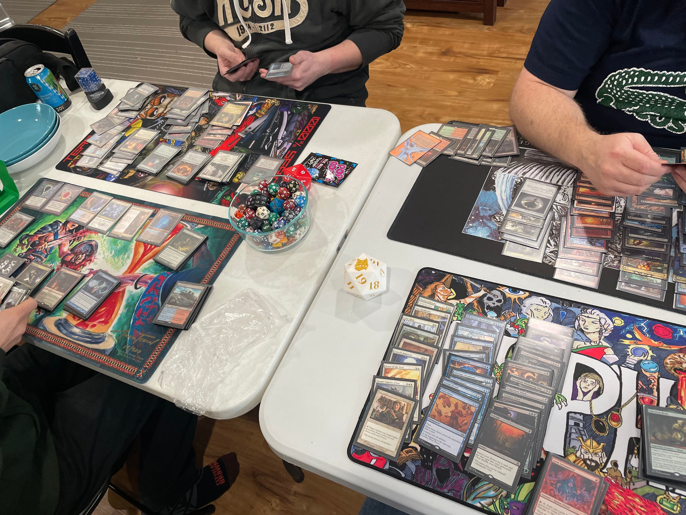
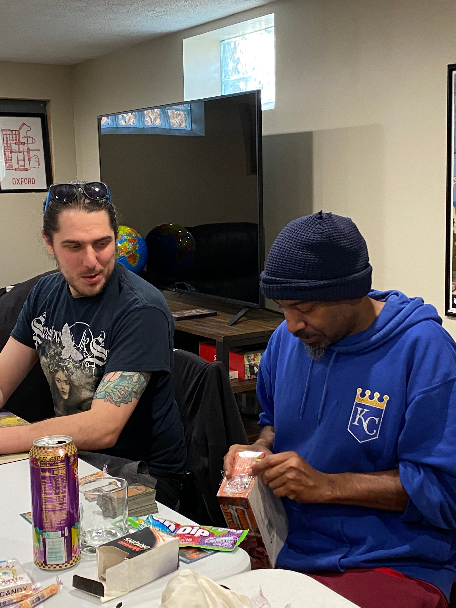
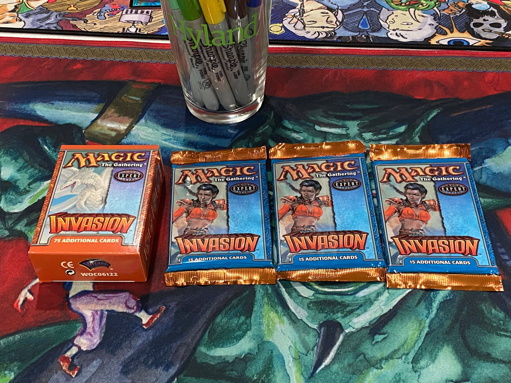
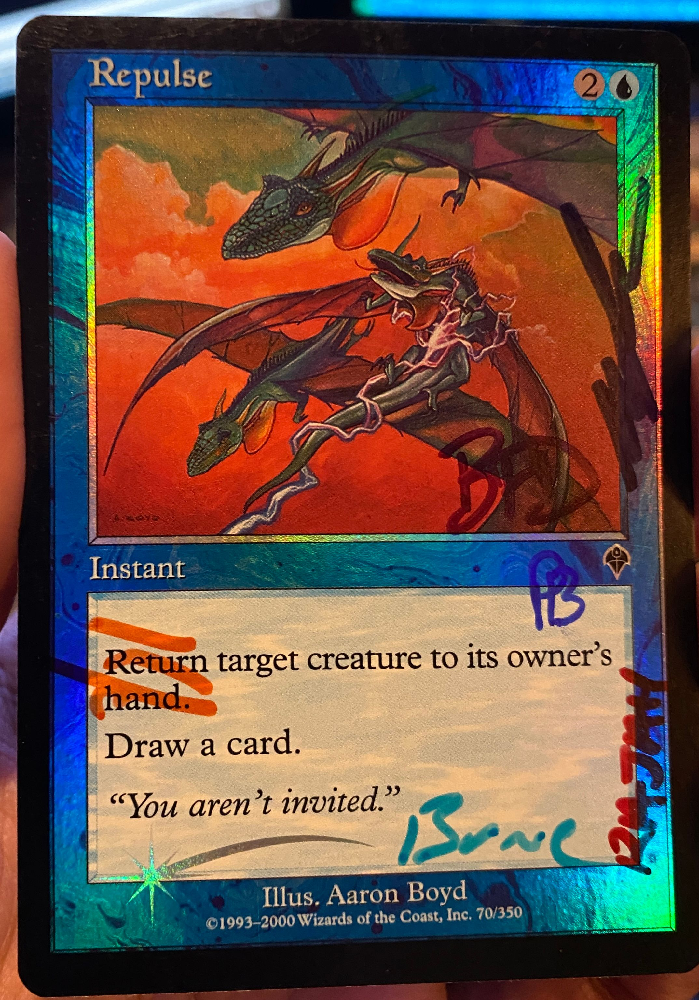
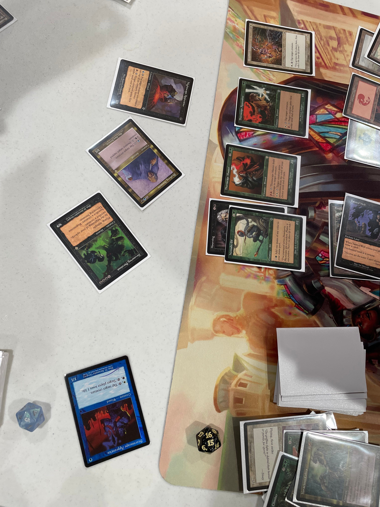
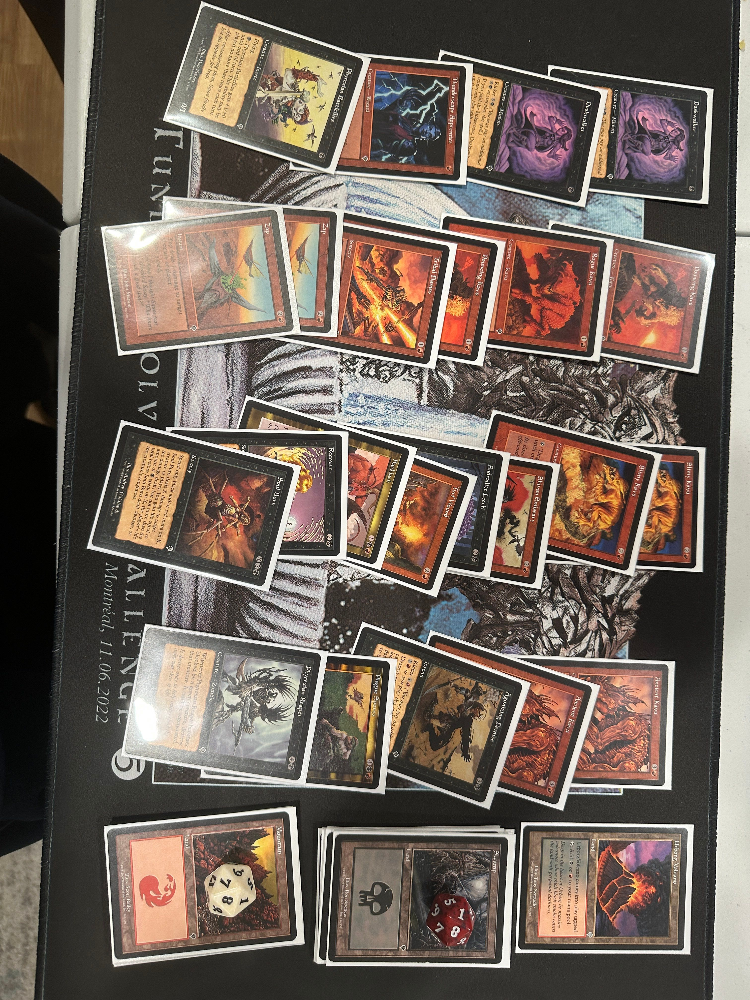
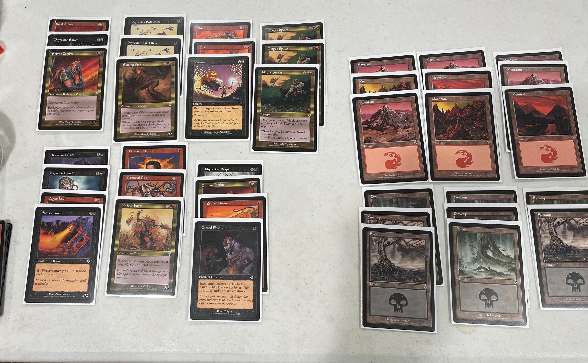
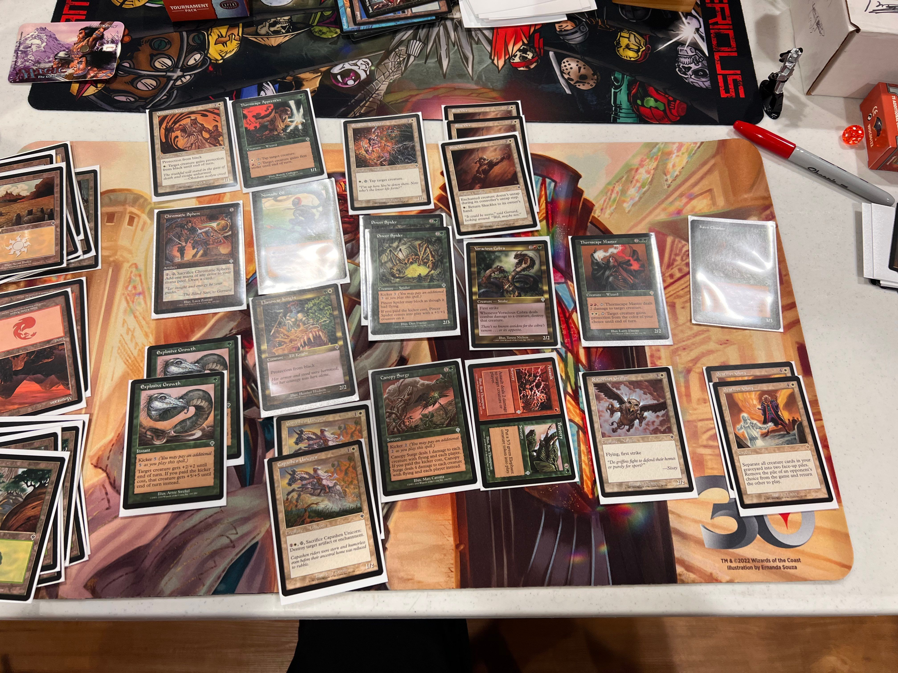

Did you know that a sealed Invasion box costs about $1100 as of 20 JAN 2023? Kyle Wells knows. 

And thus, he decided it was time to go back in time, and smell the cardboard from over 20 years ago. I was lucky enough to get an invite AND actually be able to attend. 8 Mages gathered to crack boosters and share memories.

Here's a quck writeup of how things went down.

## Venue and Pre-Game

Kyle hosted at his house and was well prepared with lots of provisions.

### snacks
{: width="90%"}

{: width="90%"}

### drinks

Kyle and his partner Katie were amazing hosts! I had several top notch cocktails.

{: width="50%"}

### Vintage Cube Draft

Before things got under way with the Draft, a few who got there early did some Vintage Cube 2-Headed Giant. Pretty cool!

{: width="50%"}

{: width="50%"}

## Cracking The Box

When it got down to it, Kyle gave new-comer Sean the chance to crack the seal, before Kyle dug in to the box to pass out the packs.

{: width="50%"}

{: width="50%"}

Kyle let folks kind of grab the packs that they wanted. I went for 3x Sisay of course. Hot packs! Kyle also went an extra mile and got everyone an awesome momento, a tournament box!

Paul brought prize cards for the group, but I didn't get a picture of them all together. Here's my Repulse:

{: width="50%"}

Here's Mike's Plains:

{: width="50%"}

## Draft and Play

Kyle used the Companion app to attempt to run the event. So the seating and first round pairings weren't exactly correct; I think I was supposed to play against Mike round 1. Companion is hard. 

{: width="50%"}

I got things moved over to the Arena Blogspot app and manually entered the round 1 results and got us going after that. 

After opening pack one, during maybe 3rd pick, someone questioned the ruleset we would use. I was happy that Kyle quickly answered, "Middle School rules", avoiding any discussion. But I think we were all inclined to play as such anyway. 

{: width="50%"}

I had Paul on my left and Kyle on my right. About half way through pack 2, I realized that Paul was sucking up all the Blue and probably a lot of the flyers. From our previous Middle School chaos drafts, I knew he was probably the guy to beat here, but I didn't know Sean or Loftis. Maybe they were ringers?

### Action

{: width="50%"}

{: width="50%"}

{: width="50%"}

{: width="50%"}

## Pairings and Standings

After 3 rounds of action, the undefeateds battled. Paul was playing an awesome UBW control pile with lots of counterspells and the limited bomb, Teferi's Moat. Loftis had a really cool pile of RGW that utilized Death or Glory to recur the creatures.

Paul 'basically cheated' (per Loftis), countering everything and anything possible and won in a commanding fashion.

{: width="50%"}
{: width="50%"}

I brought up the rear of the 6 pointers, but the games I had were amazing! NotDomain.dec was super fun to pilot. Highlight I think was Game 3 of Round 3 vs. Brne. Utilzing Elfhame Sancturay, I was able to get all five basics in play and win with my Tower Drake buffed by Strength of Unity! Insane plays.

While our illustrious host Kyle was not able to come away with many Ws, we were all able to learn from the wisdom of his son: "You should drink some milk because milk goes great with failure” 😵

## Decks

biagio

brne

kyle

loftis

paul

mike

rajah

sean

## ETC

I drafted a pretty fun NotDomain deck and got both of these Dismantaling Blows from different packs, but same box! Crazy variation.

