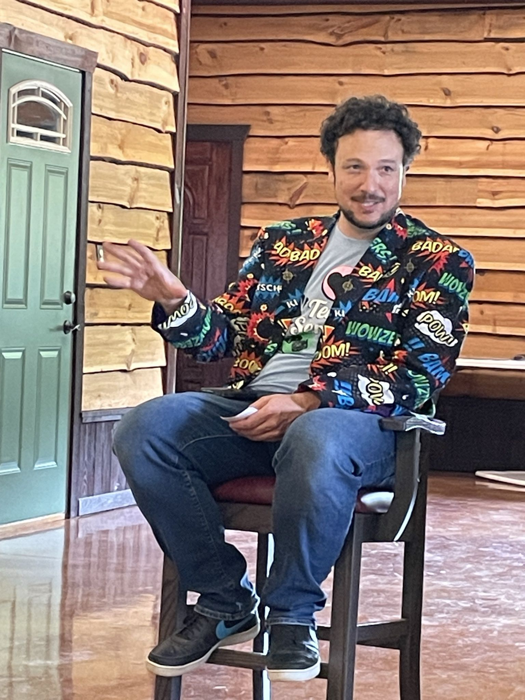
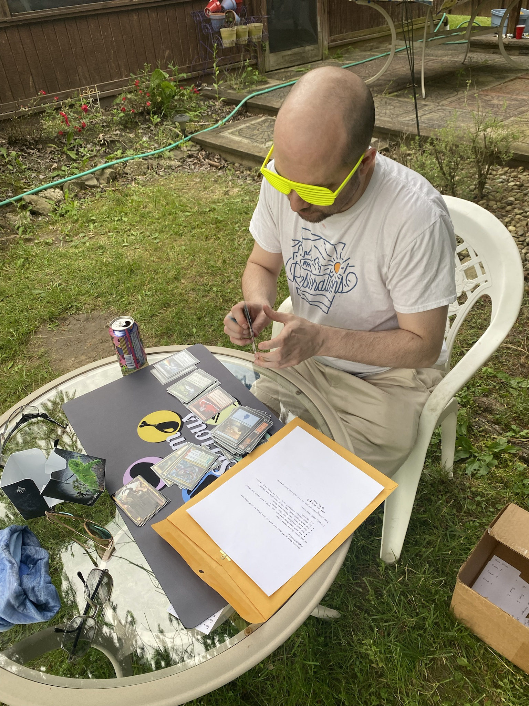
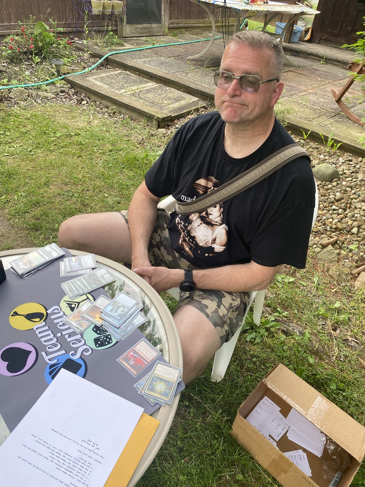
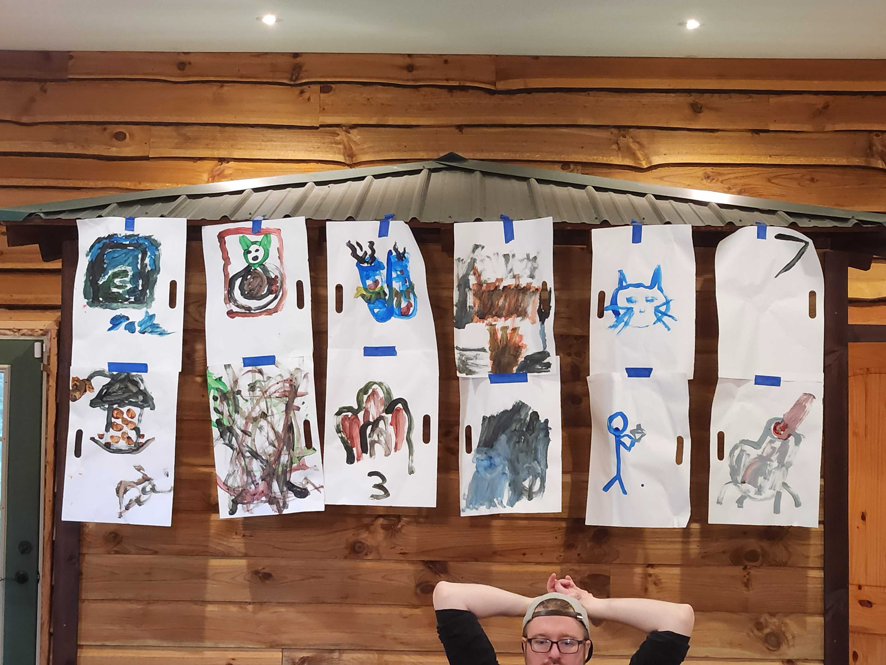
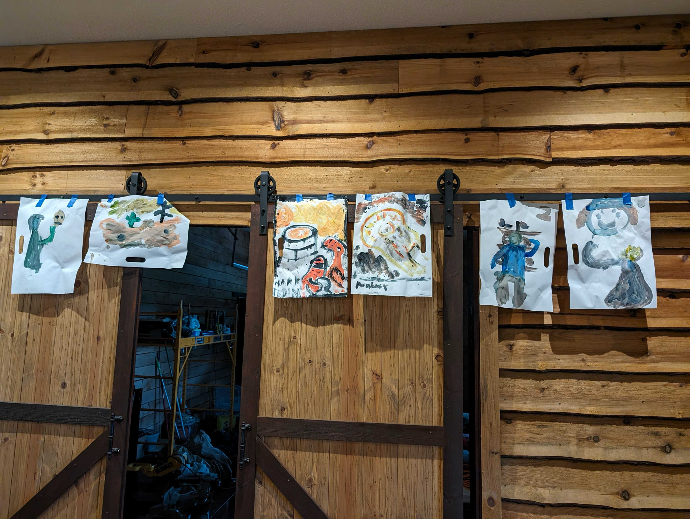
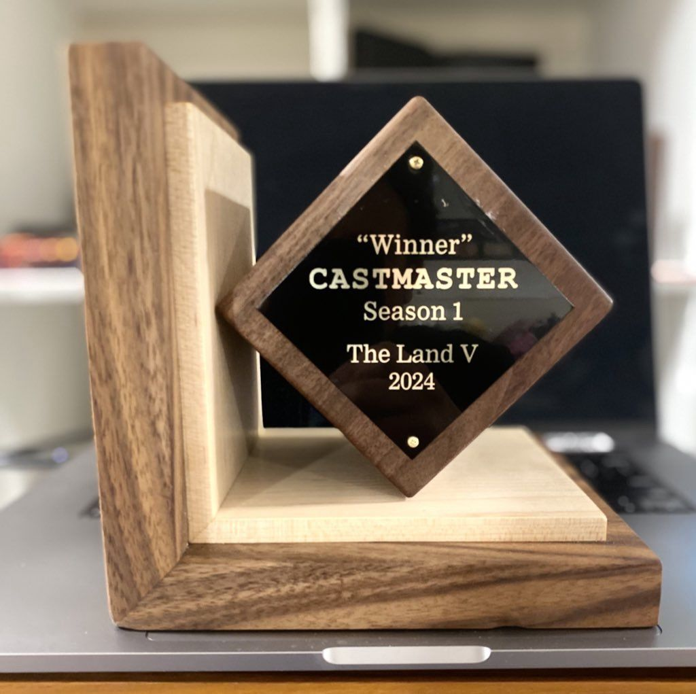

Every night after the kids are in bed I do the dishes. I like doing the dishes. It’s meditative in a way, and I can stand there and watch TV or movies on my phone, which I set on the sash of the window over the sink. It’s one of the few times that I have to watch programs that I’m interested in, so I tend to be selective. Recently, over the past year or more, I’ve been obsessed with the U.K. gameshow Taskmaster. There are now 17 complete seasons of the British version on YouTube as well as several seasons from Australia, New Zealand, Denmark, Sweden, and other countries.

The way the show works in brief is that five comedians are given “tasks” by the Taskmaster, who is the show’s host, emcee, and scorer. The Taskmaster’s assistant, who actually runs contestants through the tasks, is the cohost. Tasks are challenges in a wide range: physical and mental, sometimes trivial, sometimes grand scale, individual and team. There are some general categories, but ultimately anything is possible. Watching contestants struggle (or succeed!) at these tasks is interesting. The game encourages lateral thinking over brute force, and players are frequently rewarded for creativity, or at least recognized when it doesn’t work out. It’s great watching how different people approach problems, and then considering how you would approach the same problem yourself.

I recommend it highly. If you’re interested, pick a season and watch it. You might find one with a comedian you enjoy. Offhand, I’ll recommend U.K. Season 16 as a collection of creative, hilarious, and frequently unhinged comics. Really any season is good.

Anyway, standing at the kitchen sink last November, thinking about Taskmaster, I had the idea that it would be fun to run a similar event for Magic players. Then I had the idea that the Land, a Vintage tournament weekend hosted by Rajah James in eastern Ohio, would be a great venue: enough players, enough space, enough time, etc. So I started brainstorming tasks. In a couple days I had a doc with nearly 30 ideas, some simple and some grandiose. I started chatting with Rajah about the idea and asked Taskmaster fan and non-playing The Land attendee Jerry Yang if he wanted to help run things.

Usually at these events I run trivia, which involves making up 50 to 100 questions and putting together a slideshow to have some stuff on screen. This was going to be a lot more work. The setup was longer, more complicated, and more expensive. I do it because I love you.

I called it Castmaster. Things were in motion.

### The Tasks

The structure of each episode of Taskmaster is similar: there are five tasks upon which the five contestants are scored out of five points, and there’s a winner at the end. Points are also tallied to give a season winner, who receives a gold bust of the host as a trophy.

Castmaster would have more time for tasks but would otherwise be similar. To get more people involved without increasing the load on scoring or on individual players trying to squeeze in tasks between rounds, I set things up for teams of two but with more tasks.

#### Task 1 – The Prize Task

Each episode of Taskmaster opens with a “prize task” where contestants bring in an item to meet some criteria, and the episode’s eventual winner gets to take home all the items as a prize. Castmaster was the same except I didn’t want people to worry about bringing in something valuable that could get lost either to another player or just in the bustle of the day. So no one else was going to keep these cards.

The directive given was “Bring me the card that I (the Taskmaster) least want to play.”

The simple interpretation of course was some Magic: The Gathering card that is very bad or very ugly or outdated or worn or whatever. Lots of submissions were perfectly mediocre cards, in either foil or nonfoil, depending on whether players thought I preferred or didn’t prefer that treatment. Justin Genari and Dan Nelson brought in a first-birthday greeting card which was creative and good for third place. Josh Chapple and Paul Blakeley presented a Little Girl, which is such a bizarre card, certainly uncomfortable in many Magic gameplay situations. That got second. And Steven McGrew and Angelo Kortyka won the task with a Fourth Edition Tempest Efreet, which had a lot going for it. It’s an ante card, so banned in most formats; it’s white bordered, which is an unpopular aesthetic choice; and they had altered it to have a veiny, hairy phallus on it, which is an even less popular aesthetic choice. An easy win.

The altered Tempest Efreet was a strong brute-force solution, and the birthday card was good outside-the-box thinking. The refrain on Taskmaster is that “All the information is on the task” for what rules need to be followed, and nothing said it had to be a Magic card. My thinking beforehand was that I wanted someone to bring in some wildly rare and valuable card. I very much don’t want to play (or be responsible for) an Alpha Black Lotus, for example, especially not someone else’s Alpha Black Lotus.

I would run a similar task again. I liked the Magic theme and would anticipate more varied answers to that type of task in the future as players get the idea of Castmaster.

### Task 2 – The Name Task

This was actually the first task, but it was developed later. When I initially said I was going to do two-player teams and they would have team names, Rajah requested that I encourage podcast-friendly team names so that things could be discussed on the Full Warning podcast about The Land. Sure, I’ll just make that part of the show.

“Create a team name that my grandmother would approve of.”

This was entirely subjective. Lots of tasks are subjective, but this one is entirely. When Rajah filled out the signup sheet as a test, his answer was “Milk and Cookies,” which is pretty good and probably would have gotten top placement among the other submissions. I scored these and ended up giving higher placements to names that had obviously not-Magic-related names.

“Carefree Tribal” (Eric Caffrey and Matt Treible) got highest marks for being both fun loving and possibly mildly racist in a way grandma would probably accept. “Sunny Day Overgrown Estate” and “Ann Arbor TSI Planning Committee” also got high marks because grandma likes gardening and has a friend named Ann. “The Charbelchers,” “Music City Ballers,” and “The Metal Fingered Villains” got dinged because they’re potentially rude or sexual or both.

I would do something like this again, with the similar goal of encouraging “clean” team names, without explicitly (hah) excluding offensive names. Why not? “What would a class of preschoolers call your team?” “What name would your middle-school football coach call your team?” “If your team were a Magic: The Gathering card, what would it be?”

Overall I was hoping for more creative names that fit the Magic theme rather than names that felt like they were what the team would have come up with anyway, but they were OK. Glad to avoid the typical pub-quiz team names like Tyrannosaurus Sex and so on.

### Task 3 – Get the Point

I liked this task quite a bit, though I feel there’s a lot of tweaking to do before it’s final. Here’s the gist: there are a bunch of Get the Point cards hidden around The Land. Each one is worth a point! There are also some Tandem Takedown cards and You’ve Been Caught Stealing cards hidden that allow you to steal or block steals. And there’s a Sphere of Safety that protects you from all stealing cards.

Overall this was cool, I think. I would hide more cards, and just have them be the points rather than doing and coordinating and scoring all the other stuff. As it was, I made up the scoring rules on the fly, rather than having things figured out beforehand, and they didn’t end up making a difference anyway. One team, the “BAOM! Squad” (anyway half a team—Paul Blakeley), found the bulk of the cards and was essentially untouchable. That team (still mostly Paul) actually did the seek-and-find part of the game. Other teams just collected what they naturally found, without putting in much additional effort.

Secretly I hoped that someone would ask me for the three cards I used in my instructional speech at the beginning of the day, which I put in my pocket afterward. Free points left on the table. I was glad to find out that two of the teams had “an alliance” on the stealing part at the end. Not sure how that worked out.

The reason I’d run this again was because it was plain fun to hide the cards around. Where are people likely to look? Where are people unlikely to look? Hiding was meant to be somewhere between “fun” and “challenging”, without getting too far toward “obvious” or “impossible.” The stealing and blocking ultimately were too challenging to track and score, but maybe there’s a more fulfilling scheme for everyone. It helps to know how this task went for subsequent tasks.

One of my favorite parts of the task was after the event, when I walked around and found another four or five cards that were missed. I gave them to Paul.

### Task 4 – Sort of a Task

I intended tasks 4, 5, and 6 to take place between tournament rounds. For each team, one player would do task 4, one player would do task 5, and the combined team would do task 6. Essentially each player would do two out of three tasks. This was to help relieve the Castmaster task-runners and not take up all of everyone’s time.

Anyway, the directive:

    Shuffle this draft deck and sort it into piles by card color and alphabetically.

    As you sort, follow these rules:
    For each legendary creature, say “Save a kill spell for this.”
    For each artifact, say “Ooh, shiny.”
    For each land, say “Never been there.”
    For each signed card, say “These Ohio guys are idiots.”
    For each special treatment (e.g. foil) or frame (e.g. retro), say “No way!”

    Fastest, best sort wins.

    Time starts and you may pick up your deck when you put on your selected best eyewear.

So Task 4 was to sort a draft deck from one of our earlier Team Serious chaos drafts and do some additional stuff. The deck was pretty usual, had examples of everything. I’d say the trick is that one of the signed cards was pretty hidden, with one signature that blends in with the art a bit. And the “special treatment” is a little hard to determine, based on wording.

The “selected best eyewear” was from the online registration sheet. Options were safety goggles, ladies aviators, retro-style shades, old-man glasses, and “blindfold (don’t pick this one).” Eyewear was meant to be a hindrance but not preventative, except for blindfold. One team picked blindfold, and I warned them.

I recorded these on my phone and did checkmarks for each rule category. I then compared this to the decklist on record, so if you said “Never been there” 20 times out of 22 lands in the deck, you missed two ticks. Most teams did pretty well on the checkmarks and most times were between 3 and 4 minutes, so ultimately scoring was objective on timing and then a little subjective on checkmark accuracy. I didn’t scour the video to check things 100%. The team that picked blindfold was middling on time but was terrible on accuracy, for example. One team, “The Charbelchers” (perhaps unexpectedly), spent a lot of extra time to be very accurate.

In the end, “The Mental Misteppers’” Dan Nelson did very well. He was both very accurate and very fast. Like, standout above all the rest—an easy 10 points. Others mostly got graded on time with a few misses.

<video controls src="../assets/images/2024/06/08/8-n4xc8Fk.mp4" title="Sort Video"></video>

I liked this task, but scores felt muddy in the middle. Thank goodness there were some obvious outliers, and the average teams were all average and I could just score based on time. I thought this was fun. I wish eyewear had been more of a factor, but it was fun anyway.

### Task 5 – Hydrate

I had high hopes for this task. It was interesting and fun to set up and it just didn’t pan out how I wanted.

    Put these cups of LaCroix-brand sparkling water in order. The odd one out should be last.

    You have 6 minutes.

    Your time starts now.

As I explained when presenting the scoring (and which no one got during the actual task), the LaCroix flavors aligned with Magic: The Gathering colors, with one extra. The order should have been white, blue, black, red, green, tangerine. Coconut is white; plain is blue (because of the can); black razzberry is black, watermelon is red, lime is green, and tangerine is orange, which is not a Magic color.

Long story short, no one got the theme, and very few teams got more than two or three of the flavors by name anyway. The one team that potentially got closest named everything backward but just followed how the moderator laid things out and basically lucked into it.

Try it yourself. It took me forever to find the different flavors of LaCroix, and I had to pivot to watermelon from cherry for red, because they stopped making cherry. My expectation was that, once a player got to “Oh, I’m playing Castmaster, these are Magic colors” it would be fairly easy. Coconut, lime, and tangerine would be obvious, and from there watermelon. With two blanks, and a little outside knowledge, plain and black razzberry would be easy to fill in.

But players never got to the “Magic colors” step and put things in order as they thought. I gave points based on identifying flavors and getting flavors near to where they should be on the usual Magic ordering. The highest was for three matches, but I gave only 7 points. Two matches generally got 5 points. One match got 3.

The eating and drinking tasks on Taskmaster are some of my favorites, and trying to recreate them just didn’t work out. In the end, I have mixed feelings about this attempt. It was a cool idea that just did not pan out in any way. I would have felt so much better if someone—anyone!—had said, “Oh, this is WUBRG!” and tried to order based on that.

I’d try this again but somehow make it more obvious? Differentiate between the flavors more? I don’t know. Maybe next year? Maybe next next year.

### Task 6 – Paint Your Combo

This was my favorite task of the day, and I think everyone else enjoyed it too. On the signup sheet, teams were asked to declare their favorite two-card Magic: The Gathering combo. And then:

    With your teammate, paint your declared favorite Magic: The Gathering two-card combo. Each of you must paint half of the combo using the materials provided.

    You may not separate the brushes from one another or from their linking rod.

    Finest pair of paintings wins.

    You have 7 minutes. Your time starts now.

<video controls src="../assets/images/2024/06/08/5-wyoZN7z.mp4" title="Jimmy and JR Paint"></video>

Players were offered a selection of poster paint colors and a paper-plate mixing palette to work with, but the two brushes were attached to one another by a 4-foot dowel. Teams could try to paint simultaneously or paint one half, then the other half. All the information is in the task. They were not offered rinsing water. Initially they were given 9 minutes, but after the first three teams didn’t even approach the time, I shortened it to 7 to increase the pressure slightly.

Really, one reason for this event was to give everyone a potential souvenir to take home, a memento of The Land and of the Castmaster experience.

I very much enjoyed how this played out. The “finest pair” language helped make the scoring subjective. It wasn’t just about accuracy to the actual Magic: The Gathering depictions of the arts, but rather the artistry present in the paintings themselves. And if one painting was good and the other simple, that counted against a team.

The “Ann Arbor TSI Planning Committee” of Duane Haddix and Kevin Poenisch did well, even with the abstract concept of “Mishra’s Workshops and Artifacts.” They did an accurate and artistic presentation of both Mishra’s Workshop and Smokestack. Other teams that approached accurate and artistic scored highly, and scores declined as teams (subjectively) met one or the other requirement.

Great to watch teams work together and lovely to hang up all the paintings as an art gallery as they were completed.

### Task 7 – Weigh Your Chances

I also liked how this one played out, but I wish it hadn’t fed into such a downer. Spoiler alert.

    Reach under the sheet into the box and create a stack of Magic: The Gathering cards that weighs closest in ounces to your team’s declared favorite number.

Teams had declared their favorite numbers on the signup spreadsheet. The objective with the sheet was to hide how big the stack of cards was, but I ended up running things together and people holding the cards in their hands was obfuscation enough, so we didn’t use the sheet. This task ended up being pretty fun. I’d do something like it again, except that I think a lot of players got the idea, and I’d worry about it being too easy.

Basically one pack of cards is approximately one ounce. It’s close anyway. Extrapolate from there. The “declared favorite number” was picked for each team on the signup sheet, so players just had to figure out how many packs or so for their selection.

Some teams were closer than others, but this one was able to be scored objectively. How close were you to selected ounces by your actual ounces? There was a kitchen scale involved. With some practice, I was able to get these kind of picks to within one or two cards pretty easily, but it’s a different story on the fly, without the foreknowledge or practice. Some teams did very well. One team did very poorly. Other teams were medium to all over the place.

I would love to run this task again. It’s essentially trivia, but with the strong twist in that no one really knows how much an ounce is or how many Magic cards comprise one ounce.

### Task 8 – In the Bin

This ended up being much more of a challenge than I expected. I went to a college where beer pong was the drinking sport of choice, and I thought this would be fairly easy. But I didn’t try it myself. What do I know?

The idea for this came from my friend and Castmaster participant Josh Chapple, who once (two decades ago) had a Stasis deck with no win condition. I remember another friend, Steve, playing against said deck and asking, “Hey, how do you kill me?” And Josh replied, “You just concede,” and then Steve threw the deck toward a nearby open trash can. Anyway.

    Stand on the mark on the floor that matches your team’s declared least favorite number and throw the stack of cards provided by your team’s first player into the target receptacle.

[In the Bin, In the Dark](../assets/images/2024/06/08/3-PFfWXYE.png)

Greatest percentage of cards in the receptacle wins.

Putting it nicely, nobody did particularly well.  It was a largeish plastic beach bucket

I had thought about getting a pail that said “Trash Bucket” but opted for a simple (and cheaper) beach-bucket-with-shovel that I could use for my kids instead. A couple of blobs of cards made it mostly, but this task really surprised me in how difficult it was, even as some teams put their cards into a deckbox or wrapped them with rubber bands. I expected people would use similar tactics and that, ultimately, more cards would make it into the bin.

Maybe I’d try something similar again with a bigger bin or better backboard, maybe a different twist. As it was, it was very all-or-nothing, mostly nothing. A lot of zeroes were given out.

## In the End

Ultimately the winners of the first task were the winners of the day. Many congratulations to Steven McGrew and Angelo Kortyka, “The Gorilla Shamen,” who went home with a pair of engraved bookends handmade by Jon Hammack. Beyond the prize task, Steven and Angelo put in strong performances in deck sorting and card weighing, and being above average in many tasks carried them a long way.

In a retrospective spirit, I would certainly run Castmaster again. As I mentioned, I started with a list of 30 prospective tasks and still have a lot in the arsenal for next year.

Afterward, I was talking about what went well and what could be improved with Jerry Yang and Andy “Brass Man” Probasco, who helped setup and run tasks, and we came up with some good ideas. A lot of the structure was good, and contestants seemed to have fun with the different tasks, even when some were inane or baffling. The Land was a perfect venue for Castmaster as a loosely orchestrated all-day event with lots of room to spread people out and set up different tasks, and the Magic theming seemed to work well.

The thing that’s lost from the Taskmaster model is being able to show off everyone’s successes or failures. Taskmaster itself benefits from an entire video production staff and several weeks of filming. The Castmaster prize task and team-name task were fine and could have done with a little more pre-work to write up a fuller skit for scoring. And while the card weighing task was fun (if unexciting), the Get the Point task and card tossing task both needed some tuning to make into spectator events at the end. The combo-painting team task was great as it allowed for teams to see what others were doing, and I got video of most of them doing it. I also have videos from the card sorting task. But I’m very aware (now finishing the written report a month later) that I won’t have time to do anything with videos myself for some time.

So potential ideas to get a bigger audience for other peoples’ tasks: Spread things out and allow more teams to do things online where they can be recorded more easily, then edit video together. There are challenges there of what a person can do at a desk and still be interesting, but maybe that can be one event out of many and have some edited video component. Or do more head-to-head(-to-head-to-head etc.) challenges in front of a live audience, possibly abandoning the multiple-task scoring and doing smaller individual prizes.

Some of this is my thinking out loud (OK, in writing), but I’m also saying you could probably do something similar if you were so inclined and there are good options for making it fit your time and space. If you do, please feel free to reach out and let me know. I’d love to hear about it.

Thanks again to Rajah James and everyone else who helps for hosting The Land. Thanks to Jon Hammack for making the bookends as prizes. I was jealous to give those away. Thanks to Jerry and Brass Man for helping me setup and run events. There’s no way I could have done it without help. And thanks, of course, to all the teams and all the players who participated and were the guinea pigs for the first season of Castmaster.
