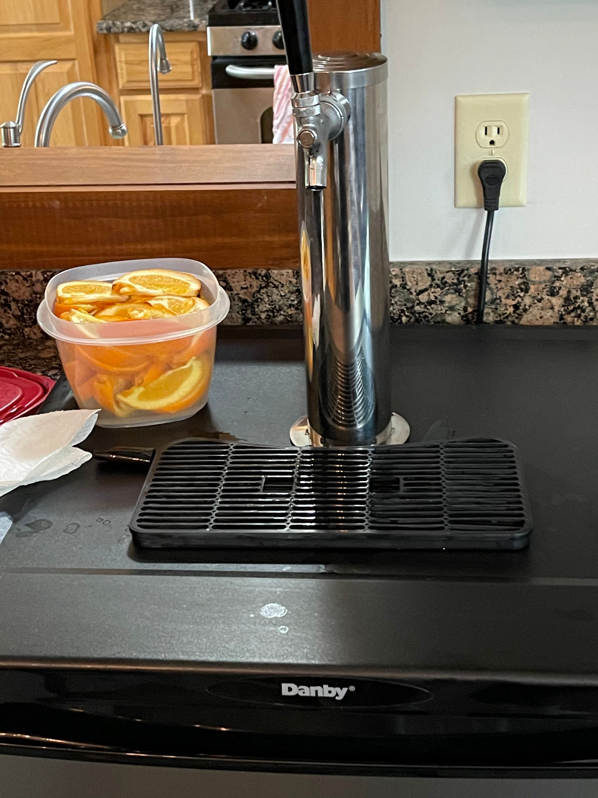
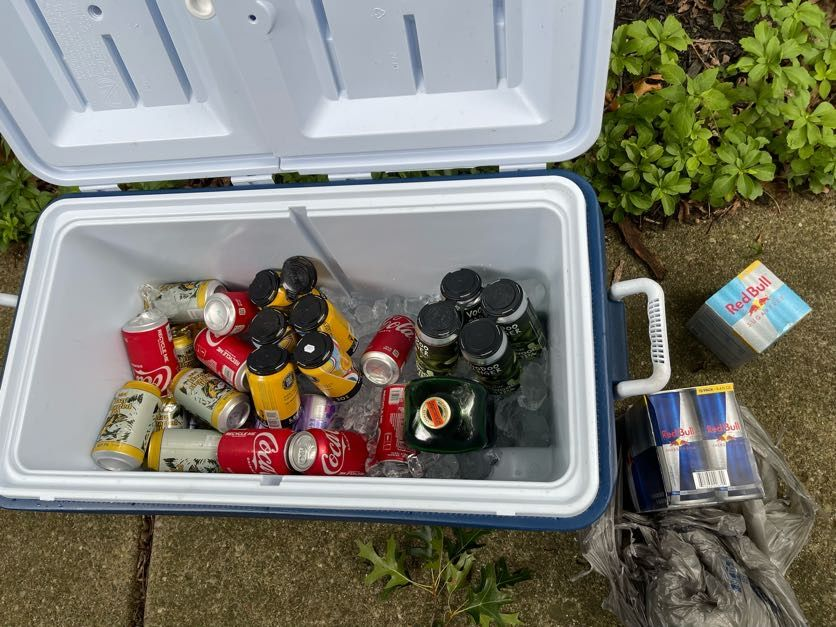
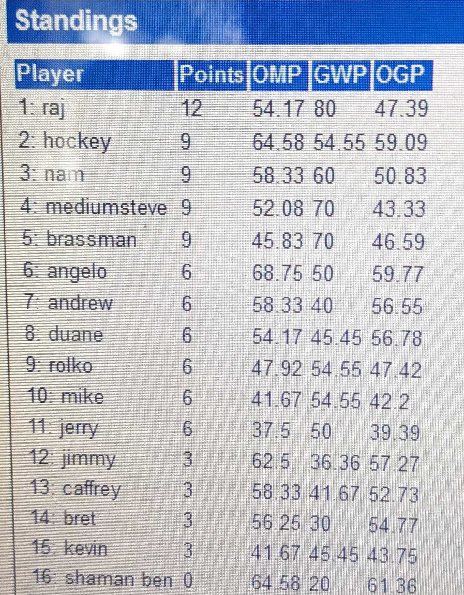

16 mages gathered to battle Vintage and celebrate the new house of friend and teammate Kevin Poesnich. What went down in the Vexing Bauble era?

## Food and Drink

As the name implies, we were treated to on-tap [Oberon](https://bellsbeer.com/beers/oberon-ale/) with a great supply of sliced oranges. An additional auxillary cooler was filled with other beverages.

{: width="50%"}

{: width="50%"}

After round 1, [Zingerman's Deli](https://www.zingermansdeli.com/) was provided for lunch. You really can taste difference.

## Vintage

### Meta Game

Blue / Blue Combo (6):

- Oath (3) - Rajah, Bret, Jimmy
- Jewel Shops - Jerry
- Lurrus - Andy
- UW Kitten Mage - Hockey

Bazaar (2):
- Hogaak - Mike O.
- Dredge - Kevin

Workshops: (4)
- KCI - Steven
- Null Rod Shops (2) - Duane, Nam
- Fleshraker / Smelting Vat - Angelo

Combo: (1)
- Doomsday - Rolko

Misc: (3)
- GR Hate - Caffrey
- Classic Mono Black Null Rod - Shaman Ben
- Classic Food Chain Goblins - Andrew

Players brought a large diversity of decks, with Oath being the most played archetype. Notably absent from the field was the Mono-White Initiative menace. Having taken several years break from Vintage proper, Shaman Ben returned to the TSI fray with a flourish! He brought Mono-Black Classic, a format that only plays cards legal up to Scourge, while Brother Andrew decided to compete with his Classic Food Chain goblins. Further spice was brought by TSI: The Land 5 champion Eric Caffrey, choosing to battle with Bloodbraid Elves in addition to his Null Rods, Blood Moons and Moon Mages.

And while Ben didn't win any matches, I know he did claim the elusive Vintage achievement of killing someone with a Nantuko Shade in 2024 Vintage. Eric also got on the board with an aggro achievement, winning at least one game off the back of his Bloodbraid elf.

### Standings

After 4 rounds of Swiss, the standings were as follows:

{: width="50%"}

### Top 4

The Top 4 after Swiss:

1. Rajah - Kegerator Oath
1. Hockey - UW Kitten Mage
1. Nam - Montolio Shops
1. Steven - KCI

#### Semi 1

Rajah vs. Steven - Rajah wins in 3.

#### Semi 2

Hockey vs. Nam - Hockey wins in 3.

#### Finals

Rajah vs. Hockey - Hockey Wins in 3!

### Top 4 Decklists

#### *Rajah James - Kegerator Oath* - 1st after Swiss

{: width="200px" }

    1 Ancestral Recall
    4 Atraxa, Grand Unifier
    1 Black Lotus
    2 Boseiju, Who Endures
    1 Brainstorm
    1 Demonic Tutor
    1 Flash
    4 Forbidden Orchard
    1 Force of Negation
    4 Force of Will
    1 Gaea's Blessing
    1 Gitaxian Probe
    2 Into the Flood Maw
    1 Mana Crypt
    1 Mental Misstep
    1 Misty Rainforest
    1 Mox Emerald
    1 Mox Jet
    1 Mox Pearl
    1 Mox Ruby
    1 Mox Sapphire
    4 Oath of Druids
    2 Oko, Thief of Crowns
    1 Polluted Delta
    4 Show and Tell
    1 Snow-Covered Island
    1 Strip Mine
    1 Time Walk
    3 Tropical Island
    3 Underground Sea
    4 Vexing Bauble
    1 Null Rod
    1 Scalding Tarn
    1 Flooded Strand
    1 Spell Pierce

    1 Flusterstorm
    1 Force of Negation
    4 Leyline of the Void
    1 Mindbreak Trap
    2 Nature's Claim
    3 Null Rod
    2 Energy Flux
    1 Into the Flood Maw

----

#### *Bryan Hockey - UW Kitten Mage* - 2nd After Swiss

{: width="200px"}

    4 Flooded Strand
    1 Scalding Tarn
    1 Tolarian Academy
    4 Urza's Saga
    1 Plains
    1 Island
    4 Tundra
    1 Pithing Needle
    1 Portable Hole
    2 The One Ring
    1 Saheeli, Sublime Artificer
    1 Narset, Parter of Veils
    4 Teferi, Time Raveler
    4 Force of Will
    1 Ancestral Recall
    1 Time Walk
    1 Tinker
    1 Bolas's Citadel
    3 Displacer Kitten
    2 Trinket Mage
    1 Thundertrap Trainer
    1 Mox Emerald
    1 Mox Ruby
    1 Mox Sapphire
    1 Mox Jet
    1 Mox Pearl
    1 Sol Ring
    1 Mana Crypt
    1 Mana Vault
    1 Black Lotus
    2 Sensei's Divining Top
    1 Brainstorm
    1 Gitaxian Probe
    1 Mental Misstep
    2 Spell Pierce
    1 Force of Negation
    1 Karn, the Great Creator
    1 Manifold Key
    1 Time Vault

    2 Swords to Plowshares
    2 Steel Sabotage
    1 Flusterstorm
    1 Containment Priest
    1 Sphinx of the Steel Wind
    1 Portal to Phyrexia
    1 Mystical Tutor
    1 Pithing Needle
    1 Tormod's Crypt
    1 Lotus Petal
    1 Soul-Guide Lantern
    1 Hurkyl's Recall
    1 Hullbreacher

----

#### *Nam Tran - Null Rod Aggro Shops* - 3rd after Swiss

{: width="200px"}

    4 Phyrexian Metamorph
    4 Patchwork Automaton
    4 Phyrexian Revoker
    3 Stonecoil Serpent
    1 Lodestone Golem
    1 Thorn of Amethyst
    1 Trinisphere
    1 Mox Pearl
    1 Mox Ruby
    1 Mox Jet
    1 Mox Emerald
    4 Sphere of Resistance
    1 Mox Sapphire
    2 Null Rod
    4 Nettlecyst
    2 Crucible of Worlds
    1 Pithing Needle
    1 Chalice of the Void
    1 Sol Ring
    1 Black Lotus
    2 Vexing Bauble
    1 Mana Crypt
    4 Urza's Saga
    4 Wasteland
    4 Ancient Tomb
    1 Tolarian Academy
    4 Mishra's Workshop
    1 Strip Mine

    3 Mindbreak Trap
    2 Soul-Guide Lantern
    3 Grafdigger's Cage
    2 Dismember
    2 Null Rod
    2 Disruptor Flute
    1 Vexing Bauble

----

#### *Steven McGrew - KCI* - 4th after Swiss

{: width="200px"}

    4 Patchwork Automaton
    4 Glaring Fleshraker
    4 Scrap Trawler
    4 Sensei's Divining Top
    4 Vexing Bauble
    4 Ichor Wellspring
    4 Krark-Clan Ironworks
    4 The One Ring
    1 Black Lotus
    1 Mana Crypt
    1 Mox Pearl
    1 Mox Sapphire
    1 Mox Jet
    1 Mox Ruby
    1 Mox Emerald
    1 Sol Ring
    1 Mana Vault
    1 Manifold Key
    1 Time Vault
    1 Trinisphere
    1 Karn, the Great Creator
    4 Mishra's Workshop
    4 Ancient Tomb
    4 Urza's Saga
    1 Tolarian Academy
    1 Strip Mine
    1 Mystic Forge

    4 Wasteland
    2 Dismember
    2 Argentum Masticore
    1 Pithing Needle
    1 Grafdigger's Cage
    1 Defense Grid
    1 Ensnaring Bridge
    1 Crucible of Worlds
    1 Wurmcoil Engine
    1 Mycosynth Lattice

----

### Thanks and Shout Outs

Shout out to Kevin for hosting! Duane for making sure the Top 4 was played clean (or as clean as possible). Jimmy for being the master of the pour. Jerry for driving back to Cleveland. Kevin again for the Oberon. Thanks to all attendees that make Team Serious Invitationals the best Vintage Magic events around!

### Pictures

