Eric Caffrey hosted a Middle School format Team Serious Open! Held at SuperScript in Lakewood, OH, the event was a Thanksgiving theme, with all the fixings! 8 Serious Mages gathered to sling old spells and break bread together.

## Flyers

THE Kyle Wells pitched in with a flyer for the event. His wife Katie thought his sucked, so she made us a nicer one. Thanks Katie! Thanks Kyle!

*THE Kyle Flyer*
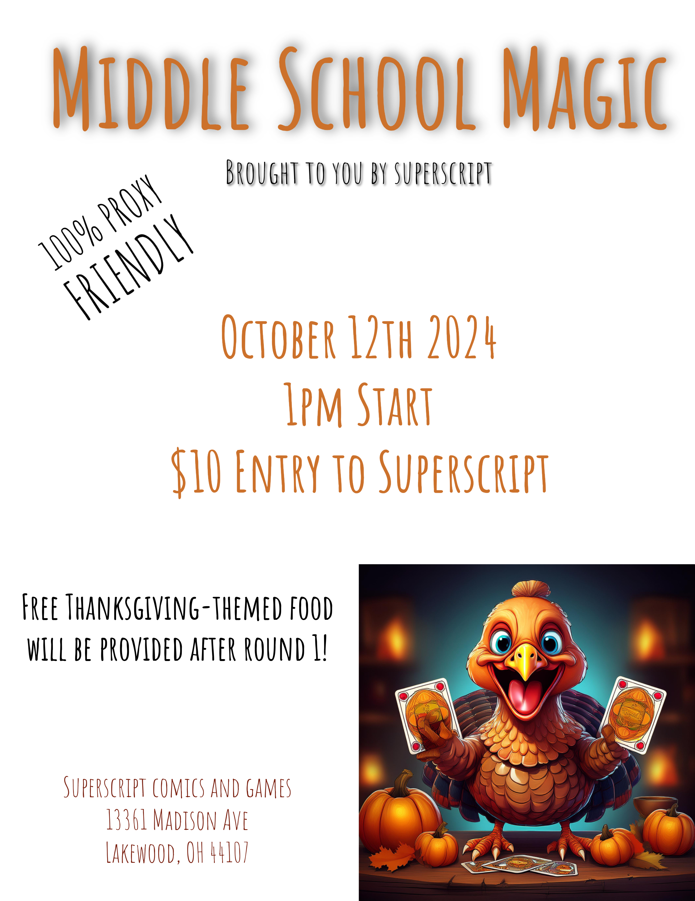{: width="80%"}

*THE Katie Flyer*
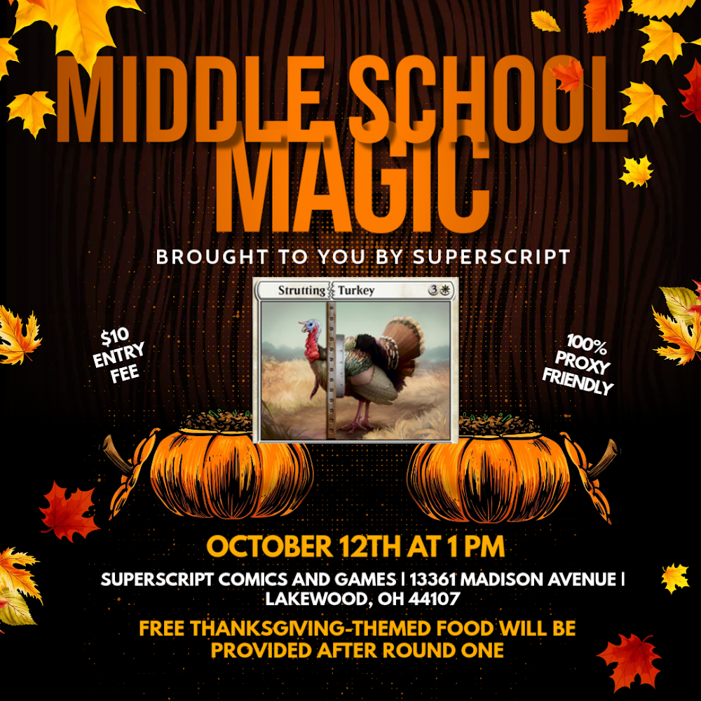{: width="80%"}

## Metagame

There was a diverse field of decks chosen for battle this day.

- Dream Halls
- Burn
- Sligh
- Mono Black Sui
- Dragon
- 5c Negator Zoo
- UG Survival Madness
- Dragonstorm

## Prizes

Eric put together some killer prizes, not just for the winner, but also for last place and most creative.

*First Place Prize*
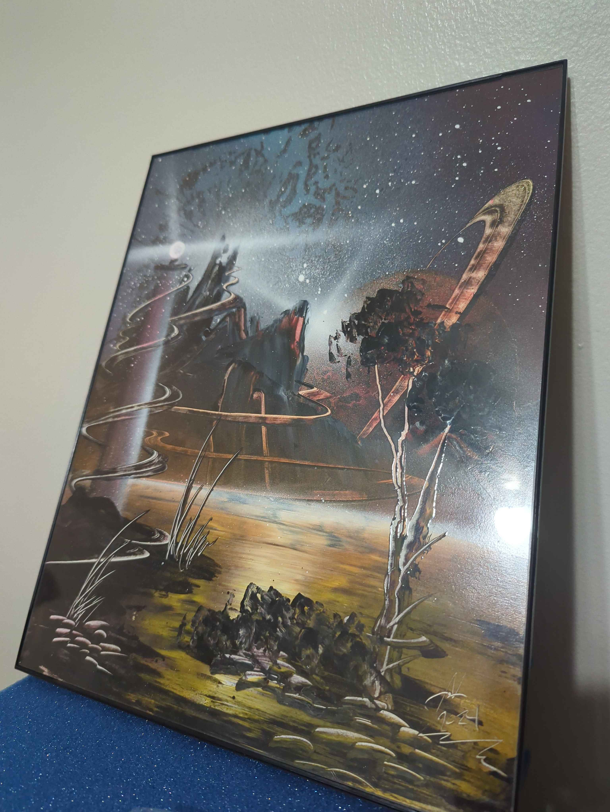{: width="50%"}

*Last Place Prize*
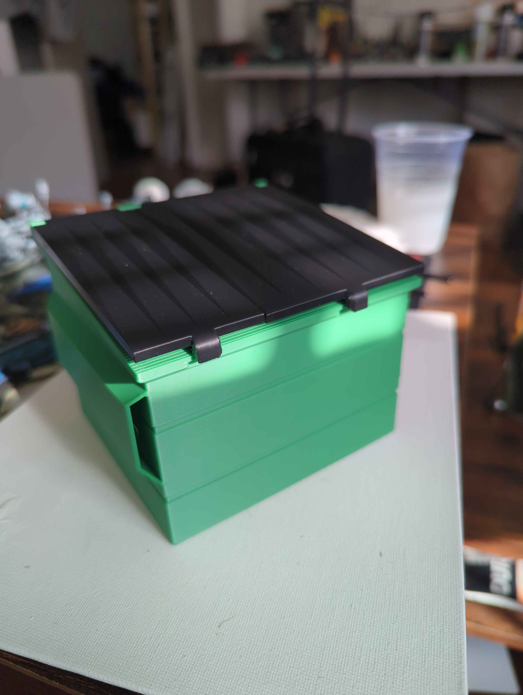{: width="50%"}

*Most Creative Prize*
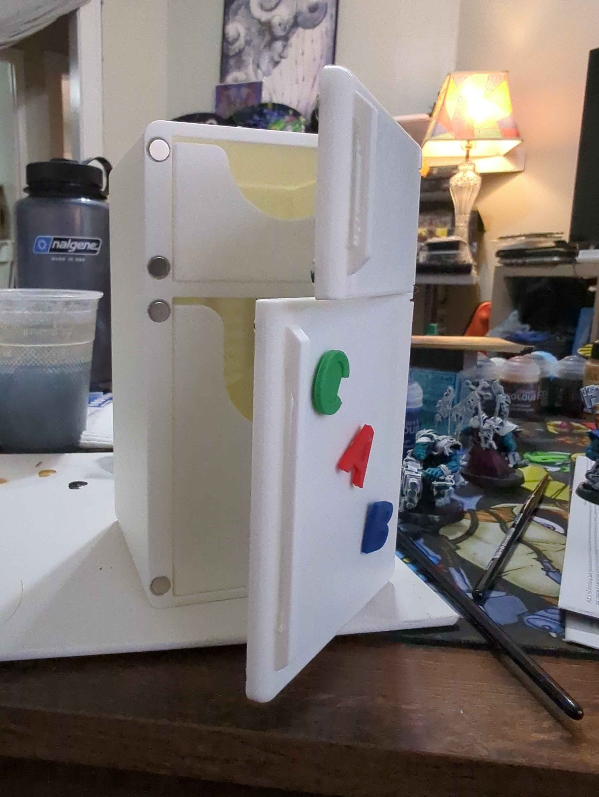{: width="50%"}

## Food

*Before*
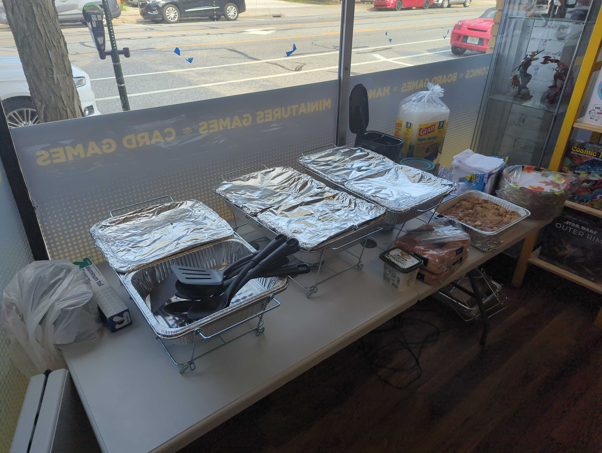

*After*
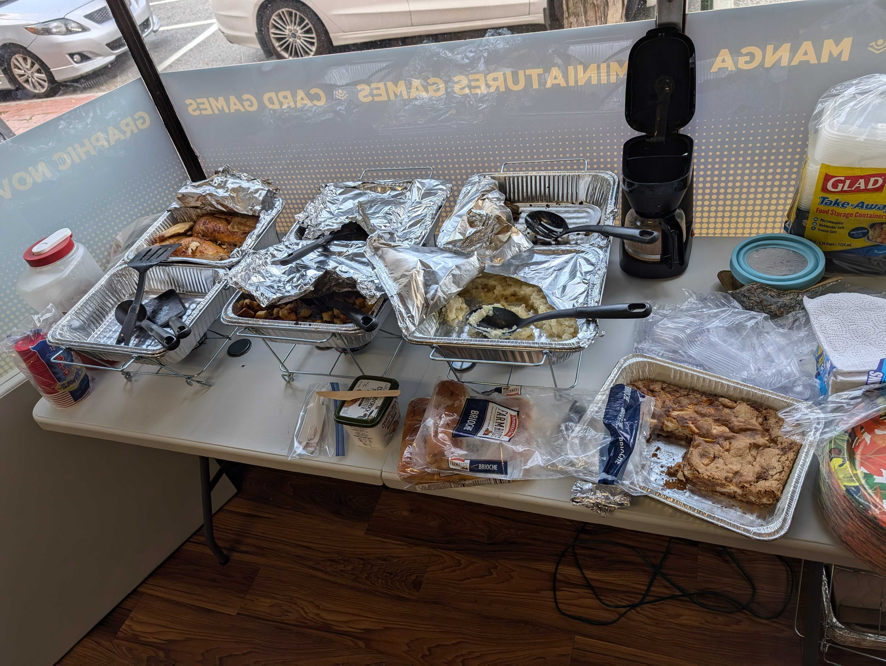

*Coffee Pot Gravy, Of Course*
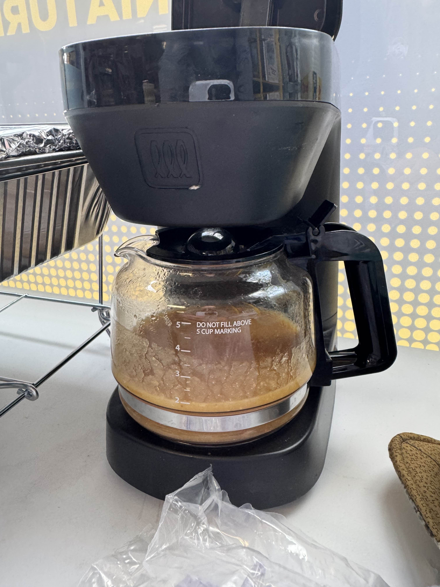{: width="50%"}

## Winners

After the dust settled, Chad Frazier was the lone 9 pointer on Dream Halls, while Jerry Yang achieved perfectly evil tiebreakers.

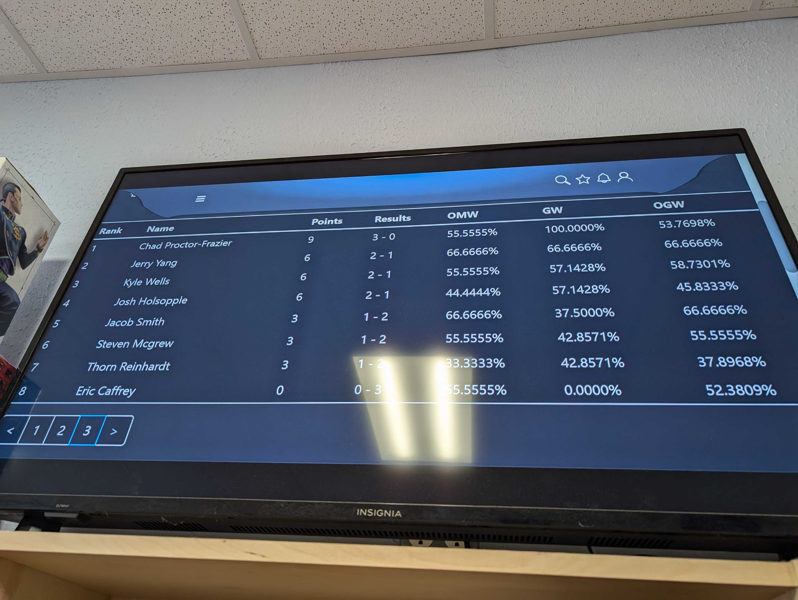

*Chad Frazier, Event Winner*
{: width="80%"}

*Eric Caffrey, Last Place*
{: width="50%"}

*Steven McGrew, Most Creative*
{: width="50%"}

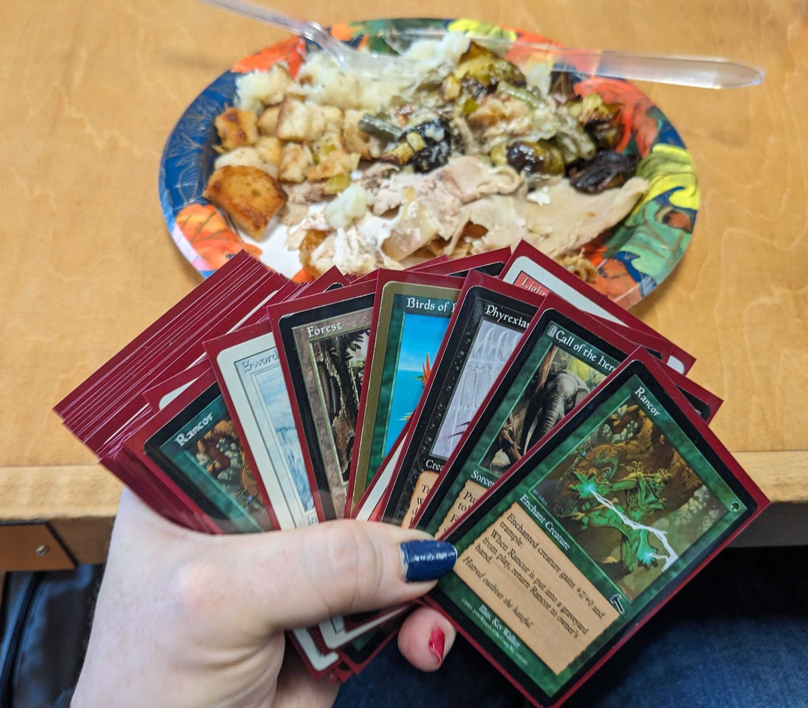{: width="70%"}

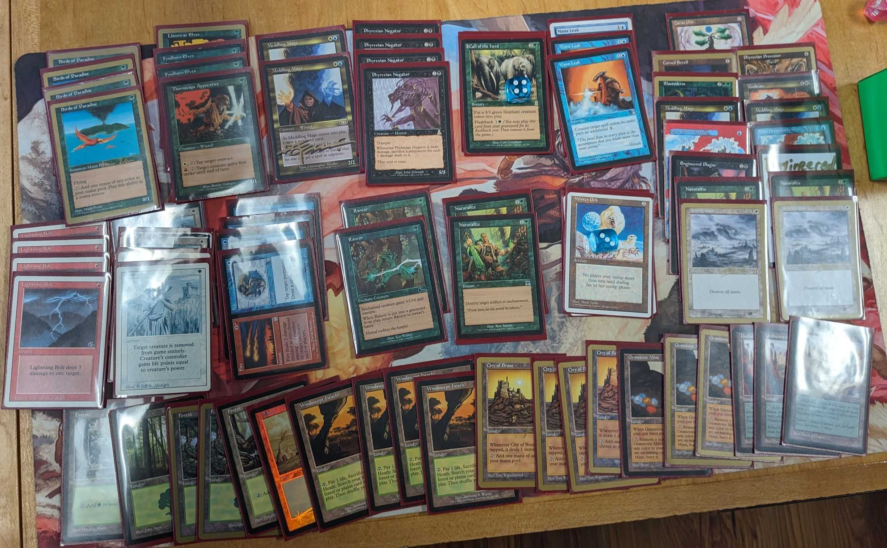

## Thanks and Ups

Big Ups to Superscript for hosting our event. Thanks to all the players that came out and made it a thing. And of course, big love and thanks to the man, Eric Caffrey. That's my man right there, we hold it down!
