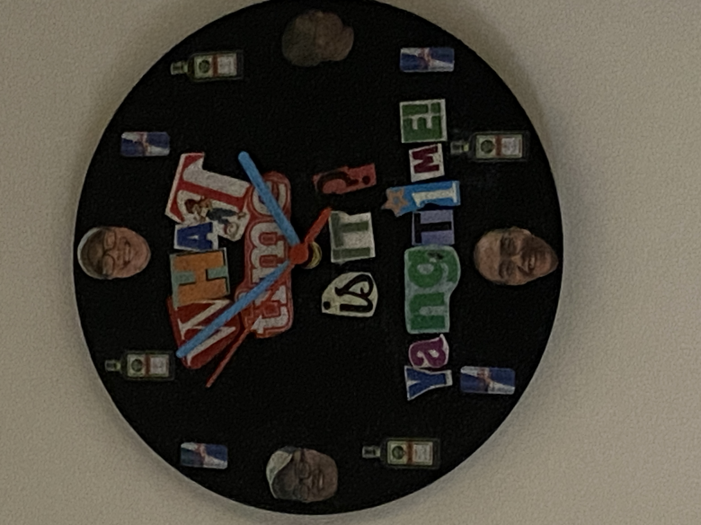
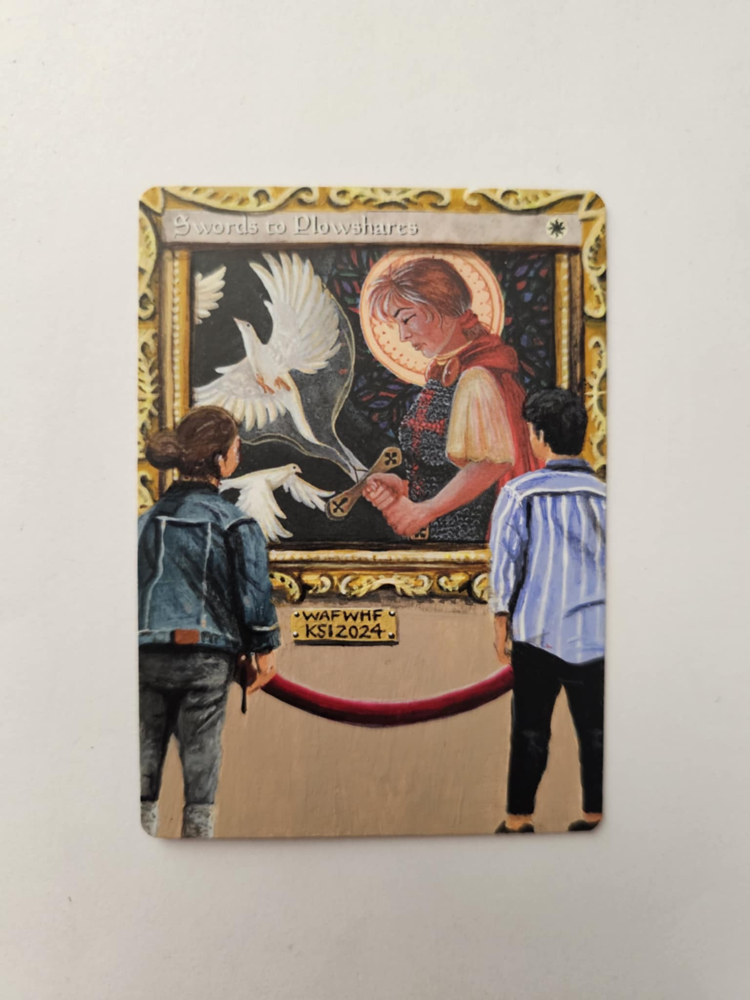

Steven joins us to review his T4 run at the KSI 2024. Angelo reveals his nemesis and Rajah just tries to keep everyone on time. Plus, Shaman Ben's 'Classic' return to Vintage! We chat on the tournament, the kegerator and Orms-By-Gore. Yangtime! 

<!-- <iframe style="border-radius:12px" src="https://podcasters.spotify.com/pod/show/full-warning/embed/episodes/Full-Warning-Episode-6-The-Land-5-2024-Wrap-Up-e2mpt0o" allow="autoplay; clipboard-write; encrypted-media; fullscreen; picture-in-picture" width="100%" height="152"  scrolling="no"></iframe> -->

<iframe style="border-radius:12px" src="https://open.spotify.com/embed/episode/11x8pVDxj4btB4F0TV4gVa?utm_source=generator&theme=0" width="100%" height="152" frameBorder="0" allowfullscreen="" allow="autoplay; clipboard-write; encrypted-media; fullscreen; picture-in-picture" loading="lazy" scrolling="no"></iframe>

## Show Notes From Spotify

<strong>Chapter List</strong>

00:00:00 - Do Ya Thing - Katty K. Intro

00:01:00 - Steven: Who are you? And what are you doing here?

00:02:32 - Discovering Magic: From Zillions to Goblins

00:11:25 - Vintage Beginnings: Exploring Proxies and Powering up from Legacy

00:13:40 - Evolving Deck Choices for KSI

00:21:30 - Vintage Play Round 1

00:28:20 - Vintage Play Round 2

00:34:03 - Yangtime Break

00:35:05 - Vintage Play Round 3

00:40:08 - Vintage Play Round 4

00:46:25 - Retreat in the Woods: An Ideal Pad in Ann Arbor

00:48:20 - Lunch Food Talk: Kegerator and Zingerman&#39;s

00:50:30 - World Famous Team Serious Invitational Prize Table

01:01:15 - Cut to T4

01:12:00 - Kitten Wins!

01:12:53 - BC Druid&#39;s Swag Corner

01:18:48 - Final Thoughts

01:20:10 - Outro - Precise Danger - Oldominion

 

<strong>Show Notes</strong>

What time is it? Yangtime! Journey back with your hosts to a simpler time, when Vexing Bauble and Urza&#39;s Saga were played in multiples, <em>*in one deck*</em>!

This episode took me a long time to edit, and not just because of the crazy ambient noise levels. This podcast is about a Vintage format that no longer exists, a lame duck format if you will. And so I found it was very unmotivating to edit this podcast, while looking forward to Eternal Weekend; the meta will discuss herein is gone. 

But we knew we owed to our dedicated fanbase (all 7 of them) to make sure that this show saw the light of day. WAFWHF and such. First we go deep with our guest Steven McGrew, and we learn about his magical background and his journey to Teams Seroius and Vintage. 

We review Vintage in a play-by-play format and opine on the current (old) state of Vintage, thinking at the time that we are praticing for Eternal Weekend. We review the food, the prize table and the &quot;Retreat in the Woods&quot;, Kevin&#39;s amazing new home and location of the tournament. And of course, we don&#39;t forget the SWAG. 

The outro song is by Oldominion, a hip-hop group from Seattle. It is from the old <em>mp3.com</em>. I did&#39;t get clearance exactly so we&#39;ll see if they flag it.

 

### Links

- [Zingerman's](https://www.zingermansdeli.com/)
- [Oberon](https://bellsbeer.com/beers/oberon-ale/)
- [VODs - Youtube](https://www.youtube.com/playlist?list=PL7mT2eVHGBPGFElec5FTIbNC_NwiZw7_1)
- [KSI Event Report]()

### Extra Media

*YangTime!*

*KSI STP*

<!-- Pre-write up section
### Chapter List

00:00:00 - Do Ya Thing - Katty K. Intro

00:01:00 - Steven: Who are you? And what are you doing here?

00:02:32 - Discovering Magic: From Zillions to Goblins

00:11:25 - Vintage Beginnings: Exploring Proxies and Powering up from Legacy

00:13:40 - Evolving Deck Choices for KSI

00:21:30 - Vintage Play Round 1

00:28:20 - Vintage Play Round 2

00:34:03 - Yangtime Break

00:35:05 - Vintage Play Round 3

00:40:08 - Vintage Play Round 4

00:46:25 - Retreat in the Woods: An Ideal Pad in Ann Arbor

00:48:20 - Lunch Food Talk: Kegerator and Zingerman's

00:50:30 - World Famous Team Serious Invitational Prize Table

01:01:15 - Cut to T4

01:12:00 - Kitten Wins!

01:12:53 - BC Druid's Swag Corner

01:18:48 - Final Thoughts

01:20:10 - Outro - Precise Danger - Oldominion

### Show Notes

What time is it? Yangtime! Journey back with your hosts to a simpler time, when Vexing Bauble and Urza's Saga were played in multiples, *in one deck*!

This episode took me a long time to edit, and not just because of the crazy ambient noise levels. This podcast is about a Vintage format that no longer exists, a lame duck format if you will. And so I found it was very unmotivating to edit this podcast, while looking forward to Eternal Weekend; the meta will discuss herein is gone.

But we knew we owed to our dedicated fanbase (all 7 of them) to make sure that this show saw the light of day. WAFWHF and such. First we go deep with our guest Steven McGrew, and we learn about his magical background and his journey to Teams Seroius and Vintage.

We review Vintage in a play-by-play format and opine on the current (old) state of Vintage, thinking at the time that we are praticing for Eternal Weekend. We review the food, the prize table and the "Retreat in the Woods", Kevin's amazing new home and location of the tournament. And of course, we don't forget the SWAG.

The outro song is by Oldominion, a hip-hop group from Seattle. It is from the old *mp3.com*. I did't get clearance exactly so we'll see if they flag it.

### Links

- [Zingerman's](https://www.zingermansdeli.com/)
- [Oberon](https://bellsbeer.com/beers/oberon-ale/)
- [VODs - Youtube](https://www.youtube.com/playlist?list=PL7mT2eVHGBPGFElec5FTIbNC_NwiZw7_1)
- [KSI Event Report]()

### Extra Media

*YangTime!*

*KSI STP*

-->

<!-- 
## AI Generated Notes

We use a service called cleanvoice.ai to help clean up the sound on the cast.

### Vintage Metagame Shake-Up: Simplifying the Hammer Approach

### Episode Title

From Casual to Competitive: A Magic: The Gathering Journey

### Show Notes

#### A Magic Journey: From Consumer Magazine to Vintage Master

Discover how a simple consumer magazine article about "Goofus and Gallant" unexpectedly sparked Stephen McGrew's lifelong passion for Magic: The Gathering. In this fascinating episode, Stephen shares his unique origin story, from his first encounter with basic Portal and Sixth Edition cards to becoming a seasoned Vintage player.

Journey through the evolution of his playing career, from customizing goblin pre-con decks to navigating the competitive Legacy and Vintage formats. Stephen offers intimate insights into his deck-building philosophy, including his recent innovative choices at the KSI event featuring Smelting Vat and Glaring Fleshraker.

The episode explores the financial aspects of competitive Magic, from $50 Legacy decks to high-stakes Vintage tournaments, while highlighting the community aspects that make the game special. Whether you're a seasoned player or new to Magic, Stephen's story demonstrates how a simple introduction to the game can evolve into a rich, lifelong passion.

Ready to be inspired? Tune in to hear the full story of how a cautionary tale about spending money on trading cards ironically led to a fulfilling journey in competitive Magic.

### Chapters

00:00:00 - Steven McGrew's Magic Journey
00:02:32 - Discovering Magic: From Zillions to Goblins
00:11:37 - Vintage Beginnings: Exploring Proxies and Legacy
00:13:40 - Evolving Deck Choices for KSI
00:30:55 - Artifact Mana vs Land Destruction in Legacy
00:33:30 - Bouncing Grafdigger's Cage for Oath Trigger
00:43:31 - Navigating Pithing Needle and Time Vault
00:48:57 - Retreat in the Woods: An Impressive Bachelor Pad in Ann Arbor
00:52:01 - Amazing Team Series Invitational Prizes
00:55:24 - Repurposing a Frozen Clock into a Yang Time Clock
00:57:25 - Yang Time Clock: A Modpodge Project
01:09:45 - Energy Flux Wipes the Board
01:14:09 - Celebrating Swag at the BC Druid Event
01:18:08 - Reflections on a Vintage Tournament

### Key Takeaways

• Stephen McGrew's initial introduction to Magic: The Gathering was through a consumer magazine and a friend's modest card collection, rather than through a gaming store or tournament.

• McGrew's fascination with the depth and creative card names in the early stages of the game sparked his lifelong passion for the vintage Magic format.

• The speakers discuss their experiences transitioning from casual play to the highly competitive Legacy and Vintage scenes, highlighting the challenges of navigating the high costs and powerful metagames of these formats.

### Detailed Summary

Stephen McGrew, a veteran Magic: The Gathering player, shares his origin story with the hosts of the Full Warning podcast. He first learned about the game through a consumer magazine called Zillions, which featured an example of "Goofus" spending money on Magic cards versus "Gallant" saving it. Though initially drawn to the Pokemon cards, Stephen eventually discovered Magic through a friend's modest collection of Portal and Sixth Edition cards. Despite the relatively basic cards, Stephen was intrigued by the game's depth and creative card names like "Evil Eye of Orms-by-Gore." This early exposure sparked his lifelong passion for the vintage Magic format, which he continues to enjoy playing with friends today. The speaker shares their journey with the card game Magic: The Gathering, starting from their introduction to the game through a friend's goblin pre-con deck. They describe their early experiences of customizing and upgrading the deck, discovering new sets with better goblin cards, and gradually getting more invested in the game's casual and competitive scenes. The speaker recalls transitioning from playing at an arcade's gaming area to joining a college magic community focused on drafting and the Legacy format, even though their initial Legacy deck of Suicide Mono-Black struggled against the more powerful decks. Throughout, the speaker expresses their love for the mystery and questions raised by the early versions of Magic. In this conversation, the speaker describes their experiences in the Legacy and Vintage Magic: The Gathering formats. They discuss the costs of building different decks, such as paying $100 for blue duals and $50 for a Legacy Goblins deck that their friend ended up winning with. The speaker then transitioned to playing Blue-Red Delver in Legacy, before being introduced to Vintage by their friend Jake in 2015. The speaker was initially hesitant to play Vintage due to the high cost and prevalence of proxies, but eventually played in a Team Series Vintage event in Sandusky, where they faced a very powerful metagame with Chalice of the Void, Lodestone Golem, and Mentor decks. The speaker tried to innovate by playing a version of Delver, thinking they could be a "turn faster" than the Mentor decks, but acknowledged this strategy did not work out well in practice. Stephen, a top player, discusses his deck choices for the recent KSI event. He opted to play a Smelting Vat, Workshop, Glaring Fleshraker, and Sensei's Divining Top deck, which was similar to his friend Jimmy's list but with a few key differences. Stephen wanted to play a "fun deck" rather than the top blue deck, and was inspired by Justin Gennari's recent spicy Fleshraker list featuring Scrap Trawler and Ichor Wellspring. While the deck didn't perform as well for Stephen as it did for Dwayne, he enjoyed the unique gameplay and felt it was a good choice for the event. In this discussion, Angelo and Steven discuss their deck choices and strategies for a recent Vintage tournament. Angelo ran a deck similar to Duane's, which relied on digging through the deck to find key cards like Vault Key, but found it sometimes struggled to find the necessary pieces. He then tried Steve's deck, which incorporated Fleshraker as an additional way to find key cards. Meanwhile, Steven took a different approach, modifying his Atraxa Oath deck to better combat the prevalent Null Rod strategy in the metagame. He added Spell Pierce to counter early hateful permanents. While Angelo was looking to spike the tournament, Steven decided to "be the problem" and play a Workshop deck, which he felt gave him a strong Round 1 matchup against his opponent Brian Hockey. In this podcast dialog, the speakers discuss their experiences in a round one Vintage Magic: The Gathering match. Angelo faced an opponent, Michael, who appeared to be playing an outdated or unusual deck, leading to a close game. The other speaker, who remains unnamed, had a similar experience against "Shaman Ben," who opened with an unexpected Dark Ritual into Hymn to Tourach play. Despite the initial challenges, both speakers were able to navigate the unorthodox situations and secure wins, showcasing their adaptability and experience in the Vintage format. In the first game, Steven faced Shaman Ben's classic mono-black deck, which was able to strip his hand and play an Antuco Shade, taking advantage of Steven's mana issues due to Wastelands. However, in the second game, Steven managed to get an active Urza's Saga and constructs to defeat Ben's Hypnotic Specters. Meanwhile, Angelo played against Brass Man and two-owed him, taking down the opponent's Psychic Frogs and other cards with a Might Stone and Weak Stone. Finally, the narrator faced off against Eric, the Land 5 champion, who had modified his hateful red deck, leading to an interesting matchup played outside. In this podcast discussion, the speakers reflect on various matches from a recent Magic: The Gathering tournament. They discuss the deck compositions and strategies of their opponents, including their use of cards like Bloodbraid Elf, Grafdigger's Cage, and Oath of Nissa. The speakers also recount a memorable moment where one of them was able to bounce an opposing Grafdigger's Cage and resolve their own Oath trigger. However, the speakers note that their recollection of the later rounds becomes a bit fuzzy, likely due to the impact of "Yang time" - a tournament tradition involving a shared beverage break - which occurred multiple times during the event. In this tournament match, the speaker faced off against Nam, who was playing an aggressive Null Rod Shops deck. Despite the speaker's efforts to remove the Null Rod and generate mana, Nam consistently disrupted their game plan with Strip Mines and timely responses to their key plays. While the speaker managed to win one game, Nam's mastery of the Shops archetype and ability to adapt his strategy proved too much, leading to a 2-1 victory for Nam. The speaker acknowledged Nam's skill and the brutal nature of the matchup, but remained gracious in defeat. The speakers discuss the resurgence of "aggro shops" decks in the current metagame, and how they had to adapt their strategies to compete. They highlight the case of player "Nam", who was able to pick up a deck and perform well, making the Top 4 after not playing Vintage in a long time. The speakers then recount their own match-ups, with one describing a quick and lopsided victory over Nam, and the other narrowly losing a close Game 3 against a player on a "modern version of PO". Overall, the conversation focuses on the evolving Vintage format and the need for players to stay adaptable to the shifting metagame. The speakers discuss a previous Magic: The Gathering tournament where one of them narrowly escaped an early elimination, thanks to some clever plays involving Time Vault and other powerful cards. They recount the key moments of the game, including managing to shut down their opponent's hate cards like Revoker and Pithing Needle. The discussion also touches on the venue for the tournament, which was hosted by their friend Kevin and featured a well-stocked kegerator, allowing the players to enjoy some refreshing drinks during their breaks. Steven and his friend describe an amazing bachelor pad they visited in Ann Arbor, Michigan. The place was located in the woods, yet close to the city, and had a beautiful glass breakfast nook, an open living room, and a kegerator stocked with Oberon beer. They enjoyed a delicious sandwich spread from the local Zingerman's deli and indulged in some donuts. The event also featured a prize table where Steven ended up winning a valuable foil Teferi card worth around $75, which he had previously sold for $300. In a lively exchange, the speakers discussed the unique items they brought and won in a recent game event. Eric Caffrey walked away with a coveted CGC-graded Portal Storm Crow card, to the envy of the others. Andrew, meanwhile, received a set of Duels of the Planeswalkers booster packs containing Mox Crystal proxies, which the group debated the legality of using. Lastly, one speaker shared their creative idea to repurpose a clock into a "Yang Time" clock, featuring Jerry Yang's head and illustrations of Jägermeister and Red Bull bottles instead of numbers. The conversation showcased the participants' passion for unique collectibles and their willingness to think outside the box. Steven and Dwayne, two passionate Magic: The Gathering players, reflect on their recent tournament experiences. Dwayne recounts how he acquired a coveted "Yang Clock" and a unique Swords to Plowshares artwork from the event, while Steven missed out on the clock despite having the pick above Dwayne. They discuss the joy of bringing home prizes to share with their families, and the thrill of facing off against each other in the game. The conversation highlights the camaraderie and friendly rivalry that exists within the Magic community. In this podcast discussion, the speakers reflect on a close and exciting match at a Magic: The Gathering tournament. One speaker, Raja, recalls playing against his opponent Steven in the semifinals, with both players employing clever strategies and tricks to try and gain the upper hand. Despite some confusion over the details of certain plays, the speakers share their recollections of key moments, like Raja's use of a bounce spell to disrupt Steven's plan, and Dwayne's insightful prediction of the match's outcome. Overall, the discussion provides an engaging glimpse into the high-stakes drama and strategic nuance of competitive Magic gameplay. In this podcast discussion, the speakers reflect on a tense match in a high-stakes Magic: The Gathering tournament. They discuss a pivotal moment where a "vexing bobble" effect came into play, and one speaker graciously offered their opponent a chance to re-roll a die to determine the outcome. Despite the pressure of the finals and the presence of a respected player, Dwayne, the speakers remained focused and navigated a complex game state, ultimately leading to an exciting finish. The discussion highlights the camaraderie and sportsmanship within the Magic community, as well as the strategic depth and intensity of competitive play. In this engaging podcast discussion, the speakers reflect on an exciting Vintage tournament they recently attended. One speaker, Steven, describes how he struggled to deal with his opponent's "Energy Flux" card, which posed challenges for his deck strategy. Despite this setback, they both express how much they enjoyed the dynamic semi-final match, with its emotional ups and downs as they each tried to secure the win. 

Ultimately, the other speaker, Brian, emerged victorious in the tournament, playing an innovative "Kitten Mage" deck that incorporated unique combos. The speakers praise Brian's creative deck choice and acknowledge the fun, communal atmosphere of the event, where players embraced the "vintage" spirit and classic decks, like the turn one "Hypnotic Specter" play. Overall, the speakers seem to have had an exhilarating and memorable experience at the tournament. In this podcast dialog, the speakers are discussing the highlights and standout moments from a recent gaming event. They give shoutouts to several attendees who made the event special, even if they didn't necessarily win the most games. The speakers praise Shaman Ben and Brother Andrew for showing up to enjoy the community and atmosphere, rather than focusing solely on competitive play. They also recognize Kevin's friend Brett for playing a powerful deck with confidence, and Angelo for his generous card giveaways. Overall, the speakers emphasize the importance of camaraderie and shared experiences at these events, beyond just tournament results. Angelo had a great day at the tournament, despite some unexpected adventures. He felt he played well and won the matches he should have, though there was one game he could have played better. He was happy to see friends like Sean and Ben, and the overall vibes and camaraderie made for a memorable event. Steven also expressed that it was a fun gathering of friends. The podcast hosts seem to have had an engaging discussion about the tournament experience.

## Social Media

### Newsletter

Vintage Magic: The Gathering Enthusiasts Share Their Stories

Hello [Subscriber's Name],

We're excited to share the latest episode of the [podcast name] podcast, where we dive into the world of Vintage Magic: The Gathering. In this episode, we welcome *Stephen McGrew*, a veteran player who shares his fascinating origin story with the game.

Stephen first learned about Magic through a consumer magazine called Zillions, which featured an example of "Goofus" spending money on Magic cards versus "Gallant" saving it. While initially drawn to Pokemon cards, Stephen eventually discovered Magic through a friend's modest collection of Portal and Sixth Edition cards. Despite the relatively basic cards, Stephen was intrigued by the game's depth and creative card names, sparking his lifelong passion for the vintage Magic format.

In this captivating discussion, Stephen also shares his journey through the Legacy and Vintage formats, including the costs of building different decks and the unique challenges he faced in tournaments. He even discusses his recent deck choices for the KSI event, where he opted for a "fun deck" featuring Smelting Vat, Workshop, Glaring Fleshraker, and Sensei's Divining Top.

Tune in to hear Stephen's inspiring story and gain insights into the world of competitive Vintage Magic. We'd love to hear your thoughts on the episode - let us know what you think!

Best regards,
[Podcast Name] Team

### Twitter 

<tweet>Ever wondered how a lifelong Magic: The Gathering player got their start? 🤔 In the latest @FullWarningPod episode, veteran MTG enthusiast Stephen McGrew shares his origin story - from discovering the game through a consumer magazine to building a passion for vintage formats. 1/</tweet>

<tweet>• Stephen first learned about Magic through a "Goofus vs Gallant" comparison in Zillions magazine - highlighting the difference between spending vs. saving money on cards. 
• Though initially drawn to Pokémon, he eventually discovered Magic through a friend's modest collection of Portal and Sixth Edition cards. 2/</tweet>

<tweet>• Even with the relatively basic cards, Stephen was intrigued by the game's depth and creative card names like "Evil Eye of Orms-by-Gore." This early exposure sparked his lifelong love of vintage Magic, which he continues to enjoy playing with friends today.
• The speaker shares their own journey 3/</tweet>

<tweet>• from their introduction to Magic through a friend's goblin pre-con deck, to customizing and upgrading it, discovering new sets, and getting invested in both casual and competitive scenes.
• They recall transitioning from an arcade's gaming area to joining a college Magic community focused on drafting and Legacy. 4/</tweet>

<tweet>• Despite their initial Legacy deck of Suicide Mono-Black struggling against more powerful decks, the speaker expresses their fascination with the mystery and questions raised by early Magic versions.
• The discussion then delves into the speaker's experiences in Legacy and Vintage formats. 5/</tweet>

<tweet>• They discuss the costs of building different decks, such as paying $100 for blue duals and $50 for a Legacy Goblins deck that their friend ended up winning with.
• The speaker then transitioned to playing Blue-Red Delver in Legacy before being introduced to Vintage by their friend Jake in 2015. 6/</tweet>

<tweet>• Though initially hesitant about Vintage due to the high cost and prevalence of proxies, the speaker eventually played in a Team Series Vintage event in Sandusky, facing a powerful metagame with Chalice of the Void, Lodestone Golem, and Mentor decks.
• They share their deck choices and strategies. 7/</tweet>

<tweet>Want to hear more about veteran MTG players' journeys and insights into Vintage and Legacy formats? Check out the full episode of the @FullWarningPod, available now! 🎧</tweet>
-->