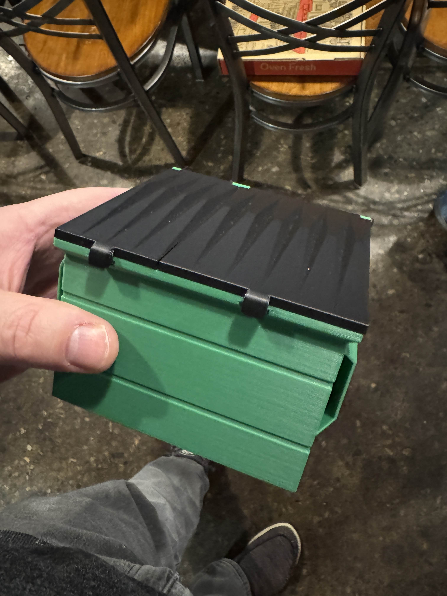
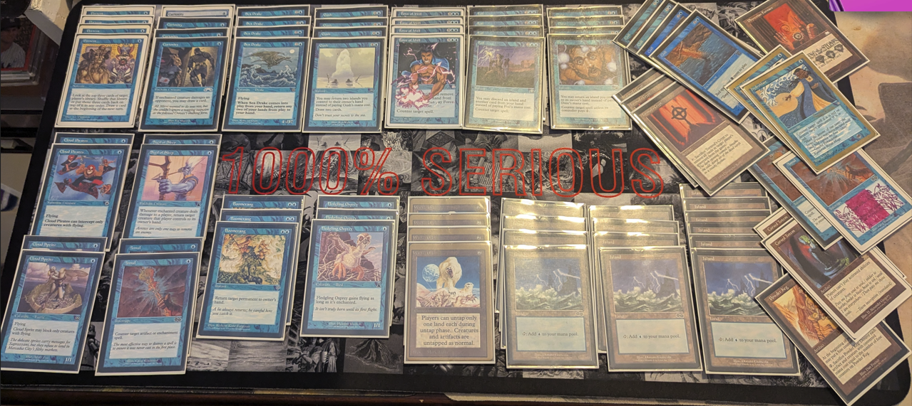

The Middle School World Championships returned to SlyFox for 2024, hosted by the incomparable Eric Caffrey! Held at the historic [Slyfox on the Highline](https://www.slyfoxbeer.com/pittsburgh-highline), in the South Side of Pittsburgh, 24 mages clashed to determine the 2024 Middle School World Champion!

## Media

THE Kyle Wells once again pitched in with a flyer for the event. Or maybe it was Katie? Thanks Katie! Thanks Kyle!

{: width="80%"}

## Metagame

There was a diverse field of decks chosen for battle this day. Unfortunately, I can't say exactly what they all were.

- Dragon
- Sligh
- Mono U Fliers
- The Rock
- Pink Shadow
- Gro-a-Tog
- Life
- UG Madness
- Terrageddon
- Reanimator
- Replenish

## Prizes and Such

Eric put together some killer prizes, not just for the winner, but also for last place and most creative.

*Prize Table*

*Evilmailman Tatted Disenchant*
{: width="50%"}

*Trophies*
{: width="50%"}

*Dumpster Deck Box*
{: width="50%"}

## Food

 

## Winners

After the dust settled, The B.C. Druid ended up on top, followed closely by Twan and then Max. Shout out to all the 4-2s that were in the hunt.

{: width="50%"}

*Top 3*

*'Coolest' Deck and 'Dumpster' Dudes*

## Middle School Play


<!--       

             -->

## Collected Decks

Here are some decks that were submitted from the event.

Angelo
 

 

Eric
 

 

mailman
 

 

Ian
 

 

Demario
 

Kyle
 

Robin
 

McGrew
 

## Thanks and Ups

Big Ups to SlyFox for hosting our event. Thanks to all the players that came out and made it a thing. And of course, big love and thanks to the man, Eric Caffrey. That's my man right there, we hold it down!
