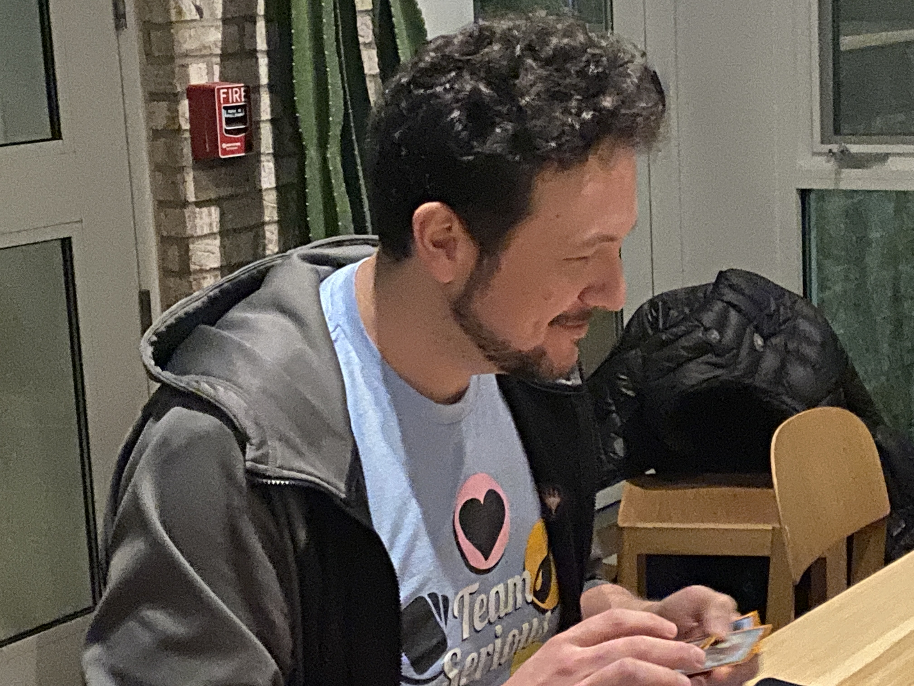
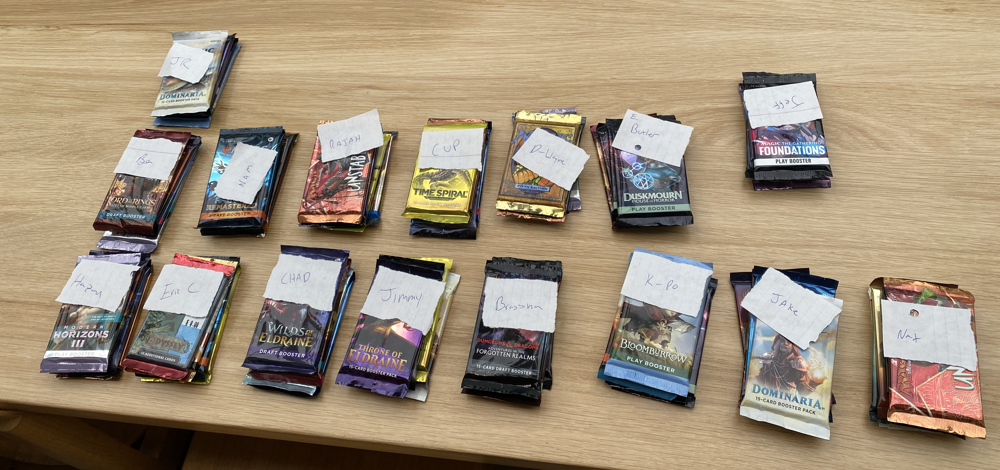
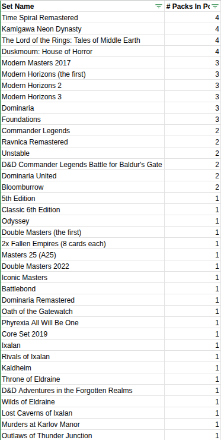
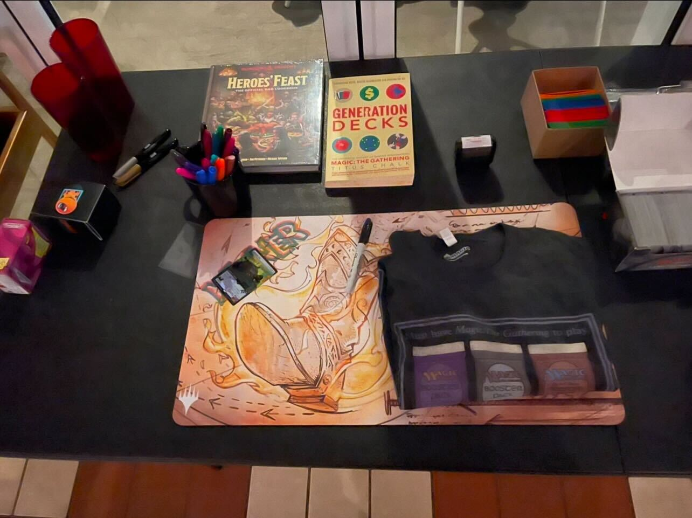
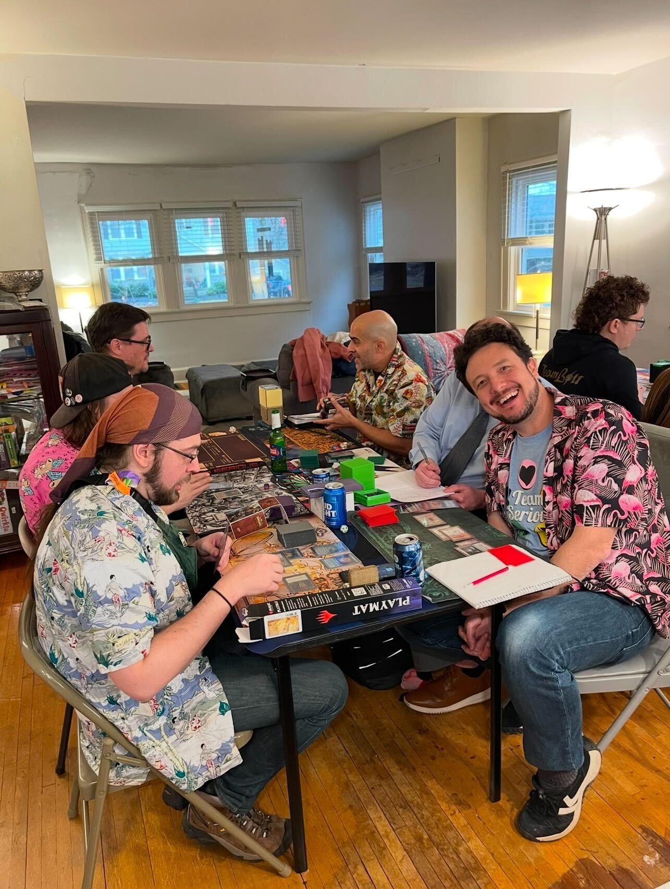
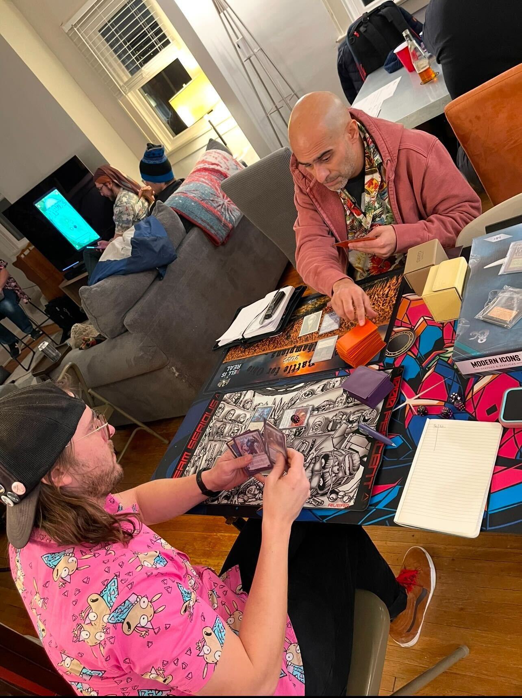
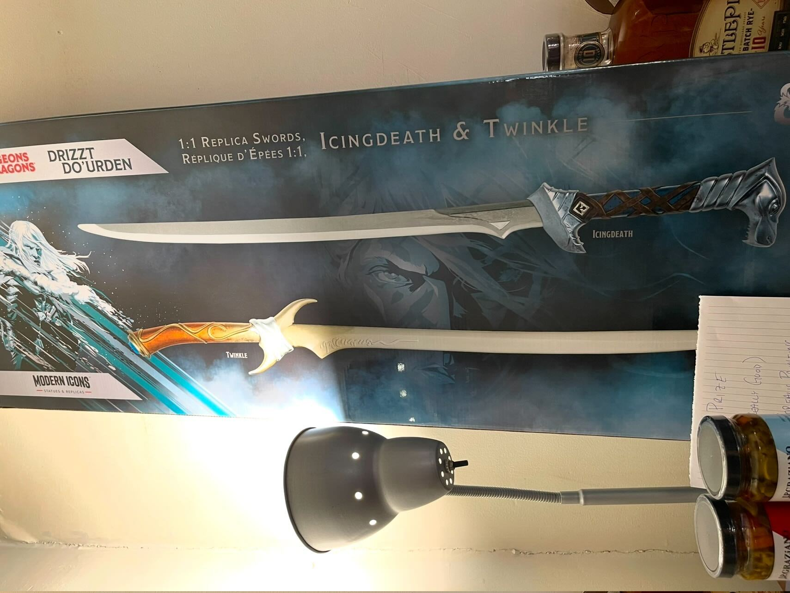

## Charity Bizarre Draft

The HSI this year not only featured a Vintage main event, but also a Friday event! Hosted by Nat "Bizarre" Moes, the charity draft took place at [Getaway Brewing](https://getawaybrewing.com/homepage)!

{: width="80%"}

### Pack Breakdown

Players chose four packs that they wanted to play and one of the four was selected at random to add to the prize pool. The other three picks were your packs to draft from.

<!-- 
 -->

| **Set Name**                                   | **\# Packs In Pool** |
| ---------------------------------------------- | -------------------- |
| Time Spiral Remastered                         | 4                    |
| Kamigawa Neon Dynasty                          | 4                    |
| The Lord of the Rings: Tales of Middle Earth   | 4                    |
| Duskmourn: House of Horror                     | 4                    |
| Modern Masters 2017                            | 3                    |
| Modern Horizons (the first)                    | 3                    |
| Modern Horizons 2                              | 3                    |
| Modern Horizons 3                              | 3                    |
| Dominaria                                      | 3                    |
| Foundations                                    | 3                    |
| Commander Legends                              | 2                    |
| Ravnica Remastered                             | 2                    |
| Unstable                                       | 2                    |
| D&D Commander Legends Battle for Baldur's Gate | 2                    |
| Dominaria United                               | 2                    |
| Bloomburrow                                    | 2                    |
| 5th Edition                                    | 1                    |
| Classic 6th Edition                            | 1                    |
| Odyssey                                        | 1                    |
| Double Masters (the first)                     | 1                    |
| 2x Fallen Empires (8 cards each)               | 1                    |
| Masters 25 (A25)                               | 1                    |
| Double Masters 2022                            | 1                    |
| Iconic Masters                                 | 1                    |
| Battlebond                                     | 1                    |
| Dominaria Remastered                           | 1                    |
| Oath of the Gatewatch                          | 1                    |
| Phyrexia All Will Be One                       | 1                    |
| Core Set 2019                                  | 1                    |
| Ixalan                                         | 1                    |
| Rivals of Ixalan                               | 1                    |
| Kaldheim                                       | 1                    |
| Throne of Eldraine                             | 1                    |
| D&D Adventures in the Forgotten Realms         | 1                    |
| Wilds of Eldraine                              | 1                    |
| Lost Caverns of Ixalan                         | 1                    |
| Murders at Karlov Manor                        | 1                    |
| Outlaws of Thunder Junction                    | 1                    |

### Bizarre Prizes

{: width="80%"}

### Bizarre Gaming

17 Drafters battled for glory with some very whacky cards.



## The Philanthropy

The draft and the main HSI event both benefitted the [Clintonville Community Resource Center](https://www.clintonvillecrc.org/),

## HSI 8

### Vintage

21 Wizards battled for the Glory of Hazard! Checkout the tournament on [mtgmelee](https://melee.gg/Tournament/View/213388).



#### Top 8

After 5 rounds of Swiss, the top 8 looked like this:

The Top 8 after Swiss:

1. Jimmy - Fleshraker
1. Chad - Jewel
1. Josh - Divinig Witch
1. Ben - Dredge
1. Rolko - BUG
1. Kyle L. - Esper Lurrus
1. Rajah - Jewel
1. Andy - Oath

#### Finals

The final match was Chad on Jewel vs Andy on Oath. Andy won in 2 games.

### Hawaiian Shirt Bros

HSI is always in the winter time and we wanted to have a more tropical atmosphere, so anyone who could was encouraged to dress in their Hawaiian shirts!

### Prizes

As always the prize table was crazy! Notable inclusion was of course, the swords!



## Thanks and Shout Outs

Shout out to Matt for hosting!
