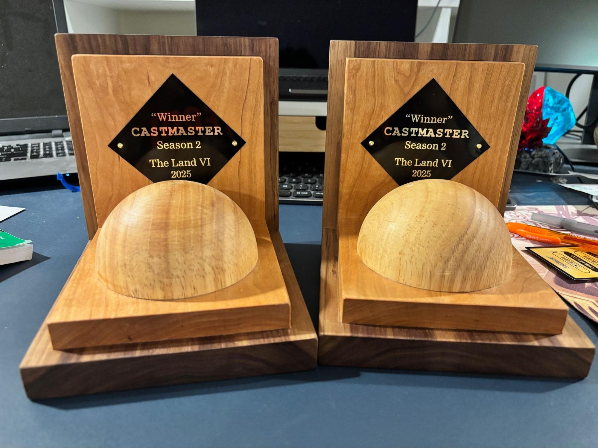
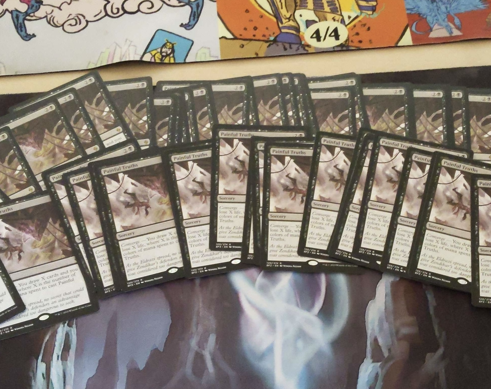
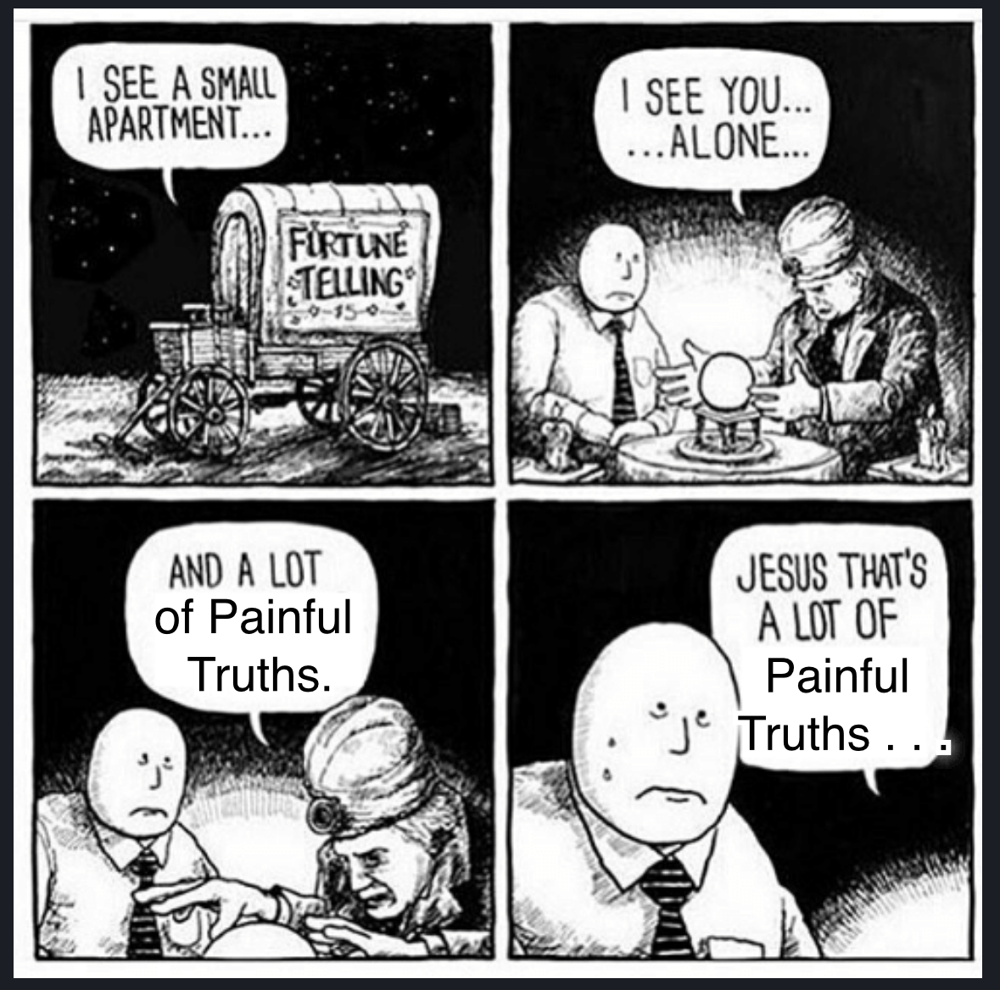
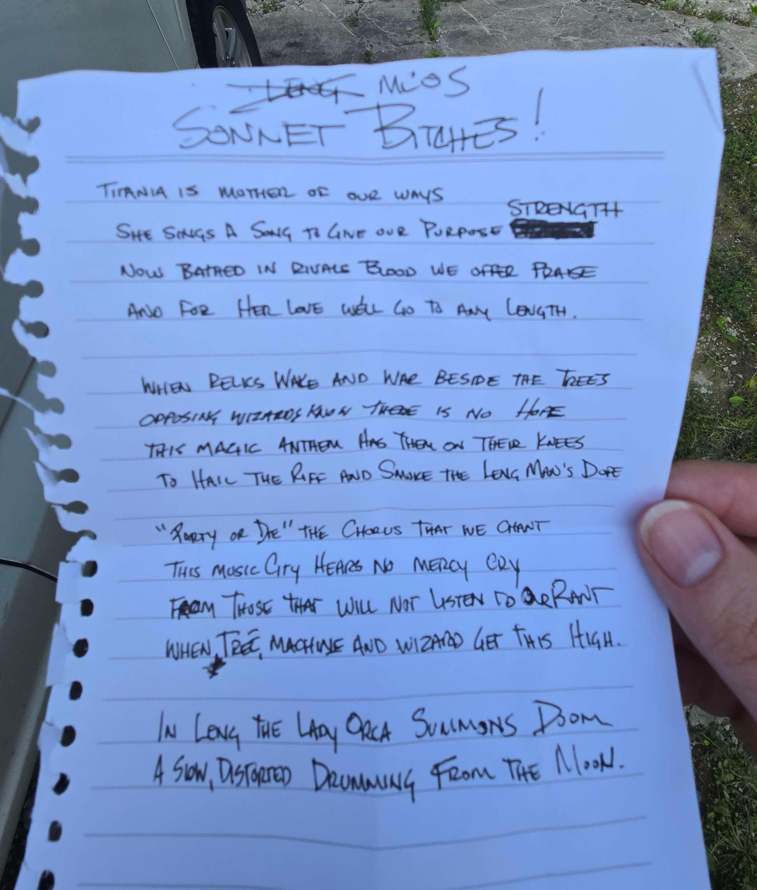
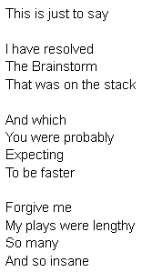

Last year, as part of Rajah James’s hosting of The Land, a Magic: The Gathering getaway extravaganza, I hosted a Magic-themed version of TV’s Taskmaster, called Castmaster. That went so well, and I enjoyed it so much, that I decided to go again this year with new tasks and adventures for all. As anticipated, it went great.

Taskmaster is a British reality game show wherein, over the course of a 10-episode season, comedians are asked to perform “tasks”—various concocted mental and physical challenges—for the delight of the audience and the host. The host, Greg Davies, is styled as the Taskmaster, who adjudicates the tasks and assigns points, eventually crowning a champion at the end of the season and 50 tasks or so. Alex Horne, the creator of the game, is the cohost and also runs the tasks in the field.

It’s a very bingeable show, very British, and the existing 19 seasons are all available online on [YouTube] (https://www.youtube.com/c/Taskmaster), as well as seasons from Australia, New Zealand, several Scandinavian countries, French Canada, and elsewhere. I highly recommend it. Season 19, which probably has ended its run by the time you read this, is an all-timer, featuring a rare American competitor, Jason Mantzoukas.

Castmaster similarly has mental and physical tasks judged by a taskmaster—me. It’s meant to be a diversion throughout a day-long Vintage tournament, as well as encouraging people to meet and mingle and have a memorable shared experience. At the end of the day, I crown a team of two players as the champion, and they win a handsome set of engraved bookend trophies, handmade by Team Serious’s Jon Hammack.

[You can read of the 2024 event here.]()

This year’s event had new tasks and teams but followed the same format. Teams of two would have some homework tasks before the event, do one task that lasts throughout the day, do three tasks in between rounds, and come together at the end for a final opportunity and scoring. The between-round tasks are for player A, player B, and a team task for both players. So in five rounds, players need to get two tasks in. This year there were eight teams signed up (down from 10 last year, a bit of a personal disappointment, I admit). Eight teams meant tasks were scored from 1 to 8, but I’m the Castmaster and can be as subjective as I want.

#### Task 1 – The Name Task

Last year, Rajah, the host of The Land and our gracious patron, made only one request: that I ask teams to come up with names that don’t need to be censored when read aloud on a podcast. I said great and decided that could be a task—I don’t need to enforce naming if I can encourage it through points.

This year I asked teams to **Create a team name that would be an appropriate book title for my five-year-old’s kindergarten class**. I expected Magic puns and good, clean fun and wasn’t disappointed. “Didgeridoos and Don’ts” (Paul Blakely and John Poggemeyer) was the winner. I liked the promise of a moral and “didgeridoo” is a fun word and a Magic card title. “Mongoose’s Big Day” and “Goodnight Magus of the Moon” also got high marks for Magic reference, and “Jake’s Carefree Visit to the Land” was a fun testament to the gathering part of Magic, including both teammates’ names (Jake Hilty and Eric “Carefree” Caffrey) and The Land itself.

Basically, reading the prompt for the team name and taking the challenge in spirit puts you in line for points. As a result, “Only God Can Judge Me” and “Below Mediocrity” were not inspiring children’s titles and scored poorly. Consider this an unsolicited tip for next year.

### Task 2 – The Card Task

This is the equivalent to the prize task on Taskmaster. On the show, contestants bring in an item that meets a criteria, and the winner each episode takes home all the items as prizes. The items are also scored as the first task based on how well they meet the criteria. On Castmaster, contestants bring in a Magic card that meets a criteria, and these are scored as part of the opener to the day. I haven’t made them be prizes for the winners, however, in case anyone wants to bring in a Beta Dual Land or something as their card. I could though, with warning. And nothing says that it has to be Magic cards as the subject of the task. That is something we all share, though, and it’s nice to have an ice breaker.

Anyway this year’s task was to Bring me the card that has brought you the most shame. It’s an open-ended idea. Did you play the card, or were you its victim? Is it a card that shamed you many times, or a card with one especially painful moment? What kind of shame did it bring? Poor play? Questionable ethics? Did your grandma catch you staring a little too long at Akroma?

Lots of great submissions this year. Many games were lost, or sometimes drawn into ninth place on breakers.

Duane Haddix of “Duane and Ben Do Castmaster Good and Also Other Things Good” submitted Razormane Masticore, along with further evidence of how often he’s played it in tournaments, how straight mediocre it is, and an anecdote about how he played it against Stephen Menendian one time and got his own card explained to him, while it was being typically mediocre. This one I felt, and it was a thorough, well supported presentation.

Also good was Bryan Hockey’s tale for “Goodnight Magus of the Moon” of speculating on a stack of Painful Truths—and then also neglecting to bring the card(s) in as required. Shame in the past and in the present. Anyway, Painful Truths is a fine card . . . currently worth $0.35. And he later provided photo evidence of having a bunch of them. I assume they’ll be his for the rest of his life.

{: width="80%"}

{: width="80%"}

### Task 3 – Triple Sleeve Yourself
I have a document file where I can type Castmaster task ideas as they come to me, and inspiration arrives at odd hours and in various states of disarray. This was a relatively late addition to the lineup this year as I wanted a physical challenge to go along with some of the more brainy, texty ones. 

    Triple sleeve yourself. First put on the green morph suit. Then cover your least favorite bone or bones (declared on the sign-up form) with an appropriate clothing item or accessory from the bin. Then get fully into the sleeping bag and stand up. Fastest time wins.

    Your time starts now and ends when you stand up, fully sleeved.

Aside 1: Special thanks and shoutout to Matt Hazard for donating his (well-used) morph suit to the cause. Participants were probably fortunate it’s an extra large.

This task started with one player of a team being led to a bedroom of The Land, with all of the expected anticipatory jokes and innuendos. The task was in an envelope on the bed, along with a pile of random stuff, only some of which was task related. Those accessories included a Team Serious T-shirt, pink wristband, bandanna, sunglasses, ankle wrap, and knee brace. The sleeping bag and morph suit were on the floor. 

Aside 2: Regarding the “least favorite bone” declared on the sign-up form. One of my favorite parts of Castmaster is making players fill out an online form that has the expected information gathering, sets up the Name and Card tasks, and then has a bunch of other random things that I later see if I can incorporate. This year I asked for each team’s “Least favorite bone” and had a list of a few from around the body. Initially I thought it would be something like “Haha, you picked ‘humerus’ and now you can’t use your arm for the next task.” Instead it became the second sleeve of the triple sleeve—hilarious.

The sign-up form information is usually fun, and I’ve had players say they wondered how a form answer would end up being used, which is how it should be. It is sometimes difficult to integrate into the rhythm of a task. I usually remind people what their answer was, and here I also spotted the location of the bone to people who weren’t sure. Maybe that was too much as it would have spread out some of the times.

Some of the bone covering was a little sloppy, particularly judging based on “appropriate clothing or accessory” from the task information, but I estimated everyone did acceptably. One player did try to cover their orbital bone with a knee brace, which was a good 20 seconds of gasping laughter and panic that ended in using a bandanna instead.

Times ranged from 1 minute 11 seconds to 2 minutes 22 seconds, based almost entirely on how badly a player wanted it and was willing to manhandle a morph suit. “The Vanishing Serras” Kyle Wells was owner of the fastest time at the end of the day, followed by Jimmy “Only God Can Judge Me” McCarthy who was very professional about the whole thing. John Poggemeyer had the candedest boudoir shot, and Angelo Kortyka of “Mongoose’s Big Day” had the proudest smile (no points for those, but worth a mention).



Good to have a very objective task. And great to have some big dudes squeezing themselves into a morph suit in a hurry! Setup was fun, though the finish was a little lackluster and I wish I’d found something to push it just a little farther into the ridiculous. In my Castmaster opinion, it would have been great to see someone struggle with this one for four or five minutes. A minor injury or equipment failure would have been icing on the cake

### Task 4 – Memory Challenge Variant #1

This task was based on one from Season 11 of Taskmaster, wherein a contestant was asked to “Complete these tasks” and presented a list of things to do. The list was then destroyed by fire, leaving the contestant the challenge of remembering the tasks as well as carrying them out. The twist was that everything was styled alphabetically as a hint: attack the biscuit, chuck the dog, embrace the fish etc.

For Castmaster it was a two-part task starting with something vague. Or at least specific but pointless.

    Sort this pile of cards in the manner of your choosing. When you are completely finished, place the sorted deck in the receptacle provided. You have 52 seconds. Your time starts now.

This was just to get people interacting with the cards, a random-looking stack of 18 Middle School era cards with enough going on to make you look at them while you sort. They were: Aether Burst, Corrupt, Doomsday, Energy Field, Glory, Hoodwink, Icatian Javelineer, Kavu Lair, Mundungu, Nausea, Orim’s Prayer, Quirion Ranger, Simoon, Tarpan, Urborg Volcano, Wild Ox, Yare, and Zombify, which I swear I typed from memory because they’re also styled alphabetically. (Of course I spent much more time with the cards.)

Most players sorted in color order and then alphabetically, like many Magic players do. One player sorted by expansion symbol, a bold gambit. And a couple sorted just alphabetically, but it didn’t help especially. Honestly, I didn’t care if it got sorted at all. This was just time to look at cards and process them mentally.

    
    At the end of 52 seconds, they put the deck away and were presented with a surprise second task, on a new paper with blanks on it: Write down the titles of the cards you sorted. Most correct titles wins. You have 52 seconds. Your time starts now.

This was great. There were some bail-outs, but most players jumped right in and started writing. Lists typically ended up in the 5, 6, 7 range, but there were some outstanding performers. Mike Solymossy put in a strong showing with 9 and a couple close misses, going well beyond the “Below Mediocrity” team name among the field. And Paul Blakely of “Didgeridoos and Don’ts” didgeridid it and listed 13, more than double the average. I was impressed!

All in all, perfect task. I spent a while figuring out how many cards to use and how much time to give people, and managed to come to a pretty close set of variables. The 52 seconds was a nod to the 26 letters in the alphabet, being double that. I doubt anyone noticed, but it was there. I do think that Magic players tend to process cards visually rather than by words, so even with the idea of sorting, players may not have been absorbing names. It might be interesting to try something similar in the future with a more visual twist.

### Task 5 – Exquisite Corpse Dance

Like last year, there was an art task. I like them because they allow teams to collaborate on something big. Maybe they even want to take their drawing home as a memento of their Castmaster adventure! This year’s taks was based on a surrealist collaborative game called Exquisite Corpse.

    With your teammate, draw a portrait of your declared favorite Magic: The Gathering creature using the colors you selected in your sign-up form.

    The first player will draw the first fifth of the portrait, then fold the paper over, hiding the drawing, but leaving short lines for the second player to continue. Then the second player will continue drawing the second fifth of the portrait and fold the paper similarly.

    The first player will draw the third fifth, the second player the fourth fifth, and the first player the final fifth, all folding similarly between sections.

    Non-drawing players may not speak.

    Most accurate drawing wins.

    You have 80 seconds per section. Your time starts now.

Players declared their favorite non-Human creatures on the sign-up form, and also picked colors from a list of 12 without knowing how the two were related, or that they were related at all. Interestingly, no team picked more than four colors or less than three. And except for “Duane and Ben Do Castmaster Good and Also Other Things Good” having to justify a hot pink Lodestone Golem, the teams’ colors were largely appropriate for their creature.

I used big rolls of easel paper pre-folded into fifths, and except for doing this outside on the grilling patio where it was windy, this went great—very fun watching things come together, or absolutely fail to. Time was meant to be limiting, but not a hindrance. Some drawings (or at least sections of drawings) even had some real artistry to them. There were accent lines and colors, crosshatching… consummate V’s! Other drawings completely omitted heads, or had extras—as hoped. When everyone was done,we hung the drawings in the tournament hall for everyone to see and enjoy.

Final results put themselves into tiers rather than individual scores, and with the very objective results of Tasks 3 and 4, I went with it. “The Vanishing Serras” Kyle Wells and Josh Burgoa got 8 points for a depiction of Serra Angel that started with an upraised sword, successfully connected it to an arm and appropriately sized head, included a feathered wing wrapped around a torso, and had a skirt with pleats. The drawing was complete, recognizable, and fun.

Old Fogey, drawn by Steven McGrew and Angelo Kortyka of “Mongoose’s Big Day” included lots of details true to the card, had head and legs appropriately attached to the torso, and featured some green, scaly skin. That got 7 points.

Nether Spirit (“Goodnight Magus of the Moon”) and Skittering Skirge (“Didgeridoos and Don’ts”) both had challenging subjects that ended up with pretty recognizable, unified, complete art, if a little awkwardly drawn. Nether Spirit’s second head had some nice eyeshadow and lipstick, for example. And while John Poggemeyer was drawing Skittering Skirge’s head he felt the need to insist, “This is a mouth, not a vagina.” Those got 5 points each.

Beyond that, the creatures were mostly missing heads or had larger problems and scored 3 points. J.R. Goldberg and Jimmy McCarthy of “Only God Can Judge Me” drew Deathrite Shaman’s skull and had some “details” on the “shaman robes,” but they neglected to draw its head. “Jake’s Carefree Visit to the Land” managed to produce a Goblin Welder that included an extra big metal guy, and in place of a head the Goblin had an extra butt, which was labeled. Soly and Jon Yoel of “Below Mediocrity” would have finished higher if their Lurrus of the Dream-Den’s torso had connected in the middle and the creature spread across all five panels of paper. There were cute Kitten Nightmares from the card art and a well-rendered Black Lotus to combo with, though!



### Task 6 – Poetry Slam

This was a great way to close out The Land VI and Castmaster Season 2. At the beginning of the day, during the player meeting I tasked teams:

    Throughout the day, write a poem about Magic: The Gathering. The subject, aspect, and style are up to you. Recitations will be made at the end of the day.

    Finest poem and recitation wins.

And, wow, did people deliver!

A range of styles and sentiments was represented, from a stinging haiku on Vintage Power, money, and loss from Mike Solymossy of “Below Mediocrity” to an epic ode to Old School from “The Vanishing Serras” (possibly ghostwritten by Librarian of Leng, Ben Perry).

Also highlighted in my mind are a nostalgic satire of Midwest Vintage circa 2006 from “Only God Can Judge Me” in the style of “This is just to say” by William Carlos Williams (below, really playing to the judge), and the rap stylings of “Mongoose’s Big Day” with lyrics by Angelo Kortyka and beatboxing by Steven McGrew.

The scores were such that the leaders at the time, “Digeridoos and Don’ts,” couldn’t be caught, particularly since they produced what would also have been a high-placing sentimental tribute to their fellow competitors, Rajah, The Land, and Magic “Colon” The Gathering. 

In the end, I took the easy way out and said everyone was a winner in my book. There was some grumbling, but that ended when I threatened to give complainers 1 point and let everyone else keep their 8. It was really only fair.

And it’s my game and I do what I want.

## In the End
I spoiled it earlier, but when the dust had settled it was “Digeridoos and Don’ts,” Paul Blakeley and John Poggemeyer who won Castmaster Season 2. They were a great all-around team and scored well in many tasks even if they weren’t always the top finishers. They went home with Jon Hammack’s fine bookends. Those bookends will (I presume) live across the street from one another in one Painesville, Ohio neighborhood, perhaps bookending Paul and John’s houses together.

Thanks to everyone who participated in the tasks, to Rajah for hosting, to Jerry Yang for helping think about tasks, and to Andy “Brass Man” Probasco for helping me run things between rounds. I always appreciate that you’re there to help me carry out ambitious things in your honor. We are, indeed, friends, and we do, indeed, have fun.

Already I’m looking forward to Castmaster Season 3, and tasks are well into development. I’ll let slip that, for the third installment, I’m planning on doing teams of three. Tasks are already in development, and I’ve already brainstormed with Jon how to do the three-player trophy. Let’s shake things up. What teams of two will collapse as one player (perhaps a little too eagerly) abandons their partner to menage some other trois?

And Rajah and I agreed that Poetry Slam should just be a part of The Land every year from now on.

<!-- 
  Wrap the code blocks for a nicer reading experience. 
    It isn't really code.
-->
