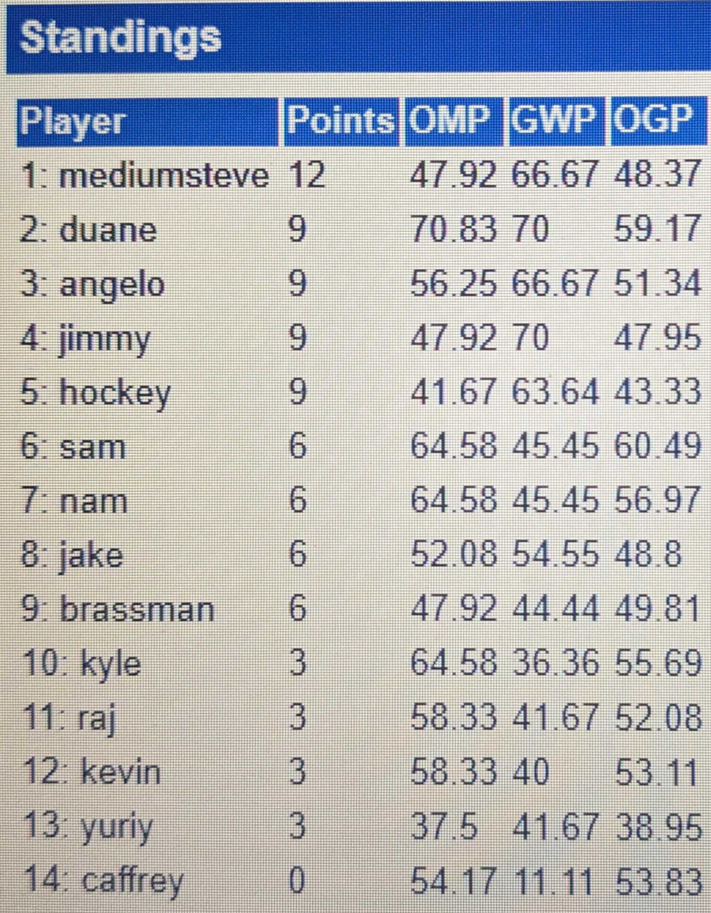

14 mages gathered in Ann Arbor, to drink a keg and battle Vintage! Hosted by Kevin Poesnich, the event featured food, friendship and the debut of ((Tezzeret, Cruel Captain)).

## Food and Drink

This year, Kevin upgraded from a quarter keg to a half keg, and let flow [Bell's Two Hearted](https://bellsbeer.com/beers/two-hearted-ale/){:target="_blank" rel="noopener"} with a great supply of sliced oranges.

{: width="50%"}

One aspect of TSI's that is sorely missed during sanctioned tournaments is breaking for food. After Round 1, we broke for lunch, with [Zingerman's Deli](https://www.zingermansdeli.com/){:target="_blank" rel="noopener"} being provided once again. *You really can taste difference.* (This is their tag line.) 

Various delicious sandwich builds were created; None were punched.

{: width="70%"}

Of course, copious other foods were offered up by our gracious host. Many donuts were consumed, one half at a time.



## Vintage

### Standings

After 4 rounds of Swiss, the standings were as follows:

{: width="50%"}

### Decklists

#### Top 4 Decks

----

##### *Steven McGrew* - 1st After Swiss

{: width="40%"}


----

##### *Duane Haddix* - 2nd After Swiss

{: width="50%"}


----

##### *B.C. Druid* - 3rd After Swiss

{: width="40%"}


----

##### *Jimmy McCarthy* - 4th After Swiss

{: width="40%"}


#### Other Decks

----

##### Hilty

{: width="33%"}


----

##### Caffrey

{: width="25%"}


----

##### THE Kyle

{: width="30%"}


----

##### Rajah

{: width="35%"}


### VODs

View the full playlist on the [Full Warning YouTube Channel](https://youtube.com/playlist?list=PL7mT2eVHGBPGTKMon1-LCdFEuZOK7WlJ_&si=IMgatc6uy7DSce_g). Embedded below are the semis and finals. Enjoy!

#### Semi Final - Steven vs. Jimmy



#### Finals - Steven vs Duane



Congratulations to Duane for taking down the title!

## Thanks and Shout Outs

Shout out to Kevin for hosting! Shout out to the Rajah Car, who was half the top 4! Shout out to Jimmy for running the pairing and keeping the stream assignments going smoothly. Thanks to all attendees for helping make Kegerator Serious Invitational such a great time. WAFWHF

## Pictures


