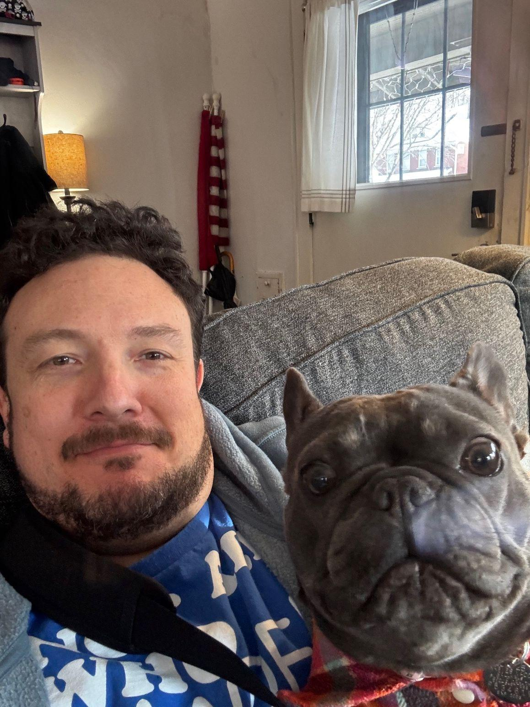
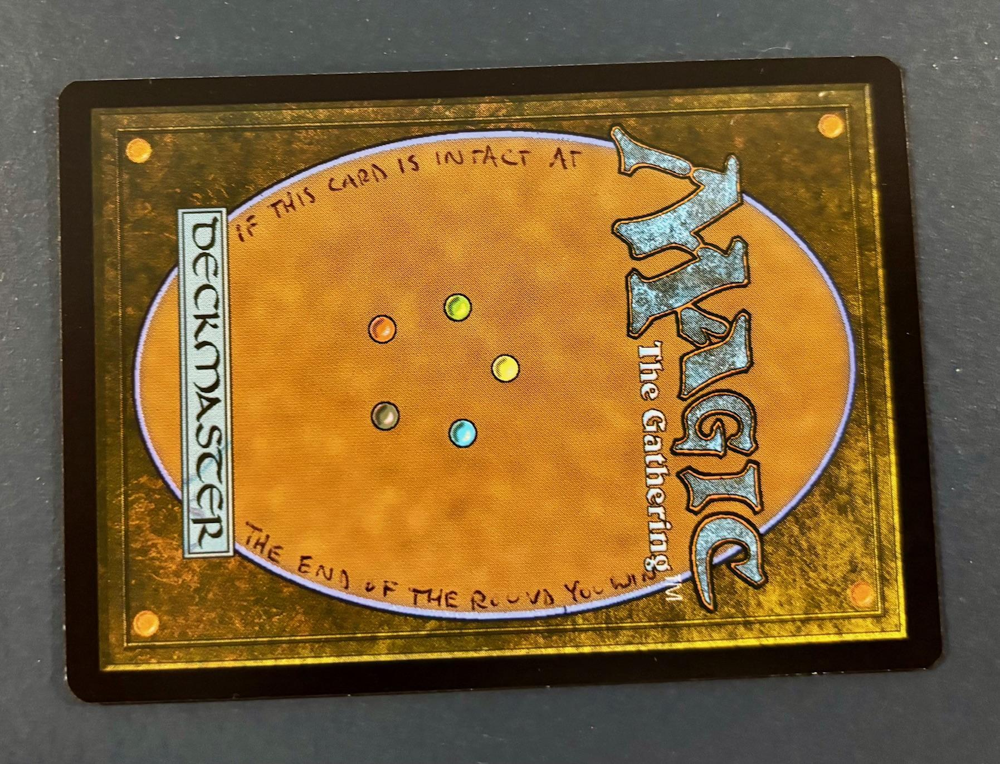
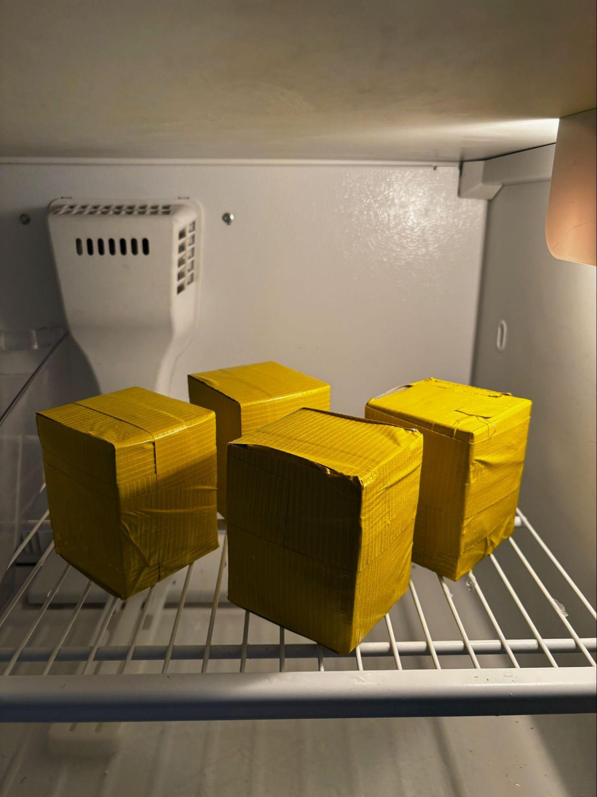
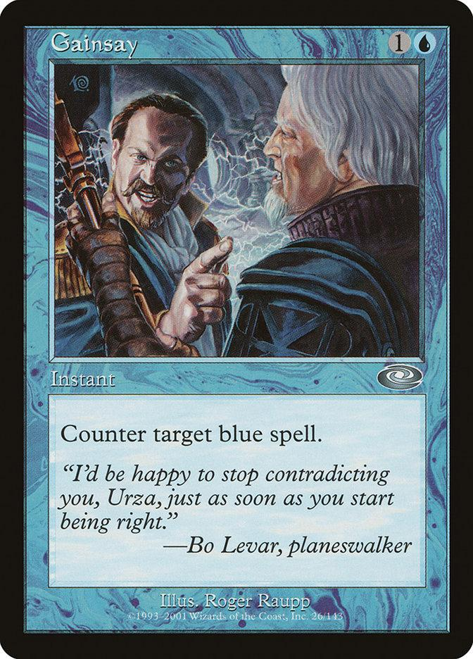
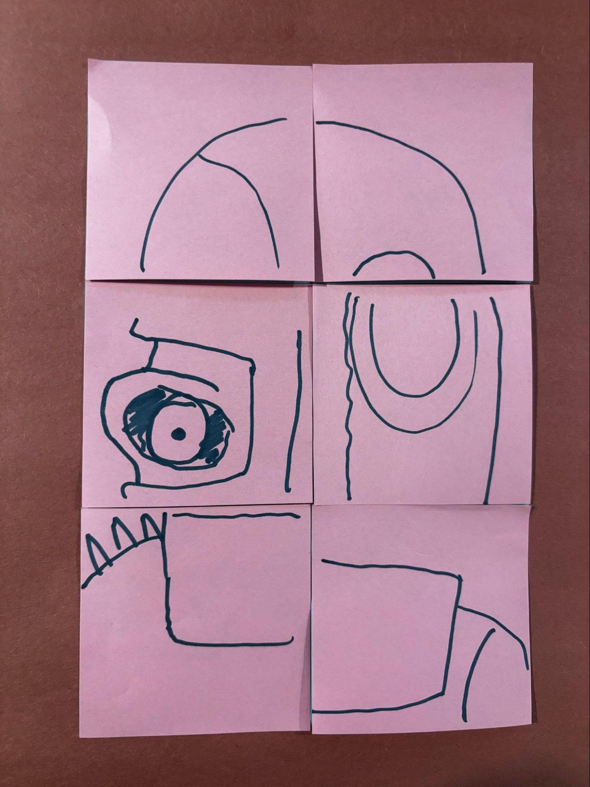

For nine years (skipping a couple for the COVID pandemic), the Hazards, Matt and Trece, have hosted a Vintage Magic tournament in February in Columbus for Matt’s birthday. The Hazardserious Invitational (HSI) is a great excuse to get together once the holidays have wound down and there’s that cold-cold lull before spring starts and you really want to go outside. For previous HSIs, I would write a fun pub-quiz style game to run after the Swiss rounds so that people could hang out, win some prizes, and wait for friends to win or lose in the finals.

This year, going into the holidays with barely half a pub quiz written and a full schedule, I decided it was going to be a lot of effort. I didn’t really have a theme, I hadn’t come up with new quiz formats, and so on. Plus, writing quiz questions takes a decent amount of time for research and crafting. Pub quiz will return, but it wasn’t going to get done for this event.

But! I had (and still have) a backlog of task ideas for Castmaster, the game I run at The Land based on Taskmaster the gameshow. By selecting and modifying some tasks to fit in the same time and space as the usual pub quiz, I decided that would be a great way to help people hang out and pass the time while the top-eight played out.

I’ve done the introduction for Taskmaster the British panel gameshow before. All of the episodes of all of the [seasons are on YouTube](https://www.youtube.com/taskmaster){:target="_blank" rel="noopener noreferrer"}, including seasons from other countries, and you can watch there to catch up. At the end of every episode they have a live task or stage task where all the contestants compete on one task at the same time. Many times these are physical challenges, but there are mental ones as well. Physical tasks make good watching for the live audience, and it’s fun to see how contestants react to other contestants and the stress of timing.

Those stage tasks were the basis for the HSI Castmaster: less writing, much less research, a little more gathering and preparing ingredients. And I decided that using a task here wouldn’t necessarily disqualify it from using it at the larger Castmaster event at The Land in June. More information on that at the bottom.

{: width="50%"}

I ran seven tasks and gave packs of Double Masters 2022 as prizes.

#### Task 1 - Dice Tower

Simple enough:

    Stack dice one on top of another to make a tower of dice. You have 53 seconds. Your score will be the height of your tower in inches multiplied by the total number of dice faces in your tower. Highest score wins.

This one really lends itself to a group setting rather than the “go off in an area and do a task” nature of Castmaster at The Land. Hazard has a nice, big, stable countertop that everyone can stand around and have a pan of dice to grab from. (Though having a rickety card table to bump would add another challenge.) I brought lots of dice from home, a good mix of mostly d6s and d20s. Obviously d20s are much better if you can manage stacking on the smaller faces.

We had four players but could easily have had more and probably should have. This was the first task of the evening and it was difficult to judge how many people would want to get into something. Anyway it was great seeing how different people approached things. Some people spent time picking out the right dice to use, but Steven got right to work and built a 7” tall tower with 118 sides in it that easily dominated with 826 points, saying afterwards “My Pathfinder group stacks a lot of dice during downtime.”

Birthday Boy Hazard himself had a strong showing with a 5” tall, 550 point tower, and John took time to build a strong foundation of d6s, but didn’t reach the heights to get over 200 points. Ben knocked his tower over with a few seconds left, which, to be fair, was part of what I wanted out of this task.

No notes, would do again, probably on a bigger scale.

#### Event 2 - Spelling Bee

Pretty simple spelling bee structure for this one.

    Taking turns in order, spell the given Magic: The Gathering card titles one letter at a time. If you say the incorrect letter or hesitate too long, you are eliminated. Last player standing wins.

This one I opened up to five players, but again we could have done more. The structure also allows some variation. I had initially thought about reversing direction whenever a vowel is said, but that’s a bit too often. There would be parts going back and forth between two players, but maybe that’s OK. Could also call on contestants to give the next letter, rather than going in order. You get the idea.

I had words picked out beforehand and knew I wanted to drop the third word as the final blow. You can’t just lead with the author of the Underworld Cookbook, though players said they knew it was coming.
DARKBLAST - pretty easy warmup, sure.
LEGERDEMAIN - a little harder, uncommon, foreign.
ASMORANOMARDICADAISTINACULDACAR - not actually that hard to spell, but easy to get lost in.
NEBUCHADNEZZAR, SHAHRAZAD, PHTHISIS - winding down, and then “TY-SIS” doesn’t make any goddamn sense. If more than one person gets through the whole bee, I’d give them both a prize.

Went about as I expected. Everyone got through Darkblast no problem. A couple of players got out on Legerdemain, and then Asmoranomardicadaistinaculdacar finished it. It’s mostly spelled like it sounds “Asmoranomardicadaistinaculdacar” but it’s easy to forget which syllable you’re on, particularly in the “dicadaist” section.

Anyway, Jake outlasted his opponents to win. I suspect he could have spelled Asmoranomardicadaistinaculdacar no problem under normal circumstances. It’s a great bar trick for Magic players. Some people can tie cherry stems with their tongue, others can spell (or, heck, pronounce) Asmoranomardicadaistinaculdacar after shots.

I’ve had this in my pocket since the beginning as the possible tiebreaker for Castmaster at The Land, with basically the same setup. So do with that what you will.

#### Event 3 - This Is My Last Resort

I was happy that other people made the joke without my saying it. Each player received a sleeved basic land before hearing the task read.

    Tear this card into pieces. You have 47 seconds. Most pieces wins.

Again, very straightforward, very easy to win if you have deft little elf fingies.

We had five players for this one and obviously could have done more. Lots of opportunity for jawing between players while tearing, as well as in the following secret task of counting all the pieces.

Charles finished his top-eight match and was able to jump in to win this one by tearing his Swamp into 40 pieces. Also, and perhaps unsurprisingly, a lot of parity: Andy had 39, Elliott had 38, Chad had 35, and Eric had 31. I offered that they could re-count their totals if they wanted, especially since there were lots of fun distractions (like counting outloud) while counting was being done.

The only surprise came after the task with my pointing out that all the lands had a line reading “If this card is intact at the end of time, you win” written on the back. One thing Taskmaster teaches is that you always turn over the card to see if there’s anything additional written on the task. Still fun!

{: width="80%"}

The other option would have been the second secret task of “Put your card back together, fastest wins.”

#### Event 4 - The Icebox

Another simple task on its face, but this one ended up being quite perilous!

    Open your box and identify the Magic: The Gathering card inside. Fastest wins.

Lots of backstory for this one. When I was a kid I had a cousin who used to take forever opening Christmas presents, very deliberately taking off tape, unfolding paper, and so on and so on. So over a few Christmases I took it upon myself to engineer both very easy-to-open gifts (like with a pulltab that would separate two halves of paper) and very difficult-to-open gifts (like with multiple boxes and layers of duct tape). So that was part of the inspiration for making a deckbox difficult to open and just having people race.

So I took four cards and triple sleeved them upside down and backwards in a top-loader, with tape, put those into four Ultrapro Commander deckboxes, and sealed the seams with duct tape. Then I put water into the deckbox and put it into the freezer. There were a few rounds of freezing, to make sure things were full of ice and solid. Then more duct tape and some packing tape, then coating the outer layer with Crisco. They were slippery! As much as I could I tried to keep all the boxes equally sealed.

{: width="50%"}

It was very helpful that I could keep the frozen deckboxes outside in the cold Ohio snow and not have to worry about taking up valuable freezer space. Also the duct tape was a good barrier between the Crisco and the ice, since it gave back some grip.

However! I wouldn’t do this one so close to a kitchen next time. Everyone except John jumped at the opportunity to get knives—with the Crisco-covered, icy deckbox—and not necessarily the knife I would choose. I was very worried I’d have to drive someone (Chad) to the emergency room for a severed thumb (Eric), and also make an embarrassed call to someone’s wife about this situation (Paul). Thankfully, all digits remained intact.

The video doesn’t do it justice, but I remember and am still wincing watching Paul use a damn paring knife to open an icy box.

  <video controls src="../assets/images/2026/02/07/1000010024.mp4" title="The Icebox"></video>

Paul extracted the Moss Monster from his deckbox just under the three-minute mark at 2:59. Chad had Hornet Cobra, John had Vampire Bats, and Eric, using a big honking kitchen knife, finally got to reveal Azure Drake.

Another event that’s fun in a group but less fun at The Land where everyone’s separate, and this was very exciting to watch in person. I’d do this again without the blades. I think there are safer ways to get through.

#### Event 5 - Scryfallen Image

This was kind of a late throw-in. Fun enough, but not my favorite.

    Scryfall the Magic: The Gathering card that most resembles you. Closest resemblance wins. You have 37 seconds.

For one, I find it difficult to judge tasks where I feel like I’m judging a person on themselves. Like, who am I to say this card doesn’t look like your version of you? What if you’ve always thought this card was you and I’m just like, nah? Maybe I’m putting more on this than others ever consider. Contestants put more effort into other endeavors, and I have no problem judging those.

Anyway, Andy “Brass Man” Probasco and Randall “Icy Triskelion” Witherell tried to use their namesake cards and jersey and a tattoo to convince me, but I didn’t buy it. Jimmy chose Deathrite Shaman, which is the card he chooses for everything, and Jake chose Bo Levar from Gainsay. Not quite right for either one. Steven’s choice of right-side enthusiastic Windfall guy and Justin Waller’s choice of Bob Maher Dark Confidant were both pretty apt, considering the time limits. I ended up giving them both a prize. 

{: width="50%"}

I like the idea of using timed Scryfall searches for future tasks, though. That had some excitement to it, and lets things get ridiculous if you can’t think of the right card immediately.

#### Event 6 - Six-Up Art

This was a smaller version of a task done on Taskmaster, season 16, episode 4.

    Draw your favorite Magic: The Gathering creature card across these six Post-Its. Your drawing must encompass all six Post-Its. You may only draw on the top Post-It in your stack. When time is up, your Post-Its will be arranged as demonstrated. Most accurate recreation wins. You have 177 seconds.

On the show, they had 100 “memo squares” and an additional direction to “only look at one memo square at a time,” not just only drawing on the top one. I had the additional challenge of rotating some of the Post-Its, which is easy if you can just do it before drawing.

This went off pretty well, but everyone basically put their pieces on the table in front of them in order and then filled in as they went along. I may also have needed to police the numbers and placement more closely to make sure people weren’t going in physical order rather than number order. I could have numbered the notes in advance.



Again, Jimmy chose Deathrite Shaman, and did an admirable job. As a tip, if you scribble everything you don’t have to worry about details lining up as much. He got the silhouette (another good spelling bee word) of an Elf and had a skull and that was it. Justin did a cute picture of a non-specific Goblin, which would have been great if it looked like a specific one. And Andy “Brass Man” Probasco said “I feel like I’ve been training my whole life for this" and did a nice neat job of pulling it off. He got the win, perhaps in light of not getting it for the Scryfall search in the previous round.

{: width="50%"}

I’d do this one again but make it harder so it gets weirder. This would actually be better at The Land where players can be observed more closely.

#### Event 7 - Packles to Packles

I liked how this one played out and wanted it to play out farther. Players were given an unopened play booster from recent “hat sets.”

    Open your pack of Magic: The Gathering cards. The judge will give you criteria to match. Farthest from that criteria will be eliminated. Ties will be contested head-to-head if necessary. Once you use a card, you may not use it again. Last player standing wins.

So, kind of similar to Apples to Apples and other friendly discussion games. I had a list of criteria made up beforehand and ended up using:

- Tallest creature in the art. (i.e. shortest creature got eliminated.)
- Smallest number of letter E’s in rules text.
- Middlest collector number.
- Most green mana symbols appearing on the card.
- Reddest art.

There was a tie for “middlest collector number,” which was surprising. There were three players at that point, and the highest and lowest numbers were both 25 away from the middlest. Justin ended up winning, in part because Jake picked a foil land which was hard to tell what was actually red and what was foiling. I decided the land art itself was mostly brown.

This would be a fun one with probably twice the number of people so there’s more rounds and more potential ties. I assume if you’re involved in a lot of ties, you run out of cards and can’t play anymore.

#### Looking Ahead

Thanks [as always](){:target="_blank" rel="noopener noreferrer"} for reading. I [write these](){:target="_blank" rel="noopener noreferrer"} with the hope that you can enjoy Castmaster vicariously and maybe you want to do something similar yourself. And you can probably tell I also do them to help keep notes for myself, in case I want to modify an event for use another time. Speaking of that…

More Castmaster looms on the horizon. New tasks will be created for The Land, June 20-22 in the middle of nowhere, Ohio. This will be the third year for Castmaster and, to celebrate, teams will be composed of three players. Get yourselves organized now! Rajah and I will have information soon, with plenty of time before the event.

More players, more teamwork, more fun!

<!-- 
  Wrap the code blocks for a nicer reading experience. 
    It isn't really code.
-->
