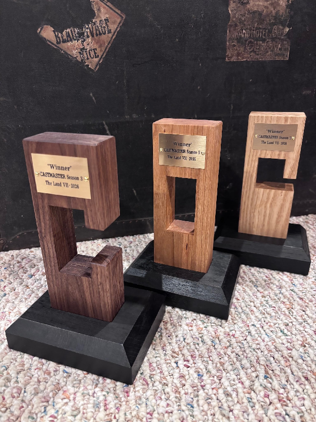
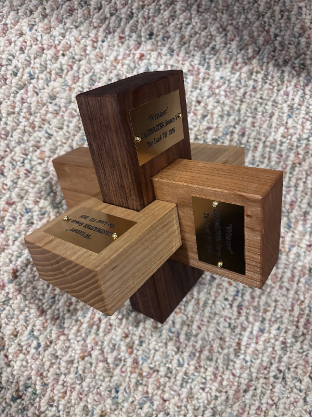
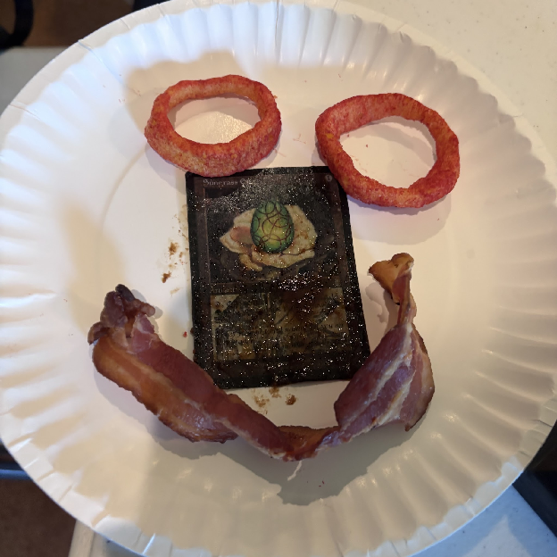
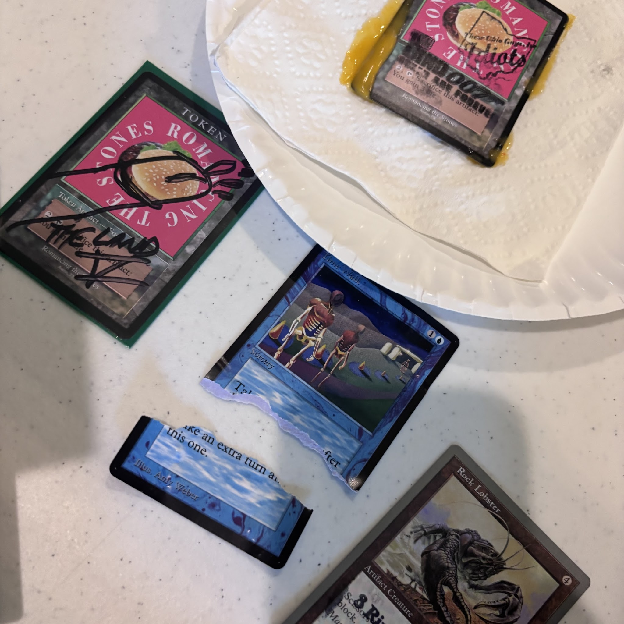
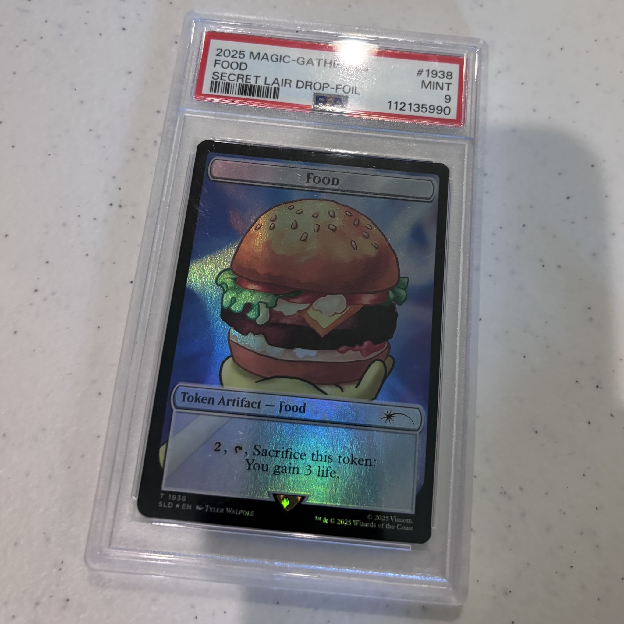
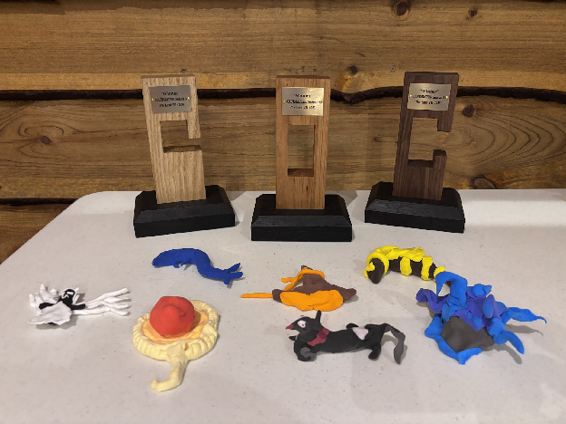
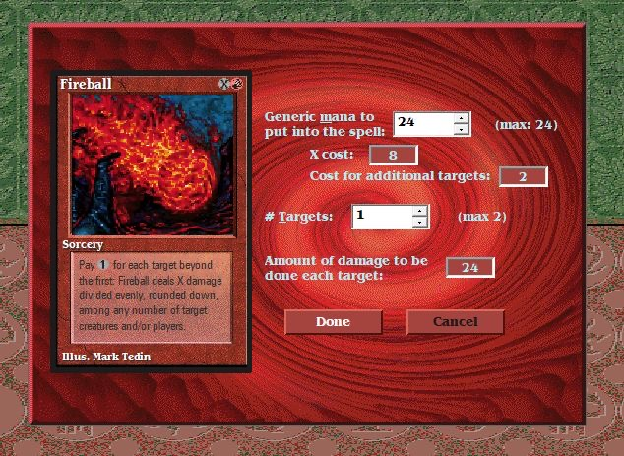

For three years running, now, I’ve hosted Castmaster, a gameshow of sorts at The Land–the Vintage tournament and friendly, good-time gathering hosted by Rajah James in a remote location near Warren, Ohio. Castmaster is based on *Taskmaster*, a televised British gameshow featuring comedians doing various challenges or “tasks” and getting scored for doing them. The tasks can be of almost any sort: large-scale or small, mental or physical, mundane or fanciful, straightforward or elaborate, and so on. Most tasks are individual, but some are team based, and a few are head-to-head.

The best introduction to the show is just to watch it. All of the British seasons (OK, “series”) are available [free on YouTube](https://youtube.com/@taskmaster?si=knr7yFfcR0oaw6sc), as well as seasons from Australia, New Zealand, and several other countries.

I love it.

Many of the tasks put contestants into ridiculous situations, and they’re frequently rewarded for lateral thinking—coming up with a unique or unexpected solution to a challenge. That’s something that I’ve tried to capture in Castmaster as well. I try to get as close as I can to the real thing except that I don’t have a production staff taking video to splice together, and all of my tasks have something to do with *Magic: The Gathering* (MTG), hence the “cast” part.

In previous [Castmaster seasons](), players grouped themselves into [two-player teams](), but this year, in honor of the third anniversary and to shake things up a little, I mandated three-player teams. This was also because my preferred trophy maker, Team Serious member Jon Hammack, was able to make a three-piece interlocking puzzle trophy this year. (Honestly he and I talked about this trophy before season two, so this had been fated for a while.)

{: width="48%"}

{: width="48%"}

Other than the team size, the overall structure remains the same and mimics the structure of the show. There are two tasks scored during the player meeting. Then teams do tasks throughout the day, between rounds of playing Vintage. They’re scored on those, there’s a big final task, and then at the end of the day I present the winners with trophies. Previously I’d done two individual tasks and a partner task. This year, there would be three partner tasks, so each team member could spend time with both their teammates. Also this year there were 7 teams, so tasks were scored to give 7 points to the best performance and 1 point to the opposite of that.

And before I go on, I should mention some thank yous. First to Rajah our illustrious host, and to Jon for making the trophies seen earlier. And especially thank you to Jerry Yang and Andy “Brass Man” Probasco who helped set up tasks and run them throughout the day. When I mention Jerry or Brassy, it’s them. Their help is invaluable as I wouldn’t have time to run this all by myself. Jerry helped with all the setup and then, sadly, had to go home on injured reserve. But Brassy went on to win the main event, so he worked extra hard.

**Task 1 \- The Name Task**

I’ve done a variant of this task every season at the request of Rajah himself, who wanted to make sure that teams would have names that could be read on Full Warning, a family-friendly podcast. Sure, we can score for that. Sidenote, does that podcast still happen?

**Create a team name that is a three-word phrase appropriate for an HR office inspirational poster. Most inspirational phrase wins.**

These were all appropriately dry and businessy. “Drive Shareholder Value,” “Tangible Business Results” and “Synergy Based Initiative” all scored highly. “Be a PeliCAN\!” and “PeliCAN not PeliCAN’T” ended up splitting their middling points out of similarity. I hadn’t noticed until the public reveal that these were basically the same.

The last team name, submitted by Jimmy McCarthy, J.R. Glodberg, and Sam Krohlow has a fun story where Jimmy and Sam both submitted signup forms. Jimmy submitted “Bring Back Wrestling-Trivia” and Sam submitted “Unfit for Society,” and when I asked which signups I should use, they said “Use the worse one,” and I said “OK.” Wrestling-Trivia is a poor example for the category and also tries to cram four words into a three-word phrase with a hyphen. Honestly, I think “Unfit for Society” could have been spun as a fairly dark office poster in the “Don’t Forget: You’re Here Forever” sense from The Simpsons.

Congratulations to Drive Shareholder Value players Mike O’Malley, Stu Ziarnik, and Bryan Hockey for their inspirational and undeniably businessy phrase.

**Task 2 \- The Card Task**

Every episode of Taskmaster begins with what’s called the prize task, where contestants bring items that fit a category and which then become prizes for the winner of the episode. For example the category “thing that is the most fun to jiggle” ended up with the episode’s winner going home with five differently shaped gelatin molds. Other categories have wider variety.

My prompts have always been to bring in an example MTG card that fits a category, but they don’t get taken home by anyone else, so players don’t have to worry about losing a card that’s valuable or special to them. This year was simply:

**Bring in the tastiest Magic: The Gathering card.**

The winner was easily the PeliCAN’s softboiled Sungrass Egg, slathered in A1 sauce, with whimsical Funyon eyes and a bacon smile, submitted by Angelo Kortyka, Steven McGrew, and Paul Blakeley. Putting flavoring on a *Magic* card definitely makes it tastier, so a hamburger token with cheese sauce and a drink from the PeliCAN’Ts and an Absolute Law with a Cheeto-dust fingerprint on it from Synergy Based Initiative also did well.

{: width="32%"}

{: width="32%"}

{: width="32%"}

All of this year’s submissions were good, some were just more good than others. Also I think this is the third year in a row that one of the submissions has been a card with a penis drawn on it. I don’t *think* that’s a thing I’m encouraging somehow… But who knows? You could have put the card in a cupcake instead.

Tip for next year: The thing to bring in won’t be a *Magic* card.

**Task 3 \- Cards In Hats on Heads**

These next three tasks don’t really have a particular order. Teams were asked to complete them throughout the day and use a different pair of teammates for each task. So, with players A, B, and C, teammates A and B could do this task, A and C could do the next task, and B and C could do the last task.

Cards In Hats on Heads was a simple physical challenge that I took extra time to obfuscate—I mean explain, to try to forestall some techniques:

**Player one: sit in the first chair and don the magisterial crown. Player two: sit in the second chair and don the foolish cap.**

**You may not move the chairs or remove the headwear.**

**Taking turns, throw art cards into the headwear opposite you.**

**Cards in the cap are worth three points.**  
**Cards in the crown are worth one point.**  
**Points are tallied after 90 seconds.**

**Your time starts when you are both seated and wearing headwear and say “Tally ho\!”**

Basically, throw cards into your teammate’s hat and score points.

We set this up in a location on the grounds I was calling the Pizza Hut Patio, a covered stone patio at the edge of a stone pond just past the parking area that also included a mini pizza oven. For setup, Jerry and Brassy and I placed the chairs and tried to decide whether we wanted them close enough so that players could lean way in and kind of pop the cards into the hats, rather than throwing them. We decided, sure, but players had to still throw cards, not just place them into the hats. I also swear we got the chairs placed and then the wind picked up and got worse throughout the day.

I think we got the distance about right. Most teams did lean in after a while, but some did try to throw the cards. We spent a decent amount of time each round picking up cards and trying not to litter.

I was relieved that all the teams got at least some points. Even The Legendary Creatures, who stayed on the straightest and narrowest path got 3 points in game while sitting squarely in their chairs fighting a strong crossbreeze. They lived and died within the rules as three points didn’t get them off the ground or out of last place for this task. However, the rules were lenient enough that the highest scores were all over 200 points as PeliCAN, Drive Shareholder Value, and Wrestling-Trivia all realized they could take turns “throwing” groups of cards and score gobs of points at a time.

Outside of that, other strategic considerations for people included “Who’s the better thrower, you or me?” so that they could throw into the crown, “Wait, don’t say ‘tally ho’ yet, the wind is real bad,” and “We should stop so none of the cards fall out and we lose points.” One team also fitted the crown to their shirt, to have a backboard. All of the information is in the task.

Anyway, I thought this was fun. I very much enjoyed seeing players make initial throws and have the cards end up twenty feet away, behind them. Also, I’m not sure of a better use for art cards.

**Task 4 \- The Ghost**

Friendship is mandatory at The Land, and one of the benefits of running Castmaster is making sure people become better friends, perhaps by creating fine art whilst holding hands. Jerry was really hoping for this to end up like the [pottery wheel scene from *Ghost*](https://www.youtube.com/watch?v=d-MxKd1WY2k)—hence the name—but it ended up being straightforward. Castmaster players are just too professional to be wiled by one another’s charms. There was one report of a “You have really soft hands” remark, though.

**Sculpt your declared favorite Magic: The Gathering creature token using the clay provided. You must hold hands with your teammate throughout the task. You have 3 minutes. Your time starts now.**

This was delightful all the way through. Teams were provided with air-dry modeling clay in their choice of colors and had to make a little creature token guy, which they had previously declared was their favorite on their signup forms.



The hand holding didn’t impede the sculpting as much as I expected, so it mostly came down to the players’ combined artistic talent and interpretation of the token art itself. Many pairs of teammates checked whether they were righthanded or lefthanded, so they could hold opposite hands. And players often delegated themselves into working on the main token versus making smaller detail items like rolling out tentacles or flattening wings or whatever.

{: width="60%"}

I graded mostly on the artistic quality and how well the sculpture matched the declared token. Synergy Based Initiative aimed high with the JingHe art 10th anniversary 4/4 white Angel token with flying (very specifically) and I judged that they hit it pretty well. There was some fine detailing on the wings and the face, and it was very clearly an Angel. I also liked The Legendary Creatures’ 1/1 artifact Wasp token with flying, which had stripes and filigree wings of a sort, and Tangible Lasting Results’ Marit Lage token felt sufficiently beefy, even if it wasn’t 20/20 size relative to, say, the Wasp.

I’m not sure what to say about PeliCAN’s Clown Robot token from *Unfinity*. I had to look it up. I saw what they were going for, but I also thought it put detail in the wrong locations. The pie crust was nicely crimped for example, but it was missing the face and the nose (I guess?) was too big.

Anyway, I hope people took their sculptures home. They were adorable.

**Task 5 \- The One at the Bar**

Jerry and I walked around a bit trying to figure out where to set this one up (including looking at Eric Caffrey’s van\!) and I think some players were a little disappointed we didn’t use the bar for something more bar related. This had nothing to do with drinking or a bar, other than being a nice place to get indoors to sit and be cool for a bit.

**Sit in the provided chairs so that one player can see the computer monitor and the other can manipulate the mouse. Either of you may reference the provided materials if desired.**

**Complete this game of Magic: The Gathering using the Microprose Magic: The Gathering Spells of the Ancients software. You have an uncontested win with Channel-Fireball in hand.**

**Fastest wins.**

**Your time starts with the first mouse click.**

This was my favorite task of the day (and not just because it was nice to be indoors to sit and be cool). The Microprose *Magic: The Gathering* software has been part of my life for many years and is such a quirky relic. I will almost certainly use it again for future tasks.

I was pleased with the amount of work people put into this. Most teams strategized before diving into the software, many people communicated about the initial layout of the screen, and I think more than half the teams used the provided reference materials, which included a *Spells of the Ancients* manual and a voluminous strategy guide. Tucked inside the strategy guide was also a small sheet of mirror, but everyone who found that decided it was mostly unusable for helping someone control the mouse on screen. Most teams went with the “Move left, move move movemovemov–STOP\!” technique which did pretty well. And I think there was only one team that realized the game started during the upkeep phase and had to be clicked past there first before doing anything else.

As I pointed out to players afterward, nowhere does it say that you have to “win” the game of *Magic*. It says “complete” and merely points out you have a win with Fireball. If you concede or quit the game somehow, that would also count and might be faster. Everyone ended up completing their game without conceding or quitting. The Legendary Creatures took longest at over 20 minutes and ended with a loss, as they asked for a restart and then somehow made mana with Channel, cast a Disintegrate with none of it, and then mana burned. I’m still not sure what happened there, but if only they’d done it faster… And the PeliCAN’Ts finished in 6:04 with a draw as they cast a 19 point Fireball and then mana burned to 0 life. Still good enough for fourth place.

Lots of good cooperation throughout the day. And I loved that teams would get into a groove and then click on Fireball only to have it bring up that spreadsheet of an interface, and you could hear the record-scratch effect in the head of the player who was directing.

The top three teams were all under 5 minutes, including the PeliCANs who set the pace with 4:18, completing the first task of the day. And Synergy Based Initiative had a blistering (relatively, I mean, for using 20-year-old software) 3:17.

**Task 6 \- Three-Card Blind Tournament**

I think I had this idea pretty early on in the development of Season 3 being a three-player teams event. Three cards and three people just line up so neatly, and I’ve always wanted to have a three-card blind (3CB) tournament in person, even though the logistics seem positively medium.

Anyway, Castmaster in the past has had a day-long task and an end-of-day task that both get scored at the end. This time they were the same task, with only one score. At the beginning of the day, I had teams collect three cards at random when they turned in their tastiest card. Throughout the day, then, they were tasked with trading cards with other teams and possibly finding additional cards hidden throughout The Land with the hazy goal of having the best three cards at the end of the day.

Structurally, this meant that seven 3CB decks were distributed randomly to teams during the player meeting, then I hid an additional 15 cards from five more decks around The Land, and I kept three more cards for myself to trade. All told there were 39 cards available, from decks I selected to kind of work together as pieces got mixed around.

At one point, I think the cards in my hand were a very playable deck of red land, Stromkirk Noble, and Pyrokinesis.

Anyway, I was a little surprised that no one put together the idea of this task being a 3CB riff early on, and even when I said that’s what was going to happen there was no reaction. I guess the format is more obscure than I thought. Since playing, though, several people have gotten more interested in the idea.

As a sidenote, I guess I have to put more rules in place around hidden cards if I need to prevent one person from finding and hoarding most of them. I do enjoy hiding cards and seeing throughout the day what gets picked up or not. There was one card in the box of forks on the lunch table for a loooong time. At the end I had to request that one team (well, one player: Paul Blakeley) trade or unload some of their collection, particularly mana, just so that other teams would be able to construct decks that did *something*. Paul didn’t do anything wrong according to the rules—totally good to get an advantage. I just wanted other teams to have active decks, otherwise we don’t have fun.

And we got there\! Seven teams had decks and they could all do *something*, even if that thing was draw with other decks that could get draws. Decks played out as such:

| Team | Deck | Points |
| :---- | :---- | ----- |
| Pelican Not PeliCAN’T | Undiscovered Paradise, Chancellor of the Tangle, Autonomous Assembler | 10.5 |
| Be a PeliCAN\! | Mox Pearl, Mishra's Factory, Ocelot Pride | 10 |
| Tangible Lasting Results | Lotus Bloom, Skrelv's Hive, The Rack | 7 |
| Synergy Based Initiative | Greater Gargadon, Copperline Gorge, Crack the Earth | 5.5 |
| Drive Shareholder Value\! | Mocking Bird, Sol Ring, Tundra | 4 |
| Bring Back Wrestling-Trivia | The Tabernacle at Pendrell Vale, Disruptor Flute, Remote Farm | 4 |
| The Legendary Creatures | Tropical Island, Aether Vial, Foretold Soldier | 1 |

Teams received 1 in-game match point for a win, 0.5 points for a draw, and 0 points for a loss, so each team had a potential of 12 points available in the round robin event. Being able to make a big attacker like PeliCAN’T’s Autonomous Assembler or many attackers like PeliCAN’s Ocelot Pride and Tangible Lasting Results’s Skrelv’s Hive carried things a long way. And I enjoyed Wrestling-Trivia’s ability to draw eight games for four points quite a bit, even if it didn’t end up great on paper.

And the way this tournament played out was a lot of fun. Representatives from each team and I adjourned to a large side table, all the decks were laid out on display, and we played out everything in order, deciding as a group what the results of each matchup would be on the play and on the draw. Massively collaborative and lots of discussion—it was great.

**Final Scoring**

At the end of the day, as is usually the case, all the teams had highlights. Even Josh B., Stoomie, and Kyle, under The Legendary Creatures banner which came last overall, were second in the token sculpture with their finely crafted Wasp. If the Aether Vial in their 3CB deck had been another mana producing land, their Foretold Soldier deck would have told a different story. And they *persevered* in the One at the Bar. I was glad they didn’t give up. They should be proud.

Four teams were in the middle: Drive Shareholder Value\! and Tangible Lasting Results tied with 23 points and Bring Back Wrestling-Trivia and PeliCAN Not PeliCAN’T tied with 25 points. Any break could have catapulted one of these teams to victory. For example, the “My Beta Time Walk\!” card task submission from Bring Back Wrestling-Trivia, would have been a winner except that I’m easily swayed by food, so it ended up in the middle. They should have gone all in and eaten the Time Walk fully.

What can I say? Scoring varies between objective and subjective, and my scoring is blameless either way. Reviewing the scores while writing this, I have no regrets.

Be a PeliCAN, a team made of previous years’ winners Steven McGrew, Angelo Kortyka, and Paul Blakeley who nearly lost a thumb at the [Head-to-Head-to-Head-to-Head-to-Head Castmaster]() at the Hazard Serious Invitational, came in second with 29 points. They did great work, obviously huge effort, on the card task. I’m fairly sure looking at the pictures that the Sungrass Egg was literally marinaded in, I guess, actually A1 sauce. No one else did a marinade. And they came in second in the 3CB tournament, certainly due to Paul’s mastery of finding hidden cards. Well done.

The winners, Synergy Based Initiative, made of Eric Caffrey, Jason Hallman, and Mike Klements were the last team to sign up. They finished second and third in the card and team name tasks, where their combined 11 points were highest to start the day. Two first place finishes in the Ghost task and the One at the Bar cemented the difference, and they deserved it. They reached high for their Angel sculpture and got it, and they mastered Microprose *Magic: The Gathering Spells of the Ancients* the fastest by far. They ended the day with 33 points

So congratulations to Synergy Based Initiative and thanks to everyone who participated in the third season of Castmaster. I always enjoy organizing it and giving people a bit of a break in between matches of MTG at The Land, so I hope other people enjoy it as well. Thanks also to Jerry and Brassy for helping teams get through tasks, and for helping with some of the brainstorming and prep work too. Thanks to Jon Hammack for producing another set of artisan bookend trophies. And of course thanks to the illustrious host of The Land, Rajah James. A big event needs big side events.
